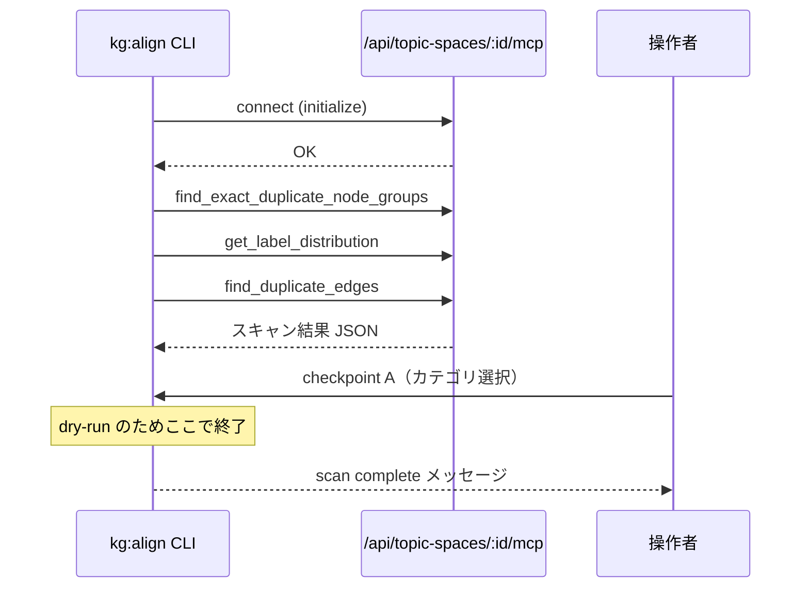

# KG Alignment Agent — テスト実行レポート（2026-05-19）

本書は、KG Alignment CLI エージェントの実装・統合後に実施した手動／半自動テストの記録です。  
対象 Topic Space: **SOSBOOK_TES**（`cmkdju6ww00e62k3ymb22v38m`）

## 目次

1. [テストの目的と範囲](#テストの目的と範囲)
2. [前提環境](#前提環境)
3. [実施した修正（テスト前後）](#実施した修正テスト前後)
4. [テストケース一覧](#テストケース一覧)
5. [フェーズ別の動作詳細](#フェーズ別の動作詳細)
6. [本番相当実行（フルフロー）](#本番相当実行フルフロー)
7. [作成された変更提案のレビュー](#作成された変更提案のレビュー)
8. [既知の制限・改善候補](#既知の制限改善候補)
9. [再現手順](#再現手順)
10. [関連ファイル](#関連ファイル)

---

## テストの目的と範囲

| 目的 | 内容 |
|------|------|
| MCP 接続 | Streamable HTTP で Topic Space 専用 MCP に接続できること |
| スキャン | 重複ノード・ラベル分布・重複エッジの調査ツールが動作すること |
| CLI | `npm run kg:align` の引数パース、dry-run、フル実行 |
| 変更提案 | ドラフト作成 → マージ → diff 生成まで（**提出は未実施**） |
| エラー処理 | 存在しない Topic Space ID で 404 となること |

**範囲外（今回未実施）**

- 変更提案の PENDING 提出・UI でのマージ承認
- fuzzy 重複（embedding 検索）を含むフル実行
- 本番 Vercel 環境での実行

---

## 前提環境

| 項目 | 値 |
|------|-----|
| 日付 | 2026-05-19 |
| ブランチ | `main`（`origin/main` 取り込み後） |
| 開発サーバー | `npm run dev`（`http://localhost:3000`） |
| Node.js | v22.21.1 |
| Topic Space ID | `cmkdju6ww00e62k3ymb22v38m` |
| Topic Space 名 | SOSBOOK_TES |
| MCP ツール識別子 | `mcpToolIdentifier` 未設定 → フォールバック `ts_cmkdju6ww00e` |

### 環境変数（設定済みだったもの）

- `OPENAI_API_KEY` — LLM プラン生成用
- `ALIGNMENT_AGENT_SESSION_COOKIE` — ドラフト書き込み用（next-auth）
- `ALIGNMENT_AGENT_BASE_URL` — `http://localhost:3000`（任意）

---

## 実施した修正（テスト前後）

テストを通す過程で、以下をコードベースに反映済みです。

| 項目 | 内容 |
|------|------|
| `origin/main` 競合解消 | MCP route / graph-edit-proposal / topic-space を upstream 構成に合わせて統合 |
| MCP route | `@vercel/mcp-adapter` をやめ `WebStandardStreamableHTTPServerTransport` を直接使用（406 回避） |
| 404 対応 | 存在しない Topic Space で HTTP 404（従来 500） |
| CLI 引数 | `--topic-space-id=<id>` 形式（`=` 付き）をパース可能に |
| Zod スキーマ | OpenAI structured output 向けに `.optional()` → `.nullable()` |
| CLI エラー表示 | MCP 404 時に typo 確認メッセージ |

---

## テストケース一覧

| # | コマンド / 操作 | 期待 | 結果 |
|---|----------------|------|------|
| 1 | `--topic-space-id=...v38`（末尾 `m` 欠落） | 404 / 明確なエラー | **OK** — 404、CLI に日本語メッセージ |
| 2 | `--topic-space-id=...v38m --dry-run` | スキャンのみ成功 | **OK** |
| 3 | MCP `initialize`（curl） | HTTP 200 | **OK**（修正後） |
| 4 | `--no-submit` フル実行 | ドラフト作成・diff まで | **OK**（Zod 修正後） |
| 5 | 初回フル実行（Zod 修正前） | — | **NG** — structured output エラー |
| 6 | `--help` / ID 未指定 | ヘルプ / 必須エラー | **OK** |

---

## フェーズ別の動作詳細

### A. `--dry-run` 実行

```bash
npm run kg:align -- --topic-space-id=cmkdju6ww00e62k3ymb22v38m --dry-run
```

#### 動作の流れ



#### checkpoint A（対話）

デフォルト選択のまま Enter した場合:

- 完全一致ノード統合（`exact_duplicates`）
- ラベル・表記統一（`label_normalization`）
- 重複エッジ整理（`edge_dedup`）
- fuzzy 重複は **未選択**

#### スキャン結果（2026-05-19 時点のグラフ）

| 指標 | 値 |
|------|-----|
| 総ノード数 | 500 |
| 総エッジ数 | 745 |
| 完全一致重複ノードグループ | 1 グループ（2 ノード） |
| ラベル種類 | 18（最多: Person 163） |
| 重複エッジグループ | 2 グループ（計 6 本が重複） |

**重複ノード（完全一致）**

| 項目 | 値 |
|------|-----|
| 名前 / ラベル | 相模原 / Place |
| ノード A | `nrql83vfqkqekdo922mjju0x` |
| ノード B | `cmkdju6xt00e82k3ycy9d15g4` |

**重複エッジグループ 1** — `HAS_MEMBER`（4 本 → 1 本に整理予定）

- 保持予定: `f168jbvgtttw6klw1cj6mupb`
- 削除予定: `ti6jpzo374shgziwvx9lfc3z`, `w58rl432c7t2pfhut7x2k4v0`, `ktyk8zqikar6vrvj7yvvmt8b`

**重複エッジグループ 2** — `CENTRAL_FIGURE_OF`（2 本 → 1 本に整理予定）

- 保持予定: `nx8mqsf7r7q54mzr90figjos`
- 削除予定: `hzdfdhefine8e55xa4quhcj9`

#### ログ出力先

`.alignment-runs/cmkdju6ww00e62k3ymb22v38m/<runId>/`

- `events.jsonl` — イベント監査ログ
- `summary.md` — dry-run サマリ（フル実行時はより詳細）

---

## 本番相当実行（フルフロー）

### 実行コマンド

```bash
yes '' | npm run kg:align -- --topic-space-id=cmkdju6ww00e62k3ymb22v38m --no-submit
```

- `yes ''` … checkpoint の確認をすべて Enter（デフォルト）で進める
- `--no-submit` … 最後の PENDING 提出は行わない（ドラフトまで）

### 途中で発生した問題と対処

**1 回目（失敗）**

```
Error: Zod field ... uses `.optional()` without `.nullable()` which is not supported by the API
```

- **原因**: `AlignmentPlanSchema` が OpenAI structured output の制約に非準拠
- **対処**: `scripts/kg-alignment-agent/types.ts` で `canonicalName` / `canonicalLabel` / `edgeDedup.rationale` を `.nullable()` に変更

**2 回目（成功）** — 実行時間おおよそ **19 秒**

### フロー詳細（runId: `2026-05-19T09-22-30-711Z`）

| 時刻（UTC 概算） | フェーズ | 内容 |
|------------------|----------|------|
| 09:22:31 | init | run 開始、`dryRun: false` |
| 09:22:31 | scan | MCP 3 ツール実行完了 |
| 09:22:33 | checkpoint_a | カテゴリ 3 種を選択 |
| 09:22:39 | plan | gpt-4o-mini が AlignmentPlan 生成 |
| 09:22:47 | checkpoint_b | マージ 1・エッジ整理 2 を承認 |
| 09:22:47 | execute | ドラフト作成・マージ・エッジ dedup |
| 09:22:47 | checkpoint_c | diff 確認（提出スキップ） |
| 09:22:47 | finish | 完了 |

### 生成された AlignmentPlan（要約）

```json
{
  "merges": [
    {
      "groupKey": "相模原\u0000Place",
      "canonicalNodeId": "nrql83vfqkqekdo922mjju0x",
      "duplicateNodeIds": ["cmkdju6xt00e82k3ycy9d15g4"],
      "confidence": "high"
    }
  ],
  "labelNormalizations": [],
  "edgeDedup": [ /* HAS_MEMBER 4→1, CENTRAL_FIGURE_OF 2→1 */ ]
}
```

### MCP 実行結果（execute）

| ツール | 結果 |
|--------|------|
| `create_graph_edit_proposal_draft_in_ts_cmkdju6ww00e` | proposalId 発行 |
| `merge_nodes_in_draft_in_ts_cmkdju6ww00e` | 重複 1 削除、エッジ 16 本付け替え、マージ内 dedup 4 本 |
| `deduplicate_edges_in_draft_in_ts_cmkdju6ww00e` | **0 件削除**（マージ時に既に整理済み） |

`merge_nodes_in_draft` のレスポンス（ログより）:

- `removedDuplicateNodeCount`: 1
- `rewiredEdgeCount`: 16
- `deduplicatedEdgeCount`: 4

### 成果物

| 項目 | 値 |
|------|-----|
| proposalId | `cmpcfd2lr0001jtp0xrk0ots5` |
| タイトル | KG Alignment 2026-05-19 |
| ステータス | **DRAFT**（未提出） |
| 確認 URL | http://localhost:3000/proposals/cmpcfd2lr0001jtp0xrk0ots5 |
| ログディレクトリ | `.alignment-runs/cmkdju6ww00e62k3ymb22v38m/2026-05-19T09-22-30-711Z/` |

### diff サマリ

```
status: DRAFT
hasChanges: true
nodes:  added 0, updated 0, removed 1
edges:  added 0, updated 16, removed 4
totalChanges: 21
```

---

## 作成された変更提案のレビュー

UI / API で確認した changes の妥当性評価です。

### 問題なし

1. **ノード REMOVE（1 件）**  
   - `cmkdju6xt00e82k3ycy9d15g4`（相模原 / Place）の削除  
   - スキャンで検出した完全一致重複どおり

2. **エッジ UPDATE（16 件）**  
   - 削除ノードを端点にしていたエッジを `nrql83vfqkqekdo922mjju0x` に付け替え  
   - 関係 type は変更なし（`LOCATED_IN`, `INVOLVED`, `DIED_IN` 等）

3. **エッジ REMOVE（4 件）**  
   - プランで承認した重複 `HAS_MEMBER` 3 本 + `CENTRAL_FIGURE_OF` 1 本  
   - 保持側（`f168jbvg...`, `nx8mqsf7...`）は削除されていない

4. **ラベル正規化**  
   - 変更なし（プランどおり）

### 承認前の確認推奨（canonical プロパティ）

- diff 上、**削除ノード** にのみ `name_en`, `name_ja`, `imageUrl` 等が記録されている
- **残る canonical**（`nrql83...`）への NODE UPDATE はない
- マージ実装は `canonicalProperties` 未指定時、canonical 既存 properties をそのまま使用する  
  → 削除側にしかない画像・英語名が引き継がれない可能性あり

**推奨**: グラフ UI で canonical ノードの properties を目視し、不足時は承認前に手動補完または canonical の再選定

### ID の typo について

| ID | 結果 |
|----|------|
| `cmkdju6ww00e62k3ymb22v38`（`m` 欠落） | TopicSpace 不存在 → **404** |
| `cmkdju6ww00e62k3ymb22v38m` | 正常 |

---

## 既知の制限・改善候補

| 項目 | 説明 | 優先度 |
|------|------|--------|
| canonical 選定 | LLM は name/label のみ参照。properties の充実度は未考慮 | 高 |
| プロパティマージ | マージ時に duplicate → canonical へ properties をマージする処理がない | 高 |
| マージ時の全体 dedup | `merge_nodes_in_draft` がドラフト全体の重複エッジを dedup する副作用あり（意図どおりだが UI 上の説明が必要な場合あり） | 中 |
| `mcpToolIdentifier` | 当 Topic Space は DB 上 `null` のためフォールバック ID を使用 | 低 |
| 非対話実行 | checkpoint は inquirer 前提。CI 向け `--yes` フラグは未実装 | 中 |
| `@vercel/mcp-adapter` | 依存は残るが MCP route では未使用 | 低 |

---

## 再現手順

### 1. dry-run のみ

```bash
npm run dev

printf '\n' | npm run kg:align -- \
  --topic-space-id=cmkdju6ww00e62k3ymb22v38m \
  --dry-run
```

### 2. 本番相当（提出なし）

```bash
export ALIGNMENT_AGENT_SESSION_COOKIE='next-auth.session-token=...'

yes '' | npm run kg:align -- \
  --topic-space-id=cmkdju6ww00e62k3ymb22v38m \
  --no-submit
```

### 3. 提出まで含める場合

```bash
npm run kg:align -- --topic-space-id=cmkdju6ww00e62k3ymb22v38m
# checkpoint C で「提出しますか？」→ y
```

### 4. ログの確認

```bash
ls .alignment-runs/cmkdju6ww00e62k3ymb22v38m/

jq 'select(.type=="plan_generated")' \
  .alignment-runs/cmkdju6ww00e62k3ymb22v38m/2026-05-19T09-22-30-711Z/events.jsonl
```

---

## 関連ファイル

| 種別 | パス |
|------|------|
| 本レポート | `.alignment-runs/test-run-2026-05-19.md` |
| 運用手順 | `docs/kg-alignment-agent/operations.md` |
| 仕様 | `docs/kg-alignment-agent/spec.md` |
| 実行ログ | `.alignment-runs/cmkdju6ww00e62k3ymb22v38m/2026-05-19T09-22-30-711Z/` |
| プラン JSON | 同上 `plan.json` |
| 変更提案（UI） | `/proposals/cmpcfd2lr0001jtp0xrk0ots5` |

---

## 変更履歴

| 日付 | 内容 |
|------|------|
| 2026-05-19 | 初版（統合テスト・本番相当実行・提案レビューを記録） |
