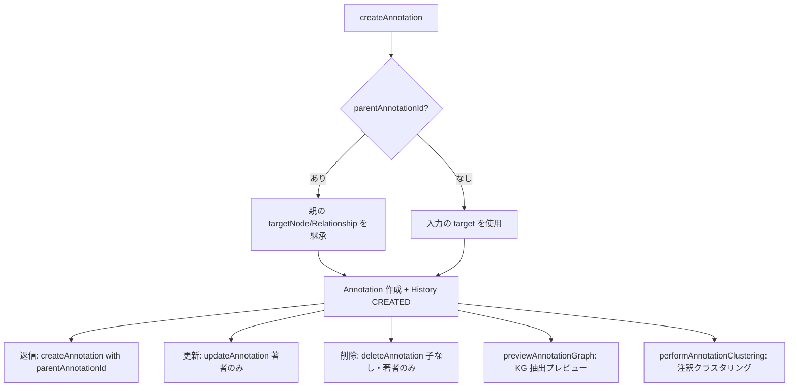

# 注釈コラボレーション API（annotationRouter）

TopicSpace のグラフノード・エッジに対するスレッド型注釈、履歴追跡、クラスタリング可視化、KG 抽出プレビューを提供する tRPC ルーター。

[自動アノテーションと情報参照](./auto-annotation-information-reference-flow.md) が Tiptap 本文のエンティティハイライトを扱うのに対し、本ドキュメントは **注釈 CRUD・スレッド・議論ランキング・クラスタリング** を対象とする。

## データモデル

`prisma/schema.prisma`:

| モデル | 役割 |
|--------|------|
| `Annotation` | 注釈本体。`targetNodeId` または `targetRelationshipId` に紐づく |
| `AnnotationHistory` | 作成・更新・削除の変更履歴 |
| `AnnotationDiscussion` | ルート注釈を中心とした議論スレッド（参加者・タグ） |

### Annotation の主要フィールド

| フィールド | 説明 |
|------------|------|
| `content` | Tiptap JSON（`TiptapContentSchema`） |
| `type` | `AnnotationType`（下表） |
| `parentAnnotationId` | 返信先。スレッドの親子関係 |
| `isDeleted` | 論理削除フラグ（物理削除ではない） |
| `sourceDocumentId` | 注釈を SourceDocument として KG 統合する場合の参照 |

### AnnotationType

| 値 | 用途 |
|----|------|
| `COMMENT` | 一般的なコメント（デフォルト） |
| `INTERPRETATION` | 解釈・分析 |
| `QUESTION` | 質問 |
| `CLARIFICATION` | 補足・説明 |
| `CRITICISM` | 批評・指摘 |
| `SUPPORT` | 支持・同意 |

### AnnotationChangeType（履歴）

`CREATED` / `UPDATED` / `DELETED` / `RESTORED` / `TYPE_CHANGED`

## 処理フロー

## 手続き一覧

### 読み取り

| 手続き | 認証 | 説明 |
|--------|------|------|
| `getAnnotationById` | 要 | ID で注釈取得（子注釈・履歴・ターゲット含む） |
| `getAnnotationsByIds` | 要 | 複数 ID の一括取得 |
| `getAnnotationDetail` | 要 | 詳細（親・子・履歴・議論参加者） |
| `getAnnotationParent` | 要 | 親注釈 |
| `getAnnotationReplies` | 要 | 指定親への返信一覧 |
| `getAnnotationGraphContext` | 要 | ターゲットノードと 1-hop 近傍の部分グラフ |
| `getNodeAnnotations` | 要 | ノード注釈一覧（議論盛り上がり順） |
| `getNodeAnnotationsPublic` | **不要** | 公開ノード注釈一覧（ソート同様） |
| `getEdgeAnnotations` | 要 | エッジ注釈一覧（`topicSpaceId` 必須） |
| `getAnnotationHistory` | 要 | 変更履歴（新しい順） |

### 書き込み

| 手続き | 制約 |
|--------|------|
| `createAnnotation` | `topicSpaceId` 必須。ターゲットノード/エッジの存在確認。返信時は親のターゲットを継承 |
| `updateAnnotation` | **著者のみ**。`content` / `type` 更新 + `AnnotationHistory` 記録 |
| `deleteAnnotation` | **著者のみ**。**子注釈がある場合は `BAD_REQUEST`**。論理削除 |

### 高度な操作

| 手続き | 説明 |
|--------|------|
| `previewAnnotationGraph` | 注釈テキストから KG を抽出してプレビュー（`AnnotationGraphExtractor`） |
| `performAnnotationClustering` | 対象ノード/エッジの注釈を TF-IDF + UMAP + クラスタリング（DBSCAN 等） |
| `getClusteringResult` | **未実装**（`NOT_IMPLEMENTED`）。キャッシュ用の将来 API |

## ソート・ランキング

`getNodeAnnotations` / `getEdgeAnnotations` / `getNodeAnnotationsPublic` は次の順で並べ替え:

1. 子注釈数（`childAnnotations._count`）降順
2. ルート議論数（`rootDiscussions._count`）降順
3. `createdAt` 降順

## クラスタリングパラメータ

`performAnnotationClustering` の `params`（省略時は `AnnotationClusteringOrchestrator.getDefaultParams()`）:

| カテゴリ | 主なパラメータ |
|----------|----------------|
| `featureExtraction` | `maxFeatures` (10–5000), `minDf`, `maxDf`, `includeMetadata`, `includeStructural` |
| `dimensionalityReduction` | UMAP: `nNeighbors`, `minDist`, `nComponents` 等 |
| `clustering` | `algorithm`: `KMEANS` / `DBSCAN` / `HIERARCHICAL` + アルゴリズム別オプション |

`topicSpaceId` は必須。`targetNodeId` / `targetRelationshipId` は TopicSpace 内の有効なノード/エッジであること。

## UI エントリポイント

| 画面 | パス / 場所 | コンポーネント |
|------|-------------|----------------|
| ワークスペース注釈 | キュレーター執筆ワークスペース | `annotation-form.tsx`, `annotation-list.tsx`, `annotation-hierarchy.tsx` |
| 注釈マップ | 同上 | `annotation-map-visualization.tsx` |
| 履歴モーダル | 同上 | `annotation-history-modal.tsx` |
| ノード詳細（認証） | グラフビュー ノードパネル | `node-annotation-section.tsx` |
| ノード詳細（公開） | 公開グラフビュー | `public-node-annotation-section.tsx` |
| 注釈詳細ページ | `/[locale]/annotations/[annotation_id]` | グラフコンテキスト + クラスタリングタブ |

ワークスペースのエッジ注釈は `workspace.getWorkspaceEdgeAnnotations` 経由（`annotationRouter` 外）。

## エラーケース

| 状況 | コード |
|------|--------|
| 注釈・ターゲット未存在 | `NOT_FOUND` |
| 更新・削除が著者以外 | `FORBIDDEN` |
| 子注釈ありで削除 | `BAD_REQUEST` |
| クラスタリングパラメータ不正 | `BAD_REQUEST` |
| KG 抽出失敗 | `INTERNAL_SERVER_ERROR` |

## 関連ファイル

- `src/server/api/routers/annotation.ts` — tRPC ルーター（全 16 手続き）
- `src/server/lib/annotation-graph-extractor.ts` — KG 抽出
- `src/server/lib/annotation-clustering-orchestrator.ts` — クラスタリング
- `src/server/lib/annotation-feature-extractor.ts` — 特徴量抽出
- `prisma/schema.prisma` — `Annotation`, `AnnotationHistory`, `AnnotationDiscussion`

## 関連ドキュメント

- [自動アノテーションと情報参照](./auto-annotation-information-reference-flow.md) — Tiptap エンティティハイライト ↔ グラフフォーカス
- [TopicSpace グラフ拡張](./topic-space-graph-extension.md) — 注釈由来テキストの KG 統合（別フロー）
- [TopicSpace 画面ナビゲーション](./topic-space-repository-ui.md) — リポジトリ管理画面
