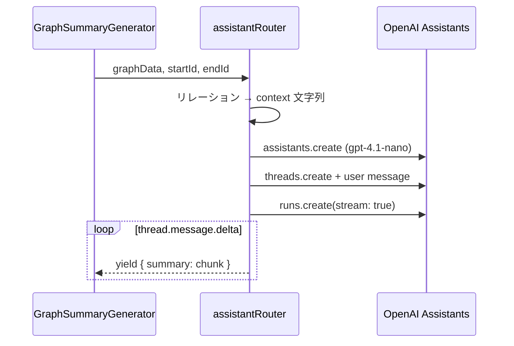

# グラフ執筆アシスタント API（assistantRouter）

2 ノード間の関係を説明する解説文・アウトラインの **ストリーミング生成** と、生成テキストの **TTS 音声化** を提供する tRPC ルーター。

ワークスペース内のインライン執筆補完（`workspace.textCompletion`）とは別用途。本ルーターは公開グラフビュー等の **サマリー生成 UI** 向け。

## 手続き一覧

| 手続き | 種別 | 認証 | 説明 |
|--------|------|------|------|
| `graphSummary` | ストリーミング mutation | 要 | 2 ノード間関係の解説文 |
| `graphOutline` | ストリーミング mutation | 要 | 同上のアウトライン |
| `textToSpeech` | mutation | 要 | テキスト → MP3 → Supabase 公開 URL |

## 共通入力（graphSummary / graphOutline）

```typescript
{
  graphData: KnowledgeGraphInputSchema, // nodes + relationships
  startId: string,  // 起点ノード ID
  endId: string,    // 終点ノード ID
}
```

グラフ全体のリレーションを `(name)-[type]->(name)` 行に展開し、OpenAI Assistants API のスレッドに渡す。

## graphSummary / graphOutline

### 処理フロー



| 項目 | graphSummary | graphOutline |
|------|--------------|--------------|
| Assistant 名 | 記事執筆アシスタント | 同左 |
| 指示 | 文脈からわかる情報のみ使用 | 同左 + アウトラインのみ出力 |
| ユーザーメッセージ | 「{start}」と「{end}」の関係解説 | 同上 + アウトライン作成 |
| モデル | `gpt-4.1-nano` | 同左 |
| temperature | 1.0 | 1.0 |

### ストリーミング yield 形式

```typescript
{ summary: string | undefined }  // delta チャンク
```

エラー時は `{ summary: "", error: "解説を作成できませんでした" }` またはアウトライン用メッセージを返す（generator の return）。

### 制約

- 各リクエストで **新規 Assistant + Thread を作成**（再利用なし）
- グラフに含まれないエッジは context に出ない（フロント送信の `graphData` に依存）
- `startId` / `endId` が `graphData.nodes` に無い場合、プロンプト内のノード名は `undefined` になる

## textToSpeech

| 項目 | 値 |
|------|-----|
| 入力 | `{ text: string }` |
| モデル | OpenAI `tts-1` |
| voice | `nova` |
| 保存先 | Supabase `BUCKETS.PATH_TO_SPEECH_AUDIO_FILE` |
| 成功時 | `{ url: string }` |
| 失敗時 | `{ error: "音声を生成できませんでした" }` |

## UI エントリポイント

| コンポーネント | パス | 手続き |
|----------------|------|--------|
| `GraphSummaryGenerator` | 公開グラフ等 | `graphSummary`, `graphOutline` |
| `TextToSpeech` | サマリー生成 UI 内 | `textToSpeech` |

未ログイン時は `GraphSummaryGenerator` が Google サインインを促す。

クライアント側は tRPC ストリーミング mutation を `for await` で受け取り、`setSummary(prev => prev + val.summary)` で逐次表示する。

## エラーケース

| 状況 | 挙動 |
|------|------|
| OpenAI Assistants 失敗 | 空 summary + 日本語 error 文字列 |
| TTS 失敗 | `{ error: "音声を生成できませんでした" }` |

## 関連ファイル

- `src/server/api/routers/assistant.ts` — tRPC ルーター（3 手続き）
- `src/server/api/schemas/knowledge-graph.ts` — `KnowledgeGraphInputSchema`
- `src/app/_components/summary-generator/graph-smmary-generator.tsx` — 解説・アウトライン UI
- `src/app/_components/summary-generator/text-to-speech.tsx` — TTS UI

## 関連ドキュメント

- [ノード解説文の自動生成](./node-description-generation.md) — ノード詳細パネルの別系統ストリーミング生成
- [執筆ワークスペース API](./workspace-router-api.md) — インライン `textCompletion`
- [TopicSpace 公開 REST API](./topic-space-public-rest-api.md) — 公開グラフ JSON 取得
