# 情報参照：自動アノテーション（処理フロー）

執筆テキストとワークスペースが参照する知識グラフのリソースを結びつけ、エディタ上で「どの語がグラフのどのノードか」を可視化し、クリックでグラフ側にフォーカスできるようにする機構。

## 処理フロー図

```mermaid
flowchart LR
    subgraph Source["参照元"]
        G[知識グラフ<br/>graphDocument.nodes]
    end

    subgraph Editor["Tiptap エディタ"]
        A[entities = nodes を渡す]
        B[ユーザがテキストを編集]
        C[onUpdate デバウンス後]
        D[triggerHighlightUpdate]
        E[performHighlightUpdate]
        F[本文中のノード名に entityHighlight マーク]
    end

    subgraph Interaction["参照との行き来"]
        H[ハイライト部分クリック]
        I[onEntityClick entityName]
        J[グラフで該当ノードをフォーカス]
    end

    G --> A
    A --> B
    B --> C
    C --> D
    D --> E
    E --> F
    F --> H
    H --> I
    I --> J
```

## 関連ファイル

- `src/app/_components/curators-writing-workspace/index.tsx` — entities={nodes} の渡し方、handleEntityClick
- `src/app/_components/curators-writing-workspace/tiptap/tip-tap-editor-content.tsx` — onUpdate デバウンス、triggerHighlightUpdate の呼び出し
- `src/app/_components/curators-writing-workspace/tiptap/hooks/use-highlight.ts` — useHighlight, triggerHighlightUpdate
- `src/app/_utils/tiptap/auto-highlight.ts` — performHighlightUpdate
- `src/app/_components/curators-writing-workspace/tiptap/extensions/entity-highlight-extension.ts` — EntityHighlight Mark
