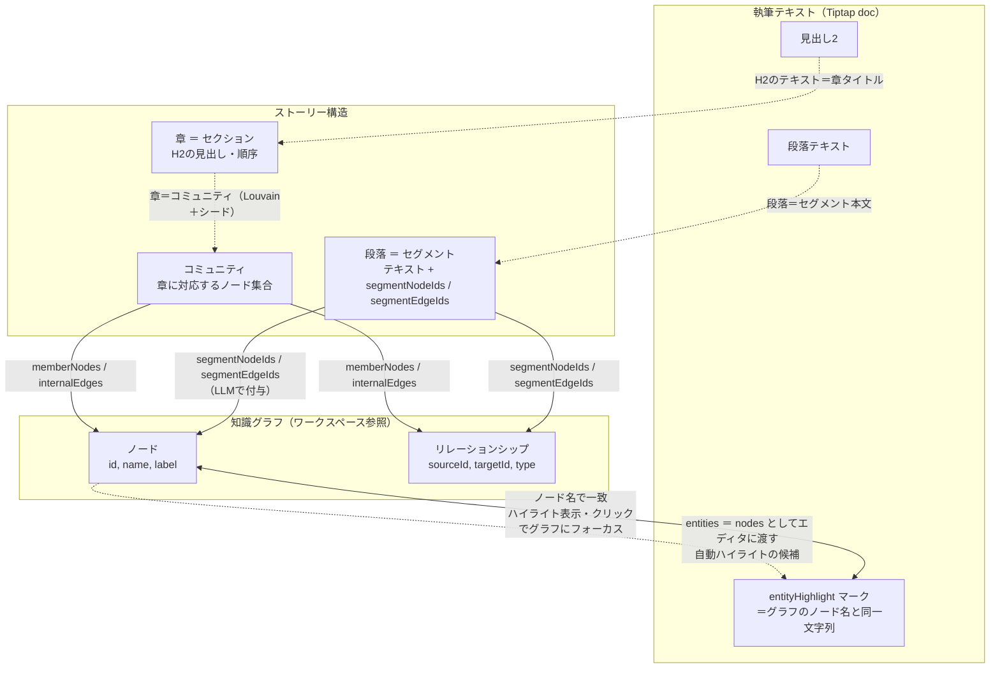

# 執筆体験におけるデータ連携の概念図

どのデータとどのデータが、執筆体験においてどう連携しているかを示す概念図。

## データ連携図

## 連携の説明

| 連携 | 内容 |
|------|------|
| **執筆テキスト ↔ 知識グラフ** | 本文中の「ノード名」が entityHighlight でマークされ、その名前はグラフのノードと一致。クリックでグラフ側のノードをフォーカス。逆に、グラフの nodes をエディタに entities として渡すことで、同じ名前の語が自動でハイライトされる。 |
| **執筆テキスト → ストーリー構造** | 見出し2が「章」、段落が「セグメント」としてパースされ、章タイトル・セグメント本文がストーリー構造の土台になる。 |
| **ストーリー構造 ↔ 知識グラフ** | 章は「コミュニティ」（ノード集合）に対応。各セグメントには LLM で segmentNodeIds / segmentEdgeIds が付き、その段落が言及するノード・エッジと紐づく。ストーリーボードで段落をクリックすると、グラフの該当ノード・エッジがハイライトされる。 |
