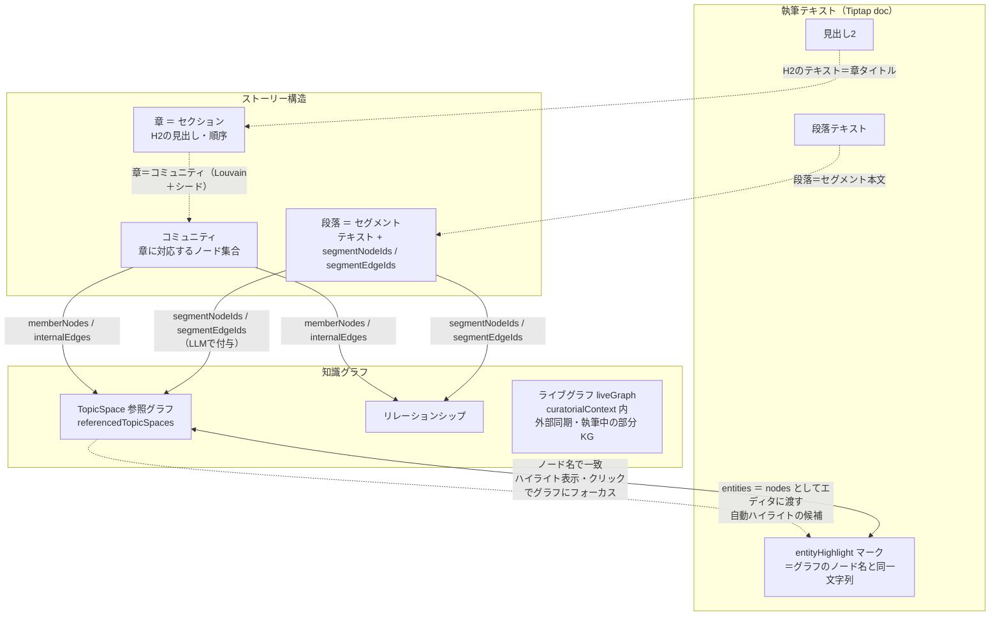

# 執筆体験におけるデータ連携の概念図

どのデータとどのデータが、執筆体験においてどう連携しているかを示す概念図。

## データ連携図

```mermaid
flowchart TB
    subgraph Writing["執筆テキスト（Tiptap doc）"]
        T1[見出し2]
        T2[段落テキスト]
        T3[entityHighlight マーク<br/>＝グラフのノード名と同一文字列]
    end

    subgraph Graph["知識グラフ"]
        G1[TopicSpace 参照グラフ<br/>referencedTopicSpaces]
        G2[リレーションシップ]
        LG[ライブグラフ liveGraph<br/>curatorialContext 内<br/>外部同期・執筆中の部分 KG]
    end

    subgraph Story["ストーリー構造"]
        S1[章 ＝ セクション<br/>H2の見出し・順序]
        S2[段落 ＝ セグメント<br/>テキスト + segmentNodeIds / segmentEdgeIds]
        S3[コミュニティ<br/>章に対応するノード集合]
    end

    T1 -.->|"H2のテキスト＝章タイトル"| S1
    T2 -.->|"段落＝セグメント本文"| S2
    T3 <-->|"ノード名で一致<br/>ハイライト表示・クリックでグラフにフォーカス"| G1

    S1 -.->|"章＝コミュニティ（Louvain＋シード）"| S3
    S3 -->|"memberNodes / internalEdges"| G1
    S3 -->|"memberNodes / internalEdges"| G2
    S2 -->|"segmentNodeIds / segmentEdgeIds<br/>（LLMで付与）"| G1
    S2 -->|"segmentNodeIds / segmentEdgeIds"| G2

    G1 -.->|"entities ＝ nodes としてエディタに渡す<br/>自動ハイライトの候補"| T3
```

## 連携の説明

| 連携 | 内容 |
|------|------|
| **執筆テキスト ↔ 知識グラフ** | 本文中の「ノード名」が entityHighlight でマークされ、その名前はグラフのノードと一致。クリックでグラフ側のノードをフォーカス。逆に、グラフの nodes をエディタに entities として渡すことで、同じ名前の語が自動でハイライトされる。 |
| **執筆テキスト → ストーリー構造** | 見出し2が「章」、段落が「セグメント」としてパースされ、章タイトル・セグメント本文がストーリー構造の土台になる。 |
| **ストーリー構造 ↔ 知識グラフ** | 章は「コミュニティ」（ノード集合）に対応。各セグメントには LLM で segmentNodeIds / segmentEdgeIds が付き、その段落が言及するノード・エッジと紐づく。ストーリーボードで段落をクリックすると、グラフの該当ノード・エッジがハイライトされる。 |
| **執筆テキスト / liveGraph → 執筆履歴** | `content` と `curatorialContext` 内の **liveGraph** の変更は `WritingHistory` にスナップショットされる。復元時は本文と liveGraph をセットで戻せる（GUI は本文のみ即時反映 — [執筆ワークスペース API](./workspace-router-api.md#執筆履歴)）。 |

外部 Web アプリから Workspace の `content` と **liveGraph** を同期する REST API は [外部 Workspace REST API](./external-workspace-api.md)。MCP トークン認証・`source`/`sourceKey` による upsert・執筆履歴（本文 + グラフ差分）の取得・復元を提供する。ブラウザ内 tRPC の対応手続きは [執筆ワークスペース API](./workspace-router-api.md) を参照。
