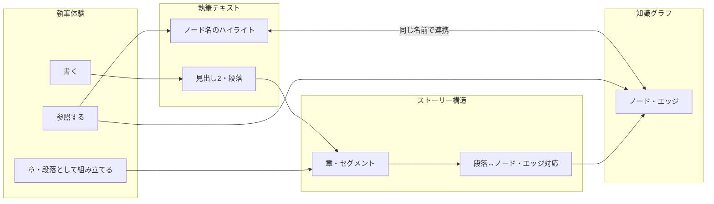

# 執筆体験とデータの関係（概念図）

「書く」「参照する」「章・段落として組み立てる」という執筆体験と、執筆テキスト・知識グラフ・ストーリー構造の3つのデータがどう対応するかを示す概念図。

## 体験とデータの対応図

## 読み方

- **書く** → 執筆テキスト（見出し2・段落）ができる。
- **参照する** → 執筆テキスト内のノード名ハイライトと知識グラフが「同じ名前」で結びつき、ハイライトクリックでグラフを参照できる。
- **章・段落として組み立てる** → 執筆テキストがストーリー構造（章・セグメント）になり、セグメントとノード・エッジが対応する。
