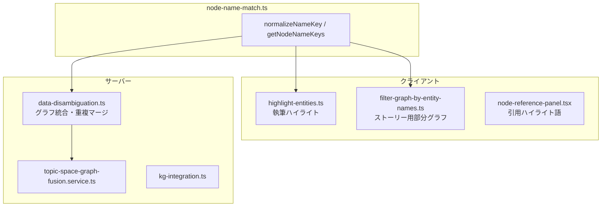

# クロス言語ノード同一性（name / name_ja / name_en）

KG 抽出やドキュメント統合の過程で、同一概念が言語違いの表記（例: `name="ART PROJECT"` と本文中の「アートプロジェクト」）として存在することがある。ArsTraverse はノードの `properties.name_ja` / `properties.name_en` と共通ユーティリティで、**表示言語と抽出言語のズレ**による重複ノード・ハイライト漏れ・クリック未検出を防ぐ（PR #82）。

## データモデル

| フィールド | 役割 |
|------------|------|
| `GraphNode.name` | 抽出時の主名称（言語はドキュメント依存） |
| `properties.name_ja` | 日本語表示名 |
| `properties.name_en` | 英語表示名 |

`name` 単体では同一性を判定しない。`name` / `name_ja` / `name_en` のいずれかが正規化後に一致すれば同一ノードとみなす。

## 正規化ルール

`normalizeNameKey`（`src/app/_utils/kg/node-name-match.ts`）:

- Unicode **NFKC** 正規化
- `trim`
- **小文字化**（ASCII の大文字小文字の揺れを吸収）

ハイライト用の `highlight-entities.ts` はマッチ位置の正確さのため **NFC** のみ使用（同一性キーとは別）。

## 共通 API

| 関数 | 用途 |
|------|------|
| `getNodeNameCandidates(node)` | 生の名前候補配列（重複除去）。ハイライト・検索向け |
| `getNodeNameKeys(node)` | 正規化済みキー集合。同一性判定向け |
| `nodesShareName(a, b)` | 2 ノードが名前候補のいずれかで一致するか |
| `nodeMatchesName(node, name)` | クリック時のノード特定など |

## 利用箇所

### 執筆エディタの自動ハイライト

`findEntityMatches` は各ノードの `name` / `name_ja` / `name_en` を候補に展開し、**長い名前から順**にマッチ（部分一致の誤検出を防止）。詳細は [自動アノテーション](./auto-annotation-information-reference-flow.md)。

### グラフ統合（disambiguation）

`mergerGraphsWithDuplicatedNodeName`（`data-disambiguation.ts`）は `nodesShareName` で重複ノードを検出し、統合時に ID を付け替える。`labelCheck` が true のときはラベルも一致が必要。

### 引用パネルのハイライト

`NodeReferencePanel` は `name` / `name_ja` / `name_en` をハイライト語として収集し、**文字数降順**で正規表現オルタネーションを構築（短い語が先にマッチして長い語が欠ける問題を防止）。

## 名前の自動翻訳（finalize 時）

KG 抽出 finalize やアノテーション由来グラフでは `completeTranslateProperties`（`src/app/_utils/kg/node-name-translation.ts`）が `name_ja` / `name_en` の欠損を補完する。

| 条件 | 動作 |
|------|------|
| 両方空 | `node.name` の文字種（CJK 有無）でソース言語を推定し、反対語へ LLM バッチ翻訳 |
| `name_en` のみ / 同一値で非 CJK | `name_ja` を英→日翻訳 |
| `name_ja` のみ / 同一値で CJK | `name_en` を日→英翻訳 |

呼び出し元:

- `finalize-accumulated-kg.service.ts`
- `kg-extraction.ts` ルーター（インライン・ジョブ完了）
- `annotation-graph-extractor.ts`

翻訳失敗時はソーステキストまたは `node.name` でフォールバック。

## 制約・既知の挙動

- 同一性は **名前文字列のみ**。意味的類似（「美術館」と「ミュージアム」）は別ノードのまま
- `normalizeNameKey` は小文字化するため、ラテン語の固有名は表記ゆれを吸収するが、意図的に大文字小文字を区別する用途には使えない
- Phase2 ローカルコンテキスト（`build-local-context.ts`）も `name` / `name_ja` / `name_en` の出現でノードを選ぶ — [KG バッチ抽出](./kg-batched-extraction-pipeline.md) 参照

## トラブルシューティング

| 症状 | 確認ポイント |
|------|--------------|
| 日本語本文でハイライトされない | ノードに `name_ja` が入っているか。finalize 翻訳が走ったか |
| 統合後に同名ノードが重複 | `nodesShareName` 前にラベル不一致（`labelCheck`）の可能性 |
| クリックで別ノードにフォーカス | `nodeMatchesName` が複数候補にヒットしていないか（先勝ちロジック側を確認） |
| `name_ja` と `name_en` が同じ値 | 翻訳前の同一値は英語/CJK 判定で上書き対象になる |

## 関連ファイル

- `src/app/_utils/kg/node-name-match.ts` — 同一性ユーティリティ本体
- `src/app/_utils/kg/node-name-match.test.ts` — 単体テスト
- `src/app/_utils/kg/node-name-translation.ts` — finalize 時の `name_ja` / `name_en` 補完
- `src/app/_utils/text/highlight-entities.ts` — 執筆ハイライト
- `src/app/_utils/kg/filter-graph-by-entity-names.ts` — エンティティ名による部分グラフ
- `src/server/domain/kg/data-disambiguation.ts` — サーバー側グラフマージ
