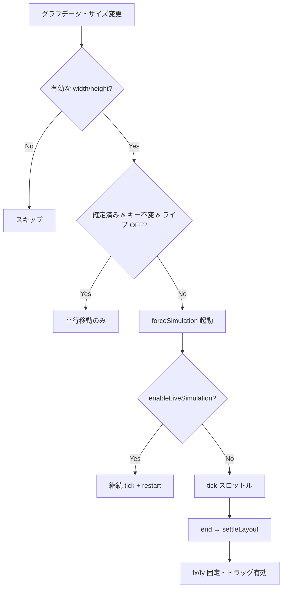

# D3 フォースグラフの描画パフォーマンス

トピックスペース・ドキュメント画面の `D3ForceGraph`（`src/app/_components/d3/force/graph.tsx`）は、大規模グラフでも操作可能な速度を保つため、**確定レイアウト（既定）** と **ライブシミュレーション（任意）** の 2 モードを持つ。PR #77 で関連ノード遷移のちらつき修正とあわせて導入され、PR #80 で単一ドキュメントビューにもライブ切替 UI が展開された。

統計パネル（次数・密度など）の仕様は [グラフ統計パネル](./graph-statistics-panel.md) を参照。

## 表示場所と props

| ビューア | `isLargeGraph` | `enableLiveSimulation` | 備考 |
|----------|----------------|------------------------|------|
| `multi-document-graph-viewer` | ノード > 1300 | 既定 `false`、ツールバーで切替可 | メインのリポジトリグラフ |
| `multi-document-graph-detail-viewer` | 同上 | 同上 | ドキュメント詳細内グラフ |
| `multi-document-graph-editor` | 同上 | 同上 | 編集モード |
| `single-document-graph-viewer` | `false` | 既定 **`true`**、ツールバーで切替可 | `/graph/[id]` 単一ドキュメントグラフ |
| `document-detail` | `false` | 既定 **`true`**、`LiveSimulationToggleButton` | ドキュメント詳細プレビュー |
| `related-nodes-viewer` | `false` | `true`（固定） | 近傍サブグラフ（常時ライブ） |
| その他（公開記事・フィールドプレビュー等） | `false` | 既定 `false` | 小規模グラフ |

**既定値の使い分け:** リポジトリ統合グラフ（1300 ノード超の可能性）はパフォーマンス優先でライブ OFF。単一ドキュメントビューはノード数が少ない前提のため、初回表示からライブ ON（微動で関係性を把握しやすくする）。

`isLargeGraph` の閾値は **1300 ノード**（各ビューアで `graphDocument.nodes.length > 1300`）。

## レイアウトモード

### 確定レイアウト（既定）

1. D3 `forceSimulation` を起動し、ノード配置を計算
2. `simulation.on("end")` で `settleLayout()` を実行
3. 各ノードの `fx` / `fy` を現在座標に固定し `simulation.stop()`
4. 以降、グラフデータ（ノード ID 集合・リンク数・クラスタ有無）が変わらない限り **再シミュレーションしない**

サイズ変更（ウィンドウリサイズ等）時は再計算せず、グラフ中心を保ったまま **平行移動** する。

### ライブシミュレーション

ツールバーの再生ボタン（`LiveSimulationToggleButton`）で有効化。`enableLiveSimulation === true` のとき:

- `alphaDecay` を小さくし、シミュレーションを継続
- `alpha` が `alphaMin` 未満になると `0.3` に戻して `restart()` — ノードが常に微動する
- ノード位置ドラッグは無効（`nodeDragEnabled` が `false`）

近傍グラフ（`RelatedNodesAndLinksViewer`）はノード数が少ないため、常にライブモードで表示する。

## 大規模グラフの LOD（詳細度制御）

`isLargeGraph === true` かつフルスクリーンでない場合、ズームアウト時に低次数ノードを非表示にする:

- `getVisibleByScaling(currentScale)` で閾値（隣接リンク数）を決定
- `node.neighborLinkCount <= visibleByScaling` のノードは `visible: false`
- ズーム変更時は **可視性のみ更新** し、シミュレーションは再起動しない

フルスクリーン時は全ノードを表示する。

## シミュレーションのチューニング

| ノード数 | tick スロットル | `alphaDecay`（確定時） | `charge` 補足 |
|----------|-----------------|------------------------|---------------|
| ≤ 500 | 16 ms | 0.028 | 標準 |
| 501–1000 | 24 ms | 0.05 | `distanceMax(400)` |
| > 1000 | 32 ms | 0.08 | `distanceMax(400)` |

tick ハンドラは `requestAnimationFrame` で React 状態更新をバッチ化する。

## シミュレーションキャッシュキー

再シミュレーション要否は `simulationDataKey` で判定:

```
{sorted node IDs}:{link count}:{isClustered}:{enableLiveSimulation}
```

確定済みかつキー不変・ライブ OFF のときは effect を早期 return する。ノード ID が変わるとキーも変わり、レイアウトを再計算する。

## React 描画の最適化

- `GraphNodeCircle` は `memo` + カスタム `graphNodeCirclePropsAreEqual`
- in-place 更新される座標・可視属性は `graphNode` 参照ではなく **プリミティブ props**（`nodeX`, `nodeY`, `nodeVisible` 等）で渡す
- ズーム・LOD 変更はノードオブジェクトを in-place 更新し、変更時のみ配列をスプレッドして再レンダー

## 固定レイアウト時のノードドラッグ

確定レイアウトかつ編集モードでないとき、`attachNodePositionDrag`（`node-position-drag-extension.tsx`）でノードを手動配置できる:

- D3 `drag` を **当該 SVG 内** の `.{graphIdentifier}-node` にのみバインド（他グラフへの伝播を防止）
- `data-node-id` 属性でノードを解決
- 位置変更は `requestAnimationFrame` でスロットル

## 関連ノードパネルと URL 遷移

ノード詳細（`NodePropertiesDetail`）の近傍グラフで別ノードをクリックすると:

1. `RelatedNodesAndLinksViewer.handleGraphNodeSelect` が **現在の node と同じ ID を無視**
2. `navigateToNode` が `router.replace(?list=true&nodeId=...)` を `scroll: false` で実行
3. コンテナサイズは初回 80 ms 待ってから `stableSize` に固定（レイアウトちらつき防止）

これにより URL 駆動の `nodeId` 更新とグラフ内選択がループしない。

## 処理フロー図



## トラブルシューティング

| 症状 | 確認ポイント |
|------|--------------|
| 大グラフで初回表示が重い | 確定レイアウトは 1 回のシミュレーションが必要。1300 超では LOD も併用 |
| ノードが動き続ける | ライブシミュレーションが ON。ツールバーで OFF にする |
| リサイズでグラフが飛ぶ | 確定後は平行移動のみ。データ変更で再レイアウトされた可能性 |
| 近傍グラフで nodeId が揺れる | `handleGraphNodeSelect` / `navigateToNode` の同一 ID ガードを確認 |
| ドラッグが効かない | ライブ ON または `isEditor` ではドラッグ無効 |
| 単一ドキュメントで常に微動する | 既定がライブ ON。ツールバー / `LiveSimulationToggleButton` で OFF にできる |

## 関連ファイル

- `src/app/_components/d3/force/graph.tsx` — シミュレーション本体
- `src/app/_components/d3/extension/node-position-drag-extension.tsx` — 固定レイアウト時ドラッグ
- `src/app/_components/view/graph-view/live-simulation-toggle-button.tsx` — ライブ切替 UI
- `src/app/_components/view/graph-view/graph-tool.tsx` — ツールバー統合
- `src/app/_components/view/graph-view/related-nodes-viewer.tsx` — 近傍サブグラフ
- `src/app/_components/view/node/node-properties-detail.tsx` — URL 駆動ノード遷移
- `src/app/_components/view/graph-view/single-document-graph-viewer.tsx` — 単一ドキュメントグラフ（ライブ既定 ON）
- `src/app/_components/document/document-detail.tsx` — ドキュメント詳細プレビュー
- `src/providers/container-size.tsx` — ResizeObserver によるコンテナ計測
