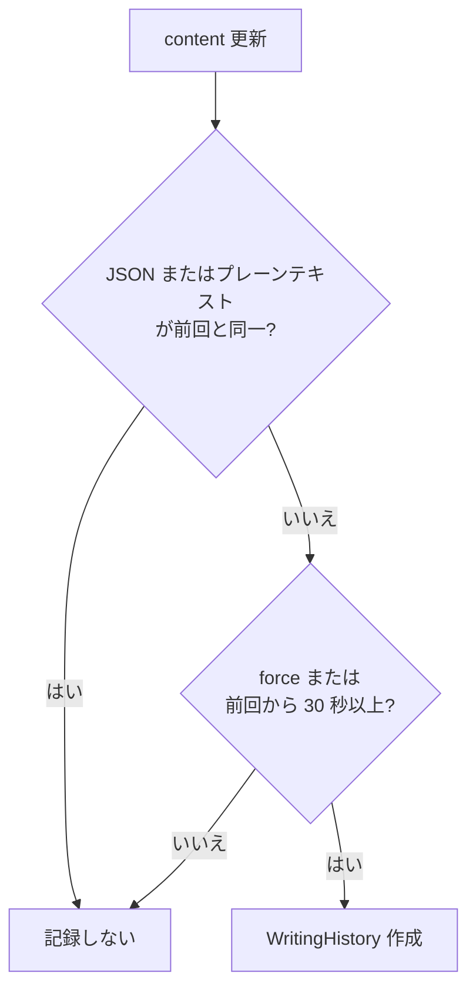

# 外部 Workspace REST API

外部 Web アプリ（例: SOS）が ArsTraverse の **執筆 Workspace** を同期するための REST エンドポイント。Tiptap 本文（`content`）、キュレトリアルコンテキスト、執筆履歴の取得・復元、共同編集者の追加を HTTP で行える。

MCP（`/api/mcp`）や TopicSpace 公開 REST API（`/api/topic-spaces/{id}`）とは別の統合面 — **認証必須** の執筆データ向け。

## 認証

[MCP 認証](./mcp-authentication.md) と同じ方式:

| 順位 | 方式             | ヘッダー                                  |
| ---- | ---------------- | ----------------------------------------- |
| 1    | アクセストークン | `Authorization: Bearer <mcp1....>`        |
| 2    | セッション       | ブラウザ Cookie `next-auth.session-token` |

トークンは `/mcp/authorize` で発行（**プラットフォーム** スコープで十分。TopicSpace 未作成でも Workspace API は利用可能）。外部 Web アプリ連携では `redirect_uri` + `EXTERNAL_OAUTH_REDIRECT_URIS` による OAuth 風コールバックも利用できる（詳細は [MCP 認証 — 外部 OAuth リダイレクト](./mcp-authentication.md#外部-oauth-リダイレクトweb-アプリ連携)）。

新規作成時、トークンに紐づくユーザーが Workspace の **所有者** になる。

## 識別子: `source` + `sourceKey`

| フィールド   | 説明                                                         |
| ------------ | ------------------------------------------------------------ |
| `source`     | 外部アプリ識別子（例: `sos`）                                |
| `sourceKey`  | アプリ内の一意キー（例: 記事 slug、外部 ID）                 |

DB 上は `@@unique([source, sourceKey])`。同一ペアは 1 Workspace にマップされる。

- **作成**: `PUT` で存在しなければ新規作成（所有者 = 認証ユーザー）
- **更新**: 所有者または **collaborator** が `content` 等を更新可能
- **論理削除後の復活**: 削除済み（`isDeleted: true`）の同一 `source`/`sourceKey` を `PUT` すると復活する。**所有者または collaborator のみ** 可能。それ以外は `403`

GUI から作成した Workspace は `source` / `sourceKey` が `null` のため、この API の upsert キーには使えない。

## エンドポイント一覧

| メソッド | パス                                     | 説明                                      |
| -------- | ---------------------------------------- | ----------------------------------------- |
| `GET`    | `/api/external/me`                       | 認証ユーザー情報                          |
| `GET`    | `/api/external/workspaces`               | `source` 単位の一覧、または 1 件取得      |
| `PUT`    | `/api/external/workspaces`               | `source` + `sourceKey` による upsert      |
| `GET`    | `/api/external/workspaces/history`       | 執筆履歴一覧                              |
| `POST`   | `/api/external/workspaces/history`       | 履歴から本文を復元                        |
| `POST`   | `/api/external/workspaces/collaborators` | **所有者のみ** collaborator 追加            |

## GET `/api/external/me`

認証済みユーザーの公開プロフィールを返す。

```json
{
  "user": {
    "id": "clxxx...",
    "name": "Curator Name",
    "image": "https://..."
  }
}
```

## GET `/api/external/workspaces`

### クエリパラメータ

| パラメータ  | 必須 | 説明                                                         |
| ----------- | ---- | ------------------------------------------------------------ |
| `source`    | はい | 外部アプリ識別子                                             |
| `sourceKey` | 任意 | 指定時は 1 件取得。未指定時は `source` に属する一覧（`updatedAt` 降順） |

アクセス可能な Workspace は **所有者または collaborator** のみ。該当なしは `404`（単件）または空配列（一覧）。

### レスポンス（単件）

```json
{
  "workspace": {
    "id": "clxxx...",
    "source": "sos",
    "sourceKey": "article-42",
    "name": "記事タイトル",
    "description": null,
    "status": "DRAFT",
    "content": { "type": "doc", "content": [ /* TipTap JSON */ ] },
    "curatorialContext": { "stance": "...", "extractionRules": {} },
    "createdAt": "2026-08-31T12:00:00.000Z",
    "updatedAt": "2026-08-31T12:30:00.000Z"
  }
}
```

### レスポンス（一覧）

```json
{
  "workspaces": [ /* ExternalWorkspaceDto[] */ ]
}
```

`status` は `DRAFT` | `IN_PROGRESS` | `REVIEW` | `PUBLISHED` | `ARCHIVED`。

## PUT `/api/external/workspaces`

`source` + `sourceKey` で upsert。本文更新時は執筆履歴を自動記録（下記「執筆履歴」）。

### リクエストボディ

| フィールド           | 必須 | 説明                                                         |
| -------------------- | ---- | ------------------------------------------------------------ |
| `source`             | はい | 外部アプリ識別子                                             |
| `sourceKey`          | はい | アプリ内一意キー                                             |
| `name`               | 任意 | 表示名。未指定時は既存値維持（新規は `sourceKey`）           |
| `description`        | 任意 | `null` でクリア可能                                          |
| `content`            | 任意 | TipTap doc JSON（`{ type: "doc", content?: [...] }`）        |
| `curatorialContext`  | 任意 | キュレトリアルコンテキスト（`stance`, `extractionRules`, `negativeArchive` 等） |
| `status`             | 任意 | `WorkspaceStatus` 列挙値                                     |
| `changeDescription`  | 任意 | 履歴に残す変更説明（既定: 「内容を更新しました」）           |
| `recordHistory`      | 任意 | `false` で履歴記録をスキップ（既定: `true`）               |

### レスポンス

```json
{ "workspace": { /* ExternalWorkspaceDto */ } }
```

### エラー

| HTTP | 条件                                                         |
| ---- | ------------------------------------------------------------ |
| 400  | `source` / `sourceKey` 欠落                                  |
| 403  | 既存 Workspace への書き込み権限なし、または削除済みの復活不可 |
| 401  | トークン・セッション無効                                     |

## GET `/api/external/workspaces/history`

### クエリパラメータ

| パラメータ    | 必須 | 説明                    |
| ------------- | ---- | ----------------------- |
| `workspaceId` | はい | Workspace ID            |

最大 **50 件**（`createdAt` 降順）。`preview` / `previousPreview` は TipTap 本文のプレーンテキスト要約（最大 160 文字）。

```json
{
  "histories": [
    {
      "id": "clhist...",
      "workspaceId": "clxxx...",
      "changeDescription": "内容を更新しました",
      "preview": "美術大学と美大生 相模原市は…",
      "previousPreview": "",
      "createdAt": "2026-08-31T12:30:00.000Z",
      "changedBy": { "id": "...", "name": "...", "image": "..." }
    }
  ]
}
```

## POST `/api/external/workspaces/history`

履歴 1 件の `currentContent` を Workspace 本文に復元する。復元操作自体も履歴に記録される（`changeDescription`: 「履歴から復元しました」）。

### リクエストボディ

```json
{
  "workspaceId": "clxxx...",
  "historyId": "clhist..."
}
```

### レスポンス

```json
{ "workspace": { /* 復元後の ExternalWorkspaceDto */ } }
```

## POST `/api/external/workspaces/collaborators`

**Workspace 所有者のみ** が共同編集者を追加できる。

### リクエストボディ

| フィールド    | 必須 | 説明                                      |
| ------------- | ---- | ----------------------------------------- |
| `workspaceId` | はい | 対象 Workspace ID                         |
| `userId`      | 任意 | 追加するユーザーの ID（`userEmail` と排他） |
| `userEmail`   | 任意 | 追加するユーザーのメール（ArsTraverse 登録済み） |

所有者自身を collaborator に追加は `400`。対象ユーザー未登録は `404`。

```json
{
  "workspaceId": "clxxx...",
  "collaborator": { "id": "...", "name": "...", "image": "..." }
}
```

## 執筆履歴の記録ルール

`content` 更新時、`recordWritingHistoryIfNeeded` が呼ばれる（`recordHistory: false` で無効化可能）。



- **スロットル**: 直近の履歴から **30 秒** 以内の連続保存は 1 件にまとめる（`DEFAULT_WRITING_HISTORY_INTERVAL_MS`）
- **同一判定**: JSON 文字列一致、または TipTap プレーンテキスト一致（`blockId` 等の属性差は無視）
- **強制記録**: 新規作成・履歴復元は `force: true` で即時記録
- GUI の執筆履歴モーダル（`WritingHistoryModal`）も同じ `writingHistory` テーブルを参照

## tRPC 相当

ブラウザ内の ArsTraverse UI は tRPC `workspace` ルーターを使用。外部 REST と共有するサービス層:

| REST | tRPC |
| ---- | ---- |
| `PUT /api/external/workspaces` | `workspace.upsertBySource` |
| `GET .../history` | `workspace.getWritingHistory` |
| `POST .../history` | `workspace.restoreWritingHistory` |
| `POST .../collaborators` | `workspace.addCollaborator`（REST は `userEmail` 解決を追加） |

## 使用例

```bash
export TOKEN="mcp1...."
export BASE="http://localhost:3000"

# 認証ユーザー確認
curl -s -H "Authorization: Bearer $TOKEN" "$BASE/api/external/me"

# 外部キーで upsert（新規 or 更新）
curl -s -X PUT "$BASE/api/external/workspaces" \
  -H "Authorization: Bearer $TOKEN" \
  -H "Content-Type: application/json" \
  -d '{
    "source": "sos",
    "sourceKey": "article-42",
    "name": "美大生のまち",
    "content": {
      "type": "doc",
      "content": [{
        "type": "paragraph",
        "content": [{ "type": "text", "text": "相模原市は美大生のまちです。" }]
      }]
    },
    "changeDescription": "SOS から同期"
  }'

# 一覧取得
curl -s -H "Authorization: Bearer $TOKEN" \
  "$BASE/api/external/workspaces?source=sos"

# 単件取得
curl -s -H "Authorization: Bearer $TOKEN" \
  "$BASE/api/external/workspaces?source=sos&sourceKey=article-42"

# 執筆履歴
curl -s -H "Authorization: Bearer $TOKEN" \
  "$BASE/api/external/workspaces/history?workspaceId=WORKSPACE_ID"

# 履歴から復元
curl -s -X POST "$BASE/api/external/workspaces/history" \
  -H "Authorization: Bearer $TOKEN" \
  -H "Content-Type: application/json" \
  -d '{"workspaceId":"WORKSPACE_ID","historyId":"HISTORY_ID"}'

# 共同編集者追加（所有者のみ）
curl -s -X POST "$BASE/api/external/workspaces/collaborators" \
  -H "Authorization: Bearer $TOKEN" \
  -H "Content-Type: application/json" \
  -d '{"workspaceId":"WORKSPACE_ID","userEmail":"collaborator@example.com"}'
```

### Web アプリ OAuth 連携（概要）

1. ArsTraverse `.env` に `EXTERNAL_OAUTH_REDIRECT_URIS` を設定
2. ユーザーを `/mcp/authorize?client=...&redirect_uri=...&state=...` にリダイレクト
3. Google ログイン → 「アクセスを許可」
4. `redirect_uri?token=...&expires_at=...&state=...` でトークン受取
5. 以降、上記 REST を `Authorization: Bearer` で呼び出す

## 関連ファイル

- `src/app/api/external/me/route.ts`
- `src/app/api/external/workspaces/route.ts`
- `src/app/api/external/workspaces/history/route.ts`
- `src/app/api/external/workspaces/collaborators/route.ts`
- `src/server/services/workspace/external-workspace.ts` — upsert・履歴・collaborator
- `src/server/services/workspace/writing-history.ts` — 履歴スロットル・プレビュー
- `src/server/services/workspace/resolve-external-auth.ts` — 認証解決
- `src/server/api/routers/workspace.ts` — tRPC `upsertBySource` 等
- `src/app/_components/curators-writing-workspace/writing-history-modal.tsx` — GUI 履歴 UI
- `prisma/schema.prisma` — `Workspace`, `WritingHistory` モデル

## 関連ドキュメント

- [MCP 認証](./mcp-authentication.md) — トークン発行・OAuth リダイレクト
- [執筆体験とデータの関係](./concept-writing-experience.md) — Workspace 本文とグラフ・ストーリーの概念
- [データ連携の概念](./concept-writing-data-linkage.md) — TipTap `content` と知識グラフの連携
- [TopicSpace 公開 REST API](./topic-space-public-rest-api.md) — グラフ JSON 取得（認証不要・別統合面）
