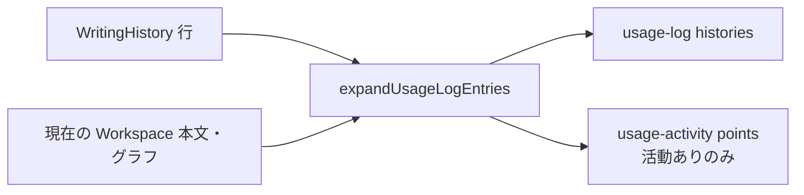
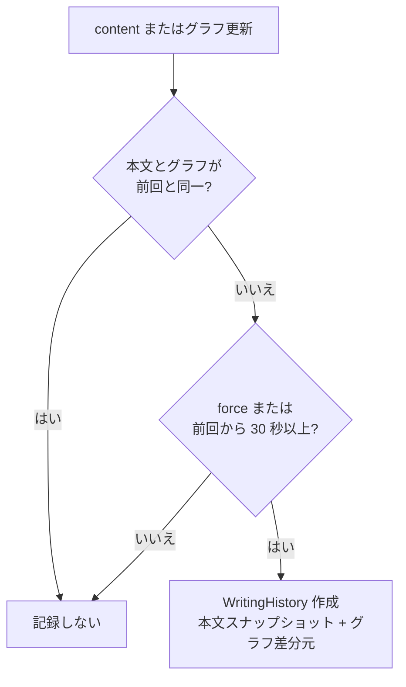

# 外部 Workspace REST API

外部 Web アプリ（例: SOS）が ArsTraverse の **執筆 Workspace** を同期するための REST エンドポイント。Tiptap 本文（`content`）、キュレトリアルコンテキスト、執筆履歴の取得・復元、共同編集者の追加を HTTP で行える。

MCP（`/api/mcp`）や TopicSpace 公開 REST API（`/api/topic-spaces/{id}`）とは別の統合面 — **認証必須** の執筆データ向け。

## 認証

[MCP 認証](./mcp-authentication.md) と同じ方式:

| 順位 | 方式             | ヘッダー                                  |
| ---- | ---------------- | ----------------------------------------- |
| 1    | アクセストークン | `Authorization: Bearer <mcp1....>`        |
| 2    | セッション       | ブラウザ Cookie `next-auth.session-token` |

トークンは `/mcp/authorize` で発行（**プラットフォーム** スコープで十分。TopicSpace 未作成でも Workspace API は利用可能）。外部 Web アプリ連携では `redirect_uri` + `EXTERNAL_OAUTH_REDIRECT_URIS` による OAuth 風コールバックも利用できる（詳細は [MCP 認証 — 外部 OAuth リダイレクト](./mcp-authentication.md#外部-oauth-リダイレクトweb-アプリ連携)）。

新規作成時、トークンに紐づくユーザーが Workspace の **所有者** になる。

## 識別子: `source` + `sourceKey`

| フィールド   | 説明                                                         |
| ------------ | ------------------------------------------------------------ |
| `source`     | 外部アプリ識別子（例: `sos`）                                |
| `sourceKey`  | アプリ内の一意キー（例: 記事 slug、外部 ID）                 |

DB 上は `@@unique([source, sourceKey])`。同一ペアは 1 Workspace にマップされる。

- **作成**: `PUT` で存在しなければ新規作成（所有者 = 認証ユーザー）
- **更新**: 所有者または **collaborator** が `content` 等を更新可能
- **論理削除**: `DELETE` で `isDeleted: true` にする（所有者または collaborator）。一覧・単件 GET では削除済みは見えない
- **論理削除後の復活**: 削除済みの同一 `source`/`sourceKey` を `PUT` すると復活する。**所有者または collaborator のみ** 可能。それ以外は `403`

GUI から作成した Workspace は `source` / `sourceKey` が `null` のため、この API の upsert キーには使えない。

## エンドポイント一覧

| メソッド | パス                                     | 説明                                      |
| -------- | ---------------------------------------- | ----------------------------------------- |
| `GET`    | `/api/external/me`                       | 認証ユーザー情報                          |
| `GET`    | `/api/external/workspaces`               | `source` 単位の一覧、または 1 件取得      |
| `PUT`    | `/api/external/workspaces`               | `source` + `sourceKey` による upsert      |
| `DELETE` | `/api/external/workspaces`               | `source` + `sourceKey` で論理削除         |
| `GET`    | `/api/external/workspaces/history`       | 執筆履歴一覧                              |
| `POST`   | `/api/external/workspaces/history`       | 履歴から本文・グラフを復元                |
| `GET`    | `/api/external/workspaces/usage-log`     | 利用ログ（履歴＋間隔ギャップの展開）      |
| `GET`    | `/api/external/workspaces/usage-activity` | `source` 横断の執筆活動トレンド        |
| `POST`   | `/api/external/workspaces/collaborators` | **所有者のみ** collaborator 追加            |

## GET `/api/external/me`

認証済みユーザーの公開プロフィールを返す。

```json
{
  "user": {
    "id": "clxxx...",
    "name": "Curator Name",
    "image": "https://..."
  }
}
```

## GET `/api/external/workspaces`

### クエリパラメータ

| パラメータ  | 必須 | 説明                                                         |
| ----------- | ---- | ------------------------------------------------------------ |
| `source`    | はい | 外部アプリ識別子                                             |
| `sourceKey` | 任意 | 指定時は 1 件取得。未指定時は `source` に属する一覧（`updatedAt` 降順） |

アクセス可能な Workspace は **所有者または collaborator** のみ。該当なしは `404`（単件）または空配列（一覧）。

### レスポンス（単件）

```json
{
  "workspace": {
    "id": "clxxx...",
    "source": "sos",
    "sourceKey": "article-42",
    "name": "記事タイトル",
    "description": null,
    "status": "DRAFT",
    "content": { "type": "doc", "content": [ /* TipTap JSON */ ] },
    "curatorialContext": { "stance": "...", "extractionRules": {} },
    "createdAt": "2026-08-31T12:00:00.000Z",
    "updatedAt": "2026-08-31T12:30:00.000Z"
  }
}
```

### レスポンス（一覧）

```json
{
  "workspaces": [ /* ExternalWorkspaceDto[] */ ]
}
```

`status` は `DRAFT` | `IN_PROGRESS` | `REVIEW` | `PUBLISHED` | `ARCHIVED`。

## PUT `/api/external/workspaces`

`source` + `sourceKey` で upsert。本文更新時は執筆履歴を自動記録（下記「執筆履歴」）。

### リクエストボディ

| フィールド           | 必須 | 説明                                                         |
| -------------------- | ---- | ------------------------------------------------------------ |
| `source`             | はい | 外部アプリ識別子                                             |
| `sourceKey`          | はい | アプリ内一意キー                                             |
| `name`               | 任意 | 表示名。未指定時は既存値維持（新規は `sourceKey`）           |
| `description`        | 任意 | `null` でクリア可能                                          |
| `content`            | 任意 | TipTap doc JSON（`{ type: "doc", content?: [...] }`）        |
| `curatorialContext`  | 任意 | キュレトリアルコンテキスト（`stance`, `extractionRules`, `negativeArchive` 等） |
| `status`             | 任意 | `WorkspaceStatus` 列挙値                                     |
| `changeDescription`  | 任意 | 履歴に残す変更説明（既定: 「内容を更新しました」）           |
| `recordHistory`      | 任意 | `false` で履歴記録をスキップ（既定: `true`）               |

### レスポンス

```json
{ "workspace": { /* ExternalWorkspaceDto */ } }
```

### エラー

| HTTP | 条件                                                         |
| ---- | ------------------------------------------------------------ |
| 400  | `source` / `sourceKey` 欠落                                  |
| 403  | 既存 Workspace への書き込み権限なし、または削除済みの復活不可 |
| 401  | トークン・セッション無効                                     |

## DELETE `/api/external/workspaces`

`source` + `sourceKey` で Workspace を**論理削除**する。物理削除は行わない。

### クエリパラメータ

| パラメータ  | 必須 | 説明           |
| ----------- | ---- | -------------- |
| `source`    | はい | 外部アプリ識別子 |
| `sourceKey` | はい | アプリ内一意キー |

### レスポンス

```json
{ "ok": true }
```

該当 Workspace が無い場合は `404`。書き込み権限が無い場合は `403`。

## GET `/api/external/workspaces/history`

### クエリパラメータ

| パラメータ    | 必須 | 説明                    |
| ------------- | ---- | ----------------------- |
| `workspaceId` | はい | Workspace ID            |

最大 **50 件**（`createdAt` 降順）。

| フィールド | 説明 |
| ---------- | ---- |
| `preview` / `previousPreview` | TipTap 本文のプレーンテキスト要約（空白正規化、最大 160 文字） |
| `previousText` / `currentText` | 段落改行を残した全文。差分表示向け |
| `hasGraph` | この版にライブグラフのスナップショットがあるか |
| `graphSummary` | グラフ差分の短い要約（例: `+2ノード · −1関係`） |
| `graphDiff` | 追加・削除・更新・**プロパティのみ**変更されたノード／関係。変化がなければ `null` |
| `graphDiff.summary.propertyChangeCount` | ラベル・型など、名前以外のプロパティ差分の件数 |

`graphDiff` の `change` は `added` | `removed` | `updated` | `property`（ノード／関係）。執筆履歴 API の要約は `diffLiveGraphs` ベース。利用ログ側のイベント列は `classifyGraphEvents`（下記）を使う。

```json
{
  "histories": [
    {
      "id": "clhist...",
      "workspaceId": "clxxx...",
      "changeDescription": "内容を更新しました",
      "preview": "美術大学と美大生 相模原市は…",
      "previousPreview": "",
      "previousText": "",
      "currentText": "美術大学と美大生\n相模原市は美大生のまちです。",
      "hasGraph": true,
      "graphSummary": "+1ノード · +1関係",
      "graphDiff": {
        "nodes": [
          { "change": "added", "id": "n1", "name": "桶屋", "label": "Studio" }
        ],
        "relationships": [],
        "summary": {
          "addedNodeCount": 1,
          "removedNodeCount": 0,
          "updatedNodeCount": 0,
          "addedRelationshipCount": 0,
          "removedRelationshipCount": 0,
          "updatedRelationshipCount": 0,
          "metaChanged": false
        }
      },
      "createdAt": "2026-08-31T12:30:00.000Z",
      "changedBy": { "id": "...", "name": "...", "image": "..." }
    }
  ]
}
```

## POST `/api/external/workspaces/history`

履歴 1 件の保存時点の本文（`currentContent`）とグラフを Workspace に復元する。表示中の差分だけを打ち消すのではなく、その版のスナップショット全体へ巻き戻す。グラフは `currentGraph` を使う。`previousGraph` だけある行は、この版にグラフが残っていないものとして本文のみ戻す。両方無いレガシー行だけ、前後の履歴から当時のグラフを補う。それでもグラフが無い履歴は本文のみ戻す。復元操作自体も履歴に記録される（`changeDescription`: 「履歴から復元しました」）。

### リクエストボディ

```json
{
  "workspaceId": "clxxx...",
  "historyId": "clhist..."
}
```

### レスポンス

```json
{ "workspace": { /* 復元後の ExternalWorkspaceDto */ } }
```

## GET `/api/external/workspaces/usage-log`

SOS 等が「誰が・いつ・何を足したか」を集計するためのログ。`WritingHistory` 行をそのまま返すのではなく、**履歴の間隔**と**最後の履歴から現在の保存**に挟まれた変更を合成したエントリ列を返す（新しい順）。

### クエリパラメータ

| パラメータ    | 必須 | 説明 |
| ------------- | ---- | ---- |
| `workspaceId` | はい | Workspace ID |
| `take`        | 任意 | 読み込む履歴行数の上限（1〜500、既定 500）。`truncated: true` は DB 上にもっと履歴がある／展開後の件数が上限を超えた可能性 |
| `historyId`   | 任意 | 指定時は当該エントリの**グラフ JSON スナップショット**のみ返す（本文は usage-log 一覧側の `previousText` / `currentText` を使う） |

### レスポンス（一覧）

```json
{
  "truncated": false,
  "histories": [
    {
      "id": "clhist...",
      "workspaceId": "clxxx...",
      "changeDescription": "グラフを更新しました",
      "previousText": "短い本文",
      "currentText": "短い本文",
      "graphEvents": [
        {
          "kind": "node",
          "change": "added",
          "origin": "manual",
          "id": "gallery",
          "name": "ギャラリー",
          "label": "Concept"
        }
      ],
      "createdAt": "2026-09-22T08:30:40.000Z",
      "changedBy": { "id": "...", "name": "...", "image": "..." }
    }
  ]
}
```

#### 合成エントリの `id`

| `id` パターン | 意味 |
| ------------- | ---- |
| 通常の履歴 ID | `WritingHistory` 1 行（`previous*` → `current*` の差分をイベント化） |
| `unrecorded:{olderId}:{newerId}` | 2 つの履歴スナップショットの間に残っていた変更。`changeDescription` は「履歴の間隔に残っていた変更です」 |
| `unrecorded:workspace` | 最新履歴から**いまの Workspace 保存**までの差分。`changeDescription` は「いまの保存にあって、直前の履歴に無い変更です」。`changedBy.id` は `unrecorded` |

`historyId` でグラフを取るとき、上記の合成 ID も使える（間隔ギャップは新しい側履歴の `previousGraph`、現在保存分はライブ `curatorialContext` のグラフ）。

#### `graphEvents`

`classifyGraphEvents(previousGraph, currentGraph)` の結果。ノード／関係ごとに:

| フィールド | 説明 |
| ---------- | ---- |
| `change` | `added` / `removed` / `updated` / `promoted`（スケッチ→根拠付き） / `property`（ラベル・型など名前以外） |
| `origin` | `manual` / `sketch` / `llm` / `unknown`（追加・昇格の出自。`properties.graphEdit`・`edits`・`provenance` / `blockExtractions` から推定） |

更新・削除は活動トレンドには含めない（下記 usage-activity）。

### レスポンス（`historyId` 指定）

```json
{ "currentGraph": { /* liveGraph JSON または履歴スナップショット */ } }
```

## GET `/api/external/workspaces/usage-activity`

認証ユーザーがアクセスできる Workspace を、`source` で横断し、**執筆の加算活動**だけを時系列で返す。各 Workspace の usage-log と同じ `expandUsageLogEntries` を使い、活動があるエントリだけを `points` に載せる。

### クエリパラメータ

| パラメータ | 必須 | 説明 |
| ---------- | ---- | ---- |
| `source`   | 任意 | 外部アプリ識別子。未指定時は `sos-research` |

### レスポンス

```json
{
  "truncated": false,
  "points": [
    {
      "at": "2026-09-22T08:30:40.000Z",
      "slug": "article-42",
      "title": "記事タイトル",
      "textAdded": 120,
      "manual": 1,
      "sketch": 0,
      "promoted": 0,
      "llm": 2,
      "unknown": 0
    }
  ]
}
```

| フィールド | 説明 |
| ---------- | ---- |
| `slug` | Workspace の `sourceKey` |
| `textAdded` | `max(0, len(currentText) - len(previousText))`（短くしただけの保存は 0） |
| `manual` / `sketch` / `llm` / `unknown` | `graphEvents` の **追加**（`change: "added"`）を `origin` で集計 |
| `promoted` | スケッチが本文根拠付きになった件数（`change: "promoted"`） |

`points` は `at` 降順。いずれかのカウントまたは `textAdded` が正のエントリのみ含む。


```mermaid
flowchart LR
  WH[WritingHistory 行] --> EXP[expandUsageLogEntries]
  LIVE[現在の Workspace 本文・グラフ] --> EXP
  EXP --> LOG[usage-log histories]
  EXP --> ACT[usage-activity points<br/>活動ありのみ]
```

## POST `/api/external/workspaces/collaborators`

**Workspace 所有者のみ** が共同編集者を追加できる。

### リクエストボディ

| フィールド    | 必須 | 説明                                      |
| ------------- | ---- | ----------------------------------------- |
| `workspaceId` | はい | 対象 Workspace ID                         |
| `userId`      | 任意 | 追加するユーザーの ID（`userEmail` と排他） |
| `userEmail`   | 任意 | 追加するユーザーのメール（ArsTraverse 登録済み） |

所有者自身を collaborator に追加は `400`。対象ユーザー未登録は `404`。

```json
{
  "workspaceId": "clxxx...",
  "collaborator": { "id": "...", "name": "...", "image": "..." }
}
```

## 執筆履歴の記録ルール

`content` または `curatorialContext`（ライブグラフ）の更新時、`recordWritingHistoryIfNeeded` が呼ばれる（`recordHistory: false` で無効化可能）。`forceHistory: true` のときは 30 秒スロットルを無視する。


```mermaid
flowchart TD
    A[content またはグラフ更新] --> B{本文とグラフが<br/>前回と同一?}
    B -->|はい| Z[記録しない]
    B -->|いいえ| C{force または<br/>前回から 30 秒以上?}
    C -->|はい| D[WritingHistory 作成<br/>本文スナップショット + グラフ差分元]
    C -->|いいえ| Z
```

- **スロットル**: 直近の履歴から **30 秒** 以内の連続保存は 1 件にまとめる（`DEFAULT_WRITING_HISTORY_INTERVAL_MS`）
- **同一判定（本文）**: JSON 文字列一致、または TipTap プレーンテキスト一致（`blockId` 等の属性差は無視）
- **同一判定（グラフ）**: `updatedAt` を除いたライブグラフ JSON 一致（ラベル・関係型のみの変更も 1 履歴として記録）
- **保存内容**: `previousContent` / `currentContent` に加え `previousGraph` / `currentGraph`
- **変更説明**: 本文のみ →「内容を更新しました」、グラフのみ →「グラフを更新しました」、両方 →「本文とグラフを更新しました」
- **強制記録**: 新規作成・履歴復元・抽出完了（`forceHistory`）は即時記録
- **30 秒スロットルと利用ログ**: スロットルでまとめられた保存のあいだの細かい変更は `WritingHistory` に残らないが、`usage-log` / `usage-activity` が履歴行の前後差分で**合成エントリ**として表面化する
- GUI の執筆履歴モーダル（`WritingHistoryModal`）も同じ `writingHistory` テーブルを参照

## tRPC 相当

ブラウザ内の ArsTraverse UI は tRPC `workspace` ルーターを使用。外部 REST と共有するサービス層:

| REST | tRPC |
| ---- | ---- |
| `PUT /api/external/workspaces` | `workspace.upsertBySource` |
| `DELETE /api/external/workspaces` | （tRPC なし・REST のみ） |
| `GET .../history` | `workspace.getWritingHistory` |
| `POST .../history` | `workspace.restoreWritingHistory` |
| `GET .../usage-log` | （tRPC なし・`listWritingUsageLog` / `getWritingUsageLogGraph`） |
| `GET .../usage-activity` | （tRPC なし・`listWritingUsageActivity`） |
| `POST .../collaborators` | `workspace.addCollaborator`（REST は `userEmail` 解決を追加） |

## 使用例

```bash
export TOKEN="mcp1...."
export BASE="http://localhost:3000"

# 認証ユーザー確認
curl -s -H "Authorization: Bearer $TOKEN" "$BASE/api/external/me"

# 外部キーで upsert（新規 or 更新）
curl -s -X PUT "$BASE/api/external/workspaces" \
  -H "Authorization: Bearer $TOKEN" \
  -H "Content-Type: application/json" \
  -d '{
    "source": "sos",
    "sourceKey": "article-42",
    "name": "美大生のまち",
    "content": {
      "type": "doc",
      "content": [{
        "type": "paragraph",
        "content": [{ "type": "text", "text": "相模原市は美大生のまちです。" }]
      }]
    },
    "changeDescription": "SOS から同期"
  }'

# 一覧取得
curl -s -H "Authorization: Bearer $TOKEN" \
  "$BASE/api/external/workspaces?source=sos"

# 単件取得
curl -s -H "Authorization: Bearer $TOKEN" \
  "$BASE/api/external/workspaces?source=sos&sourceKey=article-42"

# 執筆履歴
curl -s -H "Authorization: Bearer $TOKEN" \
  "$BASE/api/external/workspaces/history?workspaceId=WORKSPACE_ID"

# 履歴から復元
curl -s -X POST "$BASE/api/external/workspaces/history" \
  -H "Authorization: Bearer $TOKEN" \
  -H "Content-Type: application/json" \
  -d '{"workspaceId":"WORKSPACE_ID","historyId":"HISTORY_ID"}'

# 共同編集者追加（所有者のみ）
curl -s -X POST "$BASE/api/external/workspaces/collaborators" \
  -H "Authorization: Bearer $TOKEN" \
  -H "Content-Type: application/json" \
  -d '{"workspaceId":"WORKSPACE_ID","userEmail":"collaborator@example.com"}'

# 論理削除
curl -s -X DELETE "$BASE/api/external/workspaces?source=sos&sourceKey=article-42" \
  -H "Authorization: Bearer $TOKEN"

# 利用ログ（活動イベント付き）
curl -s -H "Authorization: Bearer $TOKEN" \
  "$BASE/api/external/workspaces/usage-log?workspaceId=WORKSPACE_ID&take=100"

# 横断活動トレンド（既定 source=sos-research）
curl -s -H "Authorization: Bearer $TOKEN" \
  "$BASE/api/external/workspaces/usage-activity?source=sos-research"
```

### Web アプリ OAuth 連携（概要）

1. ArsTraverse `.env` に `EXTERNAL_OAUTH_REDIRECT_URIS` を設定
2. ユーザーを `/mcp/authorize?client=...&redirect_uri=...&state=...` にリダイレクト
3. Google ログイン → 「アクセスを許可」
4. `redirect_uri?token=...&expires_at=...&state=...` でトークン受取
5. 以降、上記 REST を `Authorization: Bearer` で呼び出す

## 関連ファイル

- `src/app/api/external/me/route.ts`
- `src/app/api/external/workspaces/route.ts`
- `src/app/api/external/workspaces/history/route.ts`
- `src/app/api/external/workspaces/collaborators/route.ts`
- `src/app/api/external/workspaces/usage-log/route.ts`
- `src/app/api/external/workspaces/usage-activity/route.ts`
- `src/server/services/workspace/external-workspace.ts` — upsert・削除・履歴・利用ログ
- `src/server/services/workspace/usage-log-entries.ts` — 履歴間ギャップの合成
- `src/server/services/workspace/usage-activity.ts` — 活動ポイント集計
- `src/server/services/workspace/workspace-graph-history.ts` — グラフ差分・`classifyGraphEvents`
- `src/server/services/workspace/writing-history.ts` — 履歴スロットル・復元スナップショット解決
- `src/server/services/workspace/resolve-external-auth.ts` — 認証解決
- `src/server/api/routers/workspace.ts` — tRPC `upsertBySource` 等
- `src/app/_components/curators-writing-workspace/writing-history-modal.tsx` — GUI 履歴 UI
- `prisma/schema.prisma` — `Workspace`, `WritingHistory` モデル

## 関連ドキュメント

- [MCP 認証](./mcp-authentication.md) — トークン発行・OAuth リダイレクト
- [執筆体験とデータの関係](./concept-writing-experience.md) — Workspace 本文とグラフ・ストーリーの概念
- [データ連携の概念](./concept-writing-data-linkage.md) — TipTap `content` と知識グラフの連携
- [TopicSpace 公開 REST API](./topic-space-public-rest-api.md) — グラフ JSON 取得（認証不要・別統合面）
