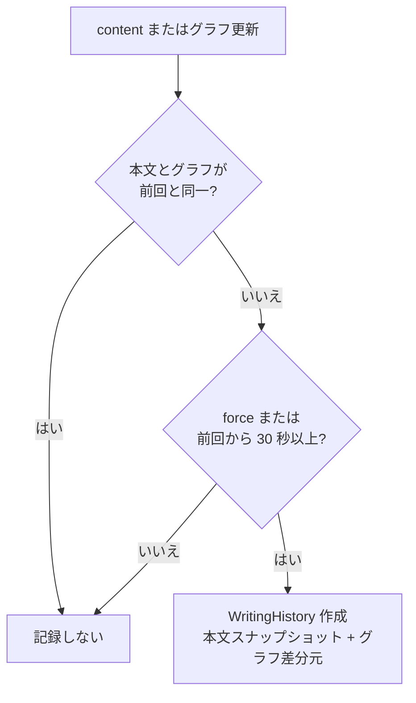

# 外部 Workspace REST API

外部 Web アプリ（例: SOS）が ArsTraverse の **執筆 Workspace** を同期するための REST エンドポイント。Tiptap 本文（`content`）、キュレトリアルコンテキスト、執筆履歴の取得・復元、共同編集者の追加を HTTP で行える。

MCP（`/api/mcp`）や TopicSpace 公開 REST API（`/api/topic-spaces/{id}`）とは別の統合面 — **認証必須** の執筆データ向け。

## 認証

[MCP 認証](./mcp-authentication.md) と同じ方式:

| 順位 | 方式             | ヘッダー                                  |
| ---- | ---------------- | ----------------------------------------- |
| 1    | アクセストークン | `Authorization: Bearer <mcp1....>`        |
| 2    | セッション       | ブラウザ Cookie `next-auth.session-token` |

トークンは `/mcp/authorize` で発行（**プラットフォーム** スコープで十分。TopicSpace 未作成でも Workspace API は利用可能）。外部 Web アプリ連携では `redirect_uri` + `EXTERNAL_OAUTH_REDIRECT_URIS` による OAuth 風コールバックも利用できる（詳細は [MCP 認証 — 外部 OAuth リダイレクト](./mcp-authentication.md#外部-oauth-リダイレクトweb-アプリ連携)）。

新規作成時、トークンに紐づくユーザーが Workspace の **所有者** になる。読み書きは、ログイン済み（有効なトークンまたはセッション）であれば所有者や共同編集者でなくてもできる。未認証は `401`。

## 識別子: `source` + `sourceKey`

| フィールド   | 説明                                                         |
| ------------ | ------------------------------------------------------------ |
| `source`     | 外部アプリ識別子（例: `sos`）                                |
| `sourceKey`  | アプリ内の一意キー（例: 記事 slug、外部 ID）                 |

DB 上は `@@unique([source, sourceKey])`。同一ペアは 1 Workspace にマップされる。

- **作成**: `PUT` で存在しなければ新規作成（所有者 = 認証ユーザー）
- **更新**: 認証済みユーザーが `content` 等を更新できる
- **論理削除後の復活**: 削除済み（`isDeleted: true`）の同一 `source`/`sourceKey` を `PUT` すると、認証済みユーザーが復活できる

GUI から作成した Workspace は `source` / `sourceKey` が `null` のため、この API の upsert キーには使えない。

## エンドポイント一覧

| メソッド | パス                                     | 説明                                      |
| -------- | ---------------------------------------- | ----------------------------------------- |
| `GET`    | `/api/external/me`                       | 認証ユーザー情報                          |
| `GET`    | `/api/external/workspaces`               | `source` 単位の一覧、または 1 件取得      |
| `PUT`    | `/api/external/workspaces`               | `source` + `sourceKey` による upsert      |
| `GET`    | `/api/external/workspaces/history`       | 執筆履歴一覧                              |
| `POST`   | `/api/external/workspaces/history`       | 履歴から本文を復元                        |
| `DELETE` | `/api/external/workspaces`               | `source` + `sourceKey` で論理削除（`isDeleted`） |
| `POST`   | `/api/external/workspaces/collaborators` | **所有者のみ** collaborator 追加            |
| `GET`    | `/api/external/workspaces/usage-log`     | 1 Workspace の執筆利用ログ（合成行あり）   |
| `GET`    | `/api/external/workspaces/usage-log-all` | 複数 `source` 横断の利用ログ（ページング） |
| `GET`    | `/api/external/workspaces/usage-activity` | ソース別の活動集計（ダッシュボード向け） |
| `GET`    | `/api/external/workspaces/curation-history` | SOS 整備バッチ一覧                        |
| `POST`   | `/api/external/workspaces/curation-history` | 整備バッチの取り消し（SOS ソース限定）   |
| `GET`    | `/api/external/drive/browse`             | Drive フォルダ 1 階層の一覧               |
| `GET`    | `/api/external/drive/files`              | フォルダ内の画像ファイル一覧              |
| `GET`    | `/api/external/drive/files/{fileId}/content` | 画像バイナリ取得                      |

## GET `/api/external/me`

認証済みユーザーの公開プロフィールを返す。

```json
{
  "user": {
    "id": "clxxx...",
    "name": "Curator Name",
    "email": "curator@example.com",
    "image": "https://..."
  }
}
```

`email` は認証した本人のアドレスだけ返す。履歴の `changedBy` など、他のユーザーを含む応答には含めない。

## GET `/api/external/workspaces`

### クエリパラメータ

| パラメータ  | 必須 | 説明                                                         |
| ----------- | ---- | ------------------------------------------------------------ |
| `source`    | はい | 外部アプリ識別子                                             |
| `sourceKey` | 任意 | 指定時は 1 件取得。未指定時は `source` に属する一覧（`updatedAt` 降順） |

認証済みユーザーは、指定した `source` の Workspace を一覧・取得できる。該当なしは `404`（単件）または空配列（一覧）。

### レスポンス（単件）

```json
{
  "workspace": {
    "id": "clxxx...",
    "source": "sos",
    "sourceKey": "article-42",
    "name": "記事タイトル",
    "description": null,
    "status": "DRAFT",
    "content": { "type": "doc", "content": [ /* TipTap JSON */ ] },
    "curatorialContext": { "stance": "...", "extractionRules": {} },
    "createdAt": "2026-08-31T12:00:00.000Z",
    "updatedAt": "2026-08-31T12:30:00.000Z"
  }
}
```

### レスポンス（一覧）

```json
{
  "workspaces": [ /* ExternalWorkspaceDto[] */ ]
}
```

`status` は `DRAFT` | `IN_PROGRESS` | `REVIEW` | `PUBLISHED` | `ARCHIVED`。

## PUT `/api/external/workspaces`

`source` + `sourceKey` で upsert。本文更新時は執筆履歴を自動記録（下記「執筆履歴」）。

### リクエストボディ

| フィールド           | 必須 | 説明                                                         |
| -------------------- | ---- | ------------------------------------------------------------ |
| `source`             | はい | 外部アプリ識別子                                             |
| `sourceKey`          | はい | アプリ内一意キー                                             |
| `name`               | 任意 | 表示名。未指定時は既存値維持（新規は `sourceKey`）           |
| `description`        | 任意 | `null` でクリア可能                                          |
| `content`            | 任意 | TipTap doc JSON（`{ type: "doc", content?: [...] }`）        |
| `curatorialContext`  | 任意 | キュレトリアルコンテキスト（`stance`, `extractionRules`, `negativeArchive` 等） |
| `status`             | 任意 | `WorkspaceStatus` 列挙値                                     |
| `changeDescription`  | 任意 | 履歴に残す変更説明（既定: 「内容を更新しました」）           |
| `recordHistory`      | 任意 | `false` で履歴記録をスキップ（既定: `true`）               |

### レスポンス

```json
{ "workspace": { /* ExternalWorkspaceDto */ } }
```

### エラー

| HTTP | 条件                                                         |
| ---- | ------------------------------------------------------------ |
| 400  | `source` / `sourceKey` 欠落                                  |
| 401  | トークン・セッション無効。認証済みなら所有者でなくても更新できる |

## DELETE `/api/external/workspaces`

### クエリパラメータ

| パラメータ  | 必須 | 説明           |
| ----------- | ---- | -------------- |
| `source`    | はい | 外部アプリ識別子 |
| `sourceKey` | はい | アプリ内一意キー |

`source_sourceKey` に一致する Workspace を論理削除する。既に削除済みでも `{ "ok": true }` を返す。行が無い場合は `404`。

## GET `/api/external/workspaces/history`

### クエリパラメータ

| パラメータ    | 必須 | 説明                    |
| ------------- | ---- | ----------------------- |
| `workspaceId` | はい | Workspace ID            |

最大 **50 件**（`createdAt` 降順）。

| フィールド | 説明 |
| ---------- | ---- |
| `preview` / `previousPreview` | TipTap 本文のプレーンテキスト要約（空白正規化、最大 160 文字） |
| `previousText` / `currentText` | 段落改行を残した全文。差分表示向け |
| `hasGraph` | この版にライブグラフのスナップショットがあるか |
| `graphSummary` | グラフ差分の短い要約（例: `+2ノード · −1関係`） |
| `graphDiff` | 追加・削除・更新されたノード／関係。変化がなければ `null` |

```json
{
  "histories": [
    {
      "id": "clhist...",
      "workspaceId": "clxxx...",
      "changeDescription": "内容を更新しました",
      "preview": "美術大学と美大生 相模原市は…",
      "previousPreview": "",
      "previousText": "",
      "currentText": "美術大学と美大生\n相模原市は美大生のまちです。",
      "hasGraph": true,
      "graphSummary": "+1ノード · +1関係",
      "graphDiff": {
        "nodes": [
          { "change": "added", "id": "n1", "name": "桶屋", "label": "Studio" }
        ],
        "relationships": [],
        "summary": {
          "addedNodeCount": 1,
          "removedNodeCount": 0,
          "updatedNodeCount": 0,
          "addedRelationshipCount": 0,
          "removedRelationshipCount": 0,
          "updatedRelationshipCount": 0,
          "metaChanged": false
        }
      },
      "createdAt": "2026-08-31T12:30:00.000Z",
      "changedBy": { "id": "...", "name": "...", "image": "..." }
    }
  ]
}
```

## POST `/api/external/workspaces/history`

履歴 1 件の保存時点の本文（`currentContent`）とグラフを Workspace に復元する。表示中の差分だけを打ち消すのではなく、その版のスナップショット全体へ巻き戻す。グラフは `currentGraph` を使う。`previousGraph` だけある行は、この版にグラフが残っていないものとして本文のみ戻す。両方無いレガシー行だけ、前後の履歴から当時のグラフを補う。それでもグラフが無い履歴は本文のみ戻す。復元操作自体も履歴に記録される（`changeDescription`: 「履歴から復元しました」）。

### リクエストボディ

```json
{
  "workspaceId": "clxxx...",
  "historyId": "clhist..."
}
```

### レスポンス

```json
{ "workspace": { /* 復元後の ExternalWorkspaceDto */ } }
```

## POST `/api/external/workspaces/collaborators`

共同編集者でなくても、認証済みユーザーは Workspace を読み書きできる。このエンドポイントで共同編集者を追加できるのは、これまでどおり **Workspace 所有者のみ**。

### リクエストボディ

| フィールド    | 必須 | 説明                                      |
| ------------- | ---- | ----------------------------------------- |
| `workspaceId` | はい | 対象 Workspace ID                         |
| `userId`      | 任意 | 追加するユーザーの ID（`userEmail` と排他） |
| `userEmail`   | 任意 | 追加するユーザーのメール（ArsTraverse 登録済み） |

所有者自身を collaborator に追加は `400`。対象ユーザー未登録は `404`。

```json
{
  "workspaceId": "clxxx...",
  "collaborator": { "id": "...", "name": "...", "image": "..." }
}
```

## GET `/api/external/workspaces/usage-log`

執筆履歴を **利用分析向け** に展開したログ。`GET .../history` がプレビュー・`graphDiff` 中心なのに対し、こちらは `previousText` / `currentText` の全文と、グラフ変更の **イベント列**（`graphEvents`）を返す。

### クエリパラメータ

| パラメータ    | 必須 | 説明 |
| ------------- | ---- | ---- |
| `workspaceId` | はい | Workspace ID |
| `take`        | 任意 | 件数（1〜500、既定 500） |
| `historyId`   | 任意 | 指定時は **当該版のライブグラフ JSON のみ**（`currentGraph`）を返す |

`historyId` を付けるとレスポンスは `{ "currentGraph": ... }` のみ。合成 ID も解決する（下記）。

### レスポンス（一覧）

```json
{
  "truncated": false,
  "histories": [
    {
      "id": "clhist...",
      "workspaceId": "clxxx...",
      "changeDescription": "内容を更新しました",
      "previousText": "",
      "currentText": "相模原市は…",
      "graphEvents": [
        {
          "kind": "node",
          "change": "added",
          "origin": "image",
          "id": "n1",
          "name": "桶屋",
          "label": "Studio"
        }
      ],
      "createdAt": "2026-08-31T12:30:00.000Z",
      "changedBy": { "id": "...", "name": "...", "image": "..." }
    }
  ]
}
```

**合成行**（`expandUsageLogEntries`）: DB に無いが履歴の隙間や「いまの保存」と直前履歴の差分として意味がある変更を、疑似 `id` で挿入する。

| `id` パターン | 意味 |
| ------------- | ---- |
| `unrecorded:workspace` | 直前履歴以降・まだ `WritingHistory` に載っていない現在の Workspace |
| `unrecorded:{newerId}:{olderId}` | 2 件の履歴の間に残っていた変更 |

`changeDescription` は `いまの保存にあって、直前の履歴に無い変更です` や `履歴の間隔に残っていた変更です` になることがある。`changedBy.id` が `unrecorded` の行は合成。

### `graphEvents` の `origin`

`classifyGraphEvents` が `properties.graphEdit` / `graphSource` / provenance から分類する。

| `origin` | 典型例 |
| -------- | ------ |
| `manual` | SOS 手入力（`graphEdit: added`） |
| `sketch` | 下書きノード |
| `image` | 画像ストック由来 |
| `llm` | 抽出・自動追加 |
| `unknown` | 分類不能 |

`change` に `promoted` がある場合、下書きが本文根拠付きに昇格したことを示す（`usage-activity` の集計でも使用）。

## GET `/api/external/workspaces/usage-log-all`

複数の外部 `source` にまたがって `WritingHistory` を時系列でエクスポートする。**カーソルページング**用。`usage-log` と異なり **DB に記録された行のみ** を返す（合成行なし）。ページ境界で抜けが出ないようにするため。

### クエリパラメータ

| パラメータ        | 必須 | 説明 |
| ----------------- | ---- | ---- |
| `sources`         | はい | カンマ区切り（例: `sos-research,sos-research-concept`）。重複・空白は正規化 |
| `take`            | 任意 | 1〜5000、既定 2000 |
| `beforeCreatedAt` | 任意 | 次ページ用カーソル（`beforeId` とセット必須） |
| `beforeId`        | 任意 | 直前ページの最古行の `id` |

### レスポンス

```json
{
  "truncated": true,
  "nextBefore": { "createdAt": "2026-08-01T00:00:00.000Z", "id": "clhist..." },
  "histories": [
    {
      "id": "clhist...",
      "workspaceId": "clxxx...",
      "source": "sos-research",
      "sourceKey": "article-42",
      "title": "記事タイトル",
      "changeDescription": "内容を更新しました",
      "previousText": "...",
      "currentText": "...",
      "graphEvents": [],
      "createdAt": "2026-08-31T12:30:00.000Z",
      "changedBy": { "id": "...", "name": "...", "image": "..." }
    }
  ]
}
```

`truncated: true` のとき、次ページは `beforeCreatedAt` + `beforeId` に `nextBefore` を渡す。

## GET `/api/external/workspaces/usage-activity`

指定 `source` の全 Workspace を走査し、**追加活動**だけを時系列ポイントにまとめる（更新・削除は含めない）。

| パラメータ | 必須 | 説明 |
| ---------- | ---- | ---- |
| `source`   | 任意 | 既定 `sos-research` |

```json
{
  "truncated": false,
  "points": [
    {
      "at": "2026-08-31T12:30:00.000Z",
      "slug": "article-42",
      "title": "記事タイトル",
      "manual": 0,
      "sketch": 1,
      "image": 0,
      "promoted": 0,
      "llm": 2,
      "unknown": 0,
      "textAdded": 120
    }
  ]
}
```

内部でも `expandUsageLogEntries` を使うため、`usage-log` と同様の合成行が集計に入る。`changedBy` は集計用に固定の `activity` アクターになる。

## GET / POST `/api/external/workspaces/curation-history`

`changeDescription` が **`グラフ整備` で始まる** `WritingHistory` だけを SOS 向けに一覧・巻き戻す。

### GET

対象 `source` はサーバー固定: `sos-research`, `sos-research-concept`（クエリなし）。最大 80 件（`createdAt` 降順）。

```json
{
  "histories": [
    {
      "id": "clhist...",
      "workspaceId": "clxxx...",
      "source": "sos-research",
      "sourceKey": "article-42",
      "title": "記事タイトル",
      "changeDescription": "グラフ整備: 重複統合",
      "graphSummary": "+0ノード · −2関係",
      "createdAt": "...",
      "changedByName": "Curator",
      "latestHistoryId": "clhist-latest...",
      "latestChangeDescription": "内容を更新しました"
    }
  ]
}
```

### POST（取り消し）

```json
{ "historyIds": ["clhist...", "clhist2..."] }
```

- Workspace の `source` が上記 SOS ソースのいずれかであること
- 各履歴の `changeDescription` が整備プレフィックスを持つこと
- 同一 Workspace に複数 ID がある場合、**新しい方から順に** 巻き戻す

成功: `{ "undone": 2 }`。整備以外の履歴は `409`。対象外ソースは `403` / `404`。

## Google Drive（外部 API）

いずれも **トークン／セッションで識別されたユーザー** の Google Drive OAuth トークンを使う。ArsTraverse 上で Drive 連携していない場合は `409` と `connected: false`。

### GET `/api/external/drive/browse`

| パラメータ | 必須 | 説明 |
| ---------- | ---- | ---- |
| `within`   | はい | ルートとみなすフォルダ ID（これより外は `404`） |
| `folderId` | 任意 | 一覧するフォルダ（未指定時は `within` 自体） |
| `fileId`   | 任意 | 指定時は `{ connected, inside }` のみ（ファイルが `within` 配下か） |

子フォルダ・ファイル一覧は `listDriveFolderChildren` の結果（`folders`, `files` 等）。

### GET `/api/external/drive/files`

| パラメータ | 必須 | 説明 |
| ---------- | ---- | ---- |
| `folderId` | はい | 画像一覧対象フォルダ |

`listDriveImageFilesInFolder` — 画像 MIME のみ。

### GET `/api/external/drive/files/{fileId}/content`

画像バイナリを `Content-Type` 付きでストリーム返却。画像以外は `400`。

Drive のユーザー OAuth フロー自体は [Google Drive 同期](./topic-space-drive-sync.md)（リポジトリ UI）を参照。

## 執筆履歴の記録ルール

`content` または `curatorialContext`（ライブグラフ）の更新時、`recordWritingHistoryIfNeeded` が呼ばれる（`recordHistory: false` で無効化可能）。`forceHistory: true` のときは 30 秒スロットルを無視する。


```mermaid
flowchart TD
    A[content またはグラフ更新] --> B{本文とグラフが<br/>前回と同一?}
    B -->|はい| Z[記録しない]
    B -->|いいえ| C{force または<br/>前回から 30 秒以上?}
    C -->|はい| D[WritingHistory 作成<br/>本文スナップショット + グラフ差分元]
    C -->|いいえ| Z
```

- **スロットル**: 直近の履歴から **30 秒** 以内の連続保存は 1 件にまとめる（`DEFAULT_WRITING_HISTORY_INTERVAL_MS`）
- **同一判定（本文）**: JSON 文字列一致、または TipTap プレーンテキスト一致（`blockId` 等の属性差は無視）
- **同一判定（グラフ）**: `updatedAt` を除いたライブグラフ JSON 一致
- **保存内容**: `previousContent` / `currentContent` に加え `previousGraph` / `currentGraph`
- **強制記録**: 新規作成・履歴復元・抽出完了（`forceHistory`）は即時記録
- GUI の執筆履歴モーダル（`WritingHistoryModal`）も同じ `writingHistory` テーブルを参照

## tRPC 相当

ブラウザ内の ArsTraverse UI は tRPC `workspace` ルーターを使用。外部 REST と共有するサービス層:

| REST | tRPC / 備考 |
| ---- | ---- |
| `PUT /api/external/workspaces` | `workspace.upsertBySource` |
| `DELETE /api/external/workspaces` | （tRPC に同等手続きなし — REST のみ） |
| `GET .../history` | `workspace.getWritingHistory` |
| `POST .../history` | `workspace.restoreWritingHistory` |
| `GET .../usage-log` | （tRPC なし — 分析用 REST） |
| `GET .../usage-log-all` | （tRPC なし） |
| `GET .../usage-activity` | （tRPC なし） |
| `GET/POST .../curation-history` | （tRPC なし） |
| `POST .../collaborators` | `workspace.addCollaborator`（REST は `userEmail` 解決を追加） |
| `/api/external/drive/*` | （tRPC なし — ユーザー OAuth 経由） |

## 使用例

```bash
export TOKEN="mcp1...."
export BASE="http://localhost:3000"

# 認証ユーザー確認
curl -s -H "Authorization: Bearer $TOKEN" "$BASE/api/external/me"

# 外部キーで upsert（新規 or 更新）
curl -s -X PUT "$BASE/api/external/workspaces" \
  -H "Authorization: Bearer $TOKEN" \
  -H "Content-Type: application/json" \
  -d '{
    "source": "sos",
    "sourceKey": "article-42",
    "name": "美大生のまち",
    "content": {
      "type": "doc",
      "content": [{
        "type": "paragraph",
        "content": [{ "type": "text", "text": "相模原市は美大生のまちです。" }]
      }]
    },
    "changeDescription": "SOS から同期"
  }'

# 一覧取得
curl -s -H "Authorization: Bearer $TOKEN" \
  "$BASE/api/external/workspaces?source=sos"

# 単件取得
curl -s -H "Authorization: Bearer $TOKEN" \
  "$BASE/api/external/workspaces?source=sos&sourceKey=article-42"

# 執筆履歴
curl -s -H "Authorization: Bearer $TOKEN" \
  "$BASE/api/external/workspaces/history?workspaceId=WORKSPACE_ID"

# 履歴から復元
curl -s -X POST "$BASE/api/external/workspaces/history" \
  -H "Authorization: Bearer $TOKEN" \
  -H "Content-Type: application/json" \
  -d '{"workspaceId":"WORKSPACE_ID","historyId":"HISTORY_ID"}'

# 共同編集者追加（所有者のみ）
curl -s -X POST "$BASE/api/external/workspaces/collaborators" \
  -H "Authorization: Bearer $TOKEN" \
  -H "Content-Type: application/json" \
  -d '{"workspaceId":"WORKSPACE_ID","userEmail":"collaborator@example.com"}'

# 利用ログ（合成行を含む）
curl -s -H "Authorization: Bearer $TOKEN" \
  "$BASE/api/external/workspaces/usage-log?workspaceId=WORKSPACE_ID&take=100"

# 複数ソース横断エクスポート（2 ページ目）
curl -s -H "Authorization: Bearer $TOKEN" \
  "$BASE/api/external/workspaces/usage-log-all?sources=sos-research,sos-research-concept&take=500&beforeCreatedAt=2026-08-01T00:00:00.000Z&beforeId=HISTORY_ID"
```

### Web アプリ OAuth 連携（概要）

1. ArsTraverse `.env` に `EXTERNAL_OAUTH_REDIRECT_URIS` を設定
2. ユーザーを `/mcp/authorize?client=...&redirect_uri=...&state=...` にリダイレクト
3. Google ログイン → 「アクセスを許可」
4. `redirect_uri?token=...&expires_at=...&state=...` でトークン受取
5. 以降、上記 REST を `Authorization: Bearer` で呼び出す

## 関連ファイル

- `src/app/api/external/me/route.ts`
- `src/app/api/external/workspaces/route.ts`
- `src/app/api/external/workspaces/history/route.ts`
- `src/app/api/external/workspaces/collaborators/route.ts`
- `src/app/api/external/workspaces/usage-log/route.ts`
- `src/app/api/external/workspaces/usage-log-all/route.ts`
- `src/app/api/external/workspaces/usage-activity/route.ts`
- `src/app/api/external/workspaces/curation-history/route.ts`
- `src/app/api/external/drive/browse/route.ts`
- `src/app/api/external/drive/files/route.ts`
- `src/app/api/external/drive/files/[fileId]/content/route.ts`
- `src/server/services/workspace/external-workspace.ts` — upsert・履歴・利用ログ・整備巻き戻し
- `src/server/services/workspace/usage-log-entries.ts` — 合成利用ログ行
- `src/server/services/workspace/usage-activity.ts` — 活動ポイント集計
- `src/server/services/workspace/writing-history.ts` — 履歴スロットル・プレビュー
- `src/server/services/workspace/resolve-external-auth.ts` — 認証解決
- `src/server/api/routers/workspace.ts` — tRPC `upsertBySource` 等
- `src/app/_components/curators-writing-workspace/writing-history-modal.tsx` — GUI 履歴 UI
- `prisma/schema.prisma` — `Workspace`, `WritingHistory` モデル

## 関連ドキュメント

- [MCP 認証](./mcp-authentication.md) — トークン発行・OAuth リダイレクト
- [執筆体験とデータの関係](./concept-writing-experience.md) — Workspace 本文とグラフ・ストーリーの概念
- [データ連携の概念](./concept-writing-data-linkage.md) — TipTap `content` と知識グラフの連携
- [TopicSpace 公開 REST API](./topic-space-public-rest-api.md) — グラフ JSON 取得（認証不要・別統合面）
