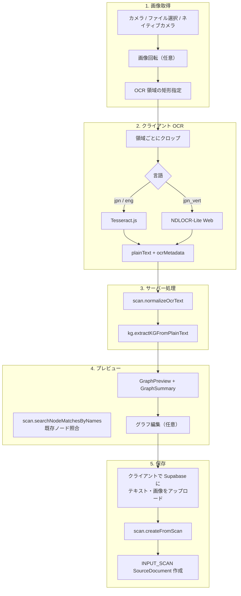

# フィールドリサーチ：現地スキャンから知識グラフ作成（処理フロー）

スマートフォン向けの現地調査フロー。カメラまたは画像ファイルから OCR でテキストを抽出し、LLM で整形・知識グラフ化したうえで `INPUT_SCAN` ドキュメントとして保存する。保存後はユーザーが管理するトピックスペースや既存ドキュメントのノード名と照合し、重複候補をハイライト表示する。

## ルーティングと画面

| パス | コンポーネント | 概要 |
|------|----------------|------|
| `/field` | `FieldSessionList` | スキャンセッション一覧（要ログイン） |
| `/field/scan` | `FieldScanFlow` | 新規スキャン（カメラ → 領域指定 → OCR → プレビュー → 保存） |
| `/field/scan/[id]` | `FieldScanDetail` | 保存済みセッションの詳細・グラフ編集 |

`/field` 配下は `page-config.ts` の `publicLandingPages` に含まれ、`SPGuardProvider` によりスマートフォンでも利用可能（他の多くの画面は PC/タブレット向け）。

## 処理フロー図



## スキャンステップ（UI）

`FieldScanFlow` は次の 4 ステップを持つ。

| ステップ | 内容 |
|----------|------|
| `camera` | ライブカメラ（`LiveCameraScanner`）、ファイル選択、ネイティブ `<input capture>` |
| `trim` | `ScanRegionSelector` で正規化座標 (0–1) の OCR 領域を指定。複数領域可 |
| `processing` | OCR → LLM 整形 → グラフ抽出のパイプライン実行 |
| `preview` | セッション名・テキスト・グラフの確認、ノード一致候補の表示、保存 |

保存条件（`canSubmit`）: セッション名・`plainText`・`graphPreview` がすべて揃っていること。

## tRPC API（`scanRouter`）

| プロシージャ | 種別 | 用途 |
|--------------|------|------|
| `createFromScan` | mutation | スキャン結果を `INPUT_SCAN` として永続化 |
| `listSessions` | query | ユーザーのスキャン一覧（ページネーション） |
| `getSession` | query | 単一セッション（グラフ・OCR メタ・一致候補） |
| `deleteSession` | mutation | 論理削除 |
| `renameSession` | mutation | セッション名変更 |
| `normalizeOcrText` | mutation | OCR テキストの LLM 整形 |
| `searchNodeMatchesByNames` | query | ノード名の完全一致照合（大文字小文字無視） |

### `createFromScan` の入力と挙動

- `graphDocument` を渡した場合、保存時に **再抽出せず** その内容をそのまま保存する（プレビュー済みグラフの確定保存）。
- `sourceTextUrl` / `sourceImageUrl` を優先。クライアント側で Supabase Storage に先にアップロードし、大きな tRPC ペイロードやサーバー側ストレージ認証の問題を避ける。
- `imageDataUrl` は非推奨（後方互換用）。
- `topicSpaceId` 指定時は作成後に `attachDocumentsToTopicSpace` で紐付け。
- 戻り値に `matchCandidates`（既存ノードとの一致候補）を含む。

## ノード一致照合

`searchUserNodeMatchesByNames` は次の 2 ソースをマージする（重複 `nodeId` は除外）。

1. **トピックスペース** — ユーザーが admin のトピックスペース内ノード
2. **ソースドキュメント** — 同一ユーザーの `INPUT_PDF` / `INPUT_TXT` / `INPUT_SCAN` グラフ内ノード（保存対象ドキュメントは `excludeSourceDocumentId` で除外）

`GraphSummary` では一致候補をオレンジ（既存ドキュメント）・エメラルド（トピックスペース）で区別表示する。詳細画面では `documentGraph.updateGraph` によるノード・関係のインライン編集にも対応。

## ストレージ

| バケット ID | 用途 |
|-------------|------|
| `input-txt` | OCR 後のプレーンテキスト |
| `input-scan` | スキャン元画像（JPEG/PNG/WebP/GIF、最大 50MB） |

ローカル開発では `input-scan` バケットが未作成だと画像アップロードが失敗する。

```bash
npm run supabase:ensure-buckets
```

`scripts/ensure-supabase-storage-buckets.ts` が `input-scan` バケットとストレージポリシーを冪等に作成する。リモート Supabase では `SUPABASE_SERVICE_ROLE_KEY` が必要な場合がある。

## OCR 実装の要点

- **ルーティング**: `ocr-runner.ts` が言語に応じてエンジンを切り替え
- **横書き日本語 / 英語**: Tesseract.js（`tesseract-client.ts`）
- **縦書き日本語**: [ndlocrlite-web](https://github.com/yuta1984/ndlocrlite-web) ベースの NDLOCR-Lite（`ndlocr/ndlocr-client.ts` + Web Worker）
- **領域 OCR**: 画像を `image-crop.ts` で領域ごとにクロップしてから認識。複数領域のテキストは結合される
- **NDLOCR モデル**: 初回 ~150MB を同一オリジンの `/api/ndlocr-models/*` 経由で取得し IndexedDB にキャッシュ（`NEXT_PUBLIC_NDL_OCR_MODEL_BASE_URL` で変更可）
- **ONNX Runtime**: `numThreads: 1` の WASM 推論（COOP/COEP は不要。Field ページの Worker・Supabase 画像との両立のため付与しない）
- **カメラ**: `camera-capture.ts` が解像度フォールバックと `ImageCapture` API を利用
- **整形**: `normalize-ocr-text.service.ts` が LLM で改行・スペースノイズを除去（意味は変更しない）

## データモデル

スキャンセッションは `SourceDocument`（`documentType: INPUT_SCAN`）として保存される。

- `url` — テキストファイルの Storage URL
- `sourceImageUrl` — スキャン画像 URL
- `ocrMetadata` — エンジン・言語・信頼度・領域座標・`plainText`（フォールバック用）
- 関連 `DocumentGraph` — 抽出されたノード・関係

テキスト再取得は `resolveScanPlainText` が `ocrMetadata.plainText` を優先し、なければ Storage から取得する。

## 関連ファイル

### ページ・UI

- `src/app/field/page.tsx` — セッション一覧
- `src/app/field/scan/page.tsx` — 新規スキャン
- `src/app/field/scan/[id]/page.tsx` — セッション詳細
- `src/features/field/components/field-scan-flow.tsx` — スキャンパイプライン本体
- `src/features/field/components/field-scan-detail.tsx` — 詳細・グラフ編集
- `src/features/field/components/field-session-list.tsx` — 一覧
- `src/features/field/components/graph-summary.tsx` — グラフ要約・一致候補・編集 UI

### OCR

- `src/features/field/ocr/ocr-runner.ts` — 言語別 OCR ルーティング
- `src/features/field/ocr/tesseract-client.ts` — Tesseract（横書き・英語）
- `src/features/field/ocr/ndlocr/ndlocr-client.ts` — NDLOCR（縦書き）
- `src/features/field/ocr/ndlocr/worker/` — ONNX Worker 群
- `public/ocr/config/NDLmoji.yaml` — 文字セット
- `public/ocr/wasm/` — onnxruntime-web WASM（`npm run ocr:copy-wasm`）
- `src/features/field/ocr/camera-capture.ts`
- `src/features/field/ocr/image-crop.ts`
- `src/features/field/ocr/region-types.ts`

### API・サービス

- `src/server/api/routers/scan.ts`
- `src/server/api/schemas/scan.ts`
- `src/server/services/scan/create-from-scan.service.ts`
- `src/server/services/scan/get-scan-session.service.ts`
- `src/server/services/scan/search-user-node-matches.service.ts`
- `src/server/services/scan/normalize-ocr-text.service.ts`

## セットアップとトラブルシューティング

| 症状 | 確認事項 |
|------|----------|
| 画像アップロード失敗 | `npm run supabase:ensure-buckets` を実行。`NEXT_PUBLIC_SUPABASE_*` とバケットポリシーを確認 |
| OCR でテキストが空 | 領域が文字を含んでいるか、言語（縦書きは `jpn_vert`）が合っているか |
| 整形・グラフ抽出失敗 | `OPENAI_API_KEY` がサーバー環境に設定されているか |
| 詳細でテキストが表示されない | 古いセッションで `ocrMetadata.plainText` も Storage URL も無効な場合。新規スキャンを推奨 |
| カメラが起動しない | HTTPS または localhost が必要。ブラウザのカメラ権限を確認 |
| 一致候補が出ない | ノード名が既存データと完全一致（大文字小文字無視）している必要がある |

## 制約

- `normalizeOcrText` の入力は最大 50,000 文字
- `searchNodeMatchesByNames` はノード名を最大 200 件、結果は最大 200 件
- グラフ統計の直径・平均ホップ数はノード数 800 超でハブノードにサンプリング（`graph-statistics.ts`、フィールド画面の `GraphPreview` でも同様の統計を利用する場合あり）
- フィールド画面はモバイル最適化。デスクトップの執筆・グラフ編集 UI とは別導線（`SPGuardProvider` が `/field` へ誘導）
