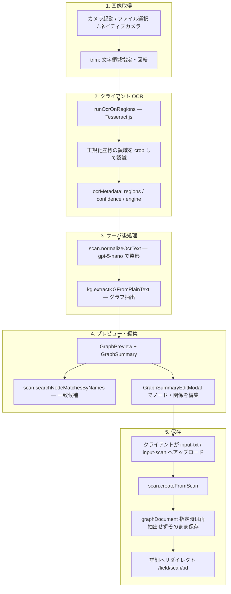

# フィールドリサーチ：現地スキャン（処理フロー）

スマートフォン向けの現地調査フロー。カメラまたは画像ファイルから OCR でテキストを抽出し、LLM で整形・知識グラフ化したうえで `INPUT_SCAN` 型の `SourceDocument` として保存する。保存後は既存リソース（トピックスペース・過去ドキュメント）とのノード名一致候補を表示し、プレビュー／詳細画面でグラフを編集できる。

## どこで使われるか

| 項目 | 内容 |
|------|------|
| 一覧 | `/field` — `FieldSessionList` |
| 新規スキャン | `/field/scan` — `FieldScanFlow` |
| セッション詳細 | `/field/scan/[id]` — `FieldScanDetail` |
| SP 対応 | `page-config.ts` の `publicLandingPages` に `/field` を含む。他ページは `SPGuardProvider` が SP 非対応を案内し、フィールドへ誘導 |
| 認証 | 保存・一覧・詳細は `protectedProcedure`（ログイン必須）。`/field` ランディングのみ未ログイン閲覧可 |

## 処理フロー図

## UI ステップ（`FieldScanFlow`）

| ステップ | 状態 | 主な操作 |
|----------|------|----------|
| `camera` | 撮影 | `LiveCameraScanner`（`getUserMedia` + フォールバック）、ファイルピッカー、`capture="environment"` のネイティブカメラ |
| `trim` | 領域調整 | `ScanRegionSelector`（全画面 ROI）、画像 90° 反時計回り、OCR 言語選択 |
| `processing` | パイプライン実行 | OCR → 整形 → グラフ抽出（進捗バー `pipelineStage`: `ocr` / `normalize` / `graph`） |
| `preview` | 確認・保存 | テキスト編集、領域再調整、グラフ再抽出、`保存して詳細へ` |

保存条件（`canSubmit`）: セッション名・OCR テキスト・`graphPreview` がすべて非空。

## tRPC API（`scanRouter`）

| プロシージャ | 種別 | 役割 |
|--------------|------|------|
| `createFromScan` | mutation | `INPUT_SCAN` の `SourceDocument` + `DocumentGraph` を作成。`graphDocument` があればサーバ再抽出をスキップ |
| `listSessions` | query | ログインユーザのスキャン一覧（ページネーション） |
| `getSession` | query | 単一セッション（テキスト・画像・グラフ・一致候補） |
| `deleteSession` | mutation | 論理削除 |
| `renameSession` | mutation | セッション名変更 |
| `normalizeOcrText` | mutation | OCR 生テキストの LLM 整形（最大 50,000 文字） |
| `searchNodeMatchesByNames` | query | 抽出ノード名と既存リソースの一致検索 |

グラフの永続編集（詳細画面）は `documentGraph.updateGraph` を使用する。

## ノード一致検索のスコープ

`searchUserNodeMatchesByNames` は次の 2 系統をマージする（重複 `nodeId` は除外、上限 `limit` 既定 100）。

| `sourceType` | 検索対象 |
|--------------|----------|
| `topicSpace` | ログインユーザが admin のトピックスペース内ノード（大文字小文字無視の名前一致） |
| `sourceDocument` | 同一ユーザの `INPUT_PDF` / `INPUT_TXT` / `INPUT_SCAN` ドキュメント内ノード。`excludeSourceDocumentId` で自分自身を除外可能 |

プレビュー時は `excludeSourceDocumentId` なし。保存後の `getSession` / `createFromScan` レスポンスでは当該スキャン ID を除外する。

## データモデル

- `DocumentType.INPUT_SCAN` — Prisma `SourceDocument.documentType`
- `sourceImageUrl` — Supabase Storage バケット `input-scan`（公開読み取り）
- `url` — OCR 整形済みプレーンテキスト（バケット `input-txt`）
- `ocrMetadata` — JSON。`regions`（0–1 正規化矩形）、`plainText`（ストレージ取得失敗時のフォールバック）、`confidence` など

### テキスト解決の優先順位（`resolveScanPlainText`）

1. `ocrMetadata.plainText` があればそれを返す
2. `url` が取得可能な `input-txt` 公開 URL なら `getTextFromDocumentFile` で取得
3. 失敗時は固定メッセージ（「OCR テキストを取得できませんでした…」）

`documentGraph.getById` および `source-document` ルーターでも `resolveSourceDocumentPlainText` 経由で同ロジックを共有する。

## OCR 領域座標

`OcrRegion` は画像に対する正規化座標（`x`, `y`, `w`, `h` ∈ [0, 1]）。デフォルト ROI は `DEFAULT_OCR_REGION`（中央 85%×75% 付近）。画像を 90° 反時計回りに回転すると `rotateRegion90CounterClockwise` で ROI も連動変換する。

## ストレージ・ローカル開発

| バケット ID | 用途 | 作成 |
|-------------|------|------|
| `input-scan` | スキャン画像（jpeg/png/webp/gif、最大 50MB） | `npm run supabase:ensure-buckets` |
| `input-txt` | OCR テキストファイル | 同上 |

`createFromScan` はクライアント事前アップロード（`sourceTextUrl` / `sourceImageUrl`）を優先する。未指定時はサーバ側で Blob / data URL をアップロード（`imageDataUrl` は非推奨）。

## グラフ編集（`GraphSummary`）

- プレビュー（`/field/scan`）: `onGraphChange` でローカル `graphPreview` のみ更新。保存時に `graphDocument` として渡す
- 詳細（`/field/scan/[id]`）: 編集のたびに `documentGraph.updateGraph` で即時永続化。失敗時はサーバ状態へ再同期
- 編集可能項目: ノード名・`properties.description`、関係 type・`properties.description`
- 編集モード終了時にノード名が変わっていれば `onRefreshNodeMatches` で一致候補を再取得

## 関連ファイル

### UI

- `src/app/field/page.tsx` / `scan/page.tsx` / `scan/[id]/page.tsx`
- `src/features/field/components/field-scan-flow.tsx` — メインフロー
- `src/features/field/components/field-scan-detail.tsx` — 保存後詳細
- `src/features/field/components/field-session-list.tsx` — 一覧
- `src/features/field/components/live-camera-scanner.tsx` — ライブカメラ
- `src/features/field/components/scan-region-selector.tsx` — ROI 選択
- `src/features/field/components/graph-summary.tsx` / `graph-summary-edit-modal.tsx`

### クライアント OCR

- `src/features/field/ocr/tesseract-client.ts` — Tesseract.js ラッパ
- `src/features/field/ocr/image-crop.ts` — 領域クロップ・回転
- `src/features/field/ocr/region-types.ts` — 正規化座標ユーティリティ
- `src/features/field/ocr/camera-capture.ts` — `getUserMedia` と静止画キャプチャ

### サーバ

- `src/server/api/routers/scan.ts` — tRPC ルーター
- `src/server/api/schemas/scan.ts` — Zod スキーマ
- `src/server/services/scan/create-from-scan.service.ts`
- `src/server/services/scan/get-scan-session.service.ts`
- `src/server/services/scan/search-user-node-matches.service.ts`
- `src/server/services/scan/normalize-ocr-text.service.ts`
- `src/server/services/scan/resolve-scan-plain-text.ts`
- `src/server/services/scan/resolve-source-document-plain-text.ts`
- `src/server/api/routers/document-graph.ts` — `getById` / `updateGraph`

### インフラ・テスト

- `scripts/ensure-supabase-storage-buckets.ts`
- `e2e/kg/scan-create-from-scan.integration.spec.ts`
- `e2e/kg/scan-source-document.integration.spec.ts`

## トラブルシューティング

| 症状 | 確認ポイント |
|------|----------------|
| カメラが起動しない | HTTPS / 権限、`LiveCameraScanner` のフォールバック（ファイル選択・ネイティブ `input[capture]`） |
| OCR が空 | 領域が文字を含むか、言語（横書き `jpn` / 縦書き `jpn_vert` / `eng`）が適切か |
| 保存時アップロード失敗 | `input-scan` / `input-txt` バケットと Storage ポリシー（`supabase:ensure-buckets`） |
| 詳細でテキストが表示されない | `ocrMetadata.plainText` の有無、`url` が公開取得可能か（`resolveScanPlainText`） |
| 一致候補が出ない | ノード名が既存グラフと完全一致（大文字小文字無視）しているか、トピックスペース admin 権限があるか |
| グラフ編集が反映されない | `documentGraph.updateGraph` のエラー表示、詳細画面の `syncGraphFromServer` 再同期 |

## 制約・設計上の注意

- OCR はブラウザ内 Tesseract.js。初回は言語データのダウンロードがあり遅くなる
- `normalizeOcrText` は意味を変えずレイアウトノイズのみ除去するプロンプト（`gpt-5-nano`）
- `searchNodeMatchesByNames` の `nodeNames` は最大 200 件、クエリ `limit` は最大 200
- プレビュー中のグラフ編集は保存までサーバに送られない。詳細画面のみ即時永続化
- `INPUT_SCAN` はワークスペース執筆フローとは独立。必要なら `createFromScan` の `topicSpaceId` でトピックスペースへ紐づけ可能
