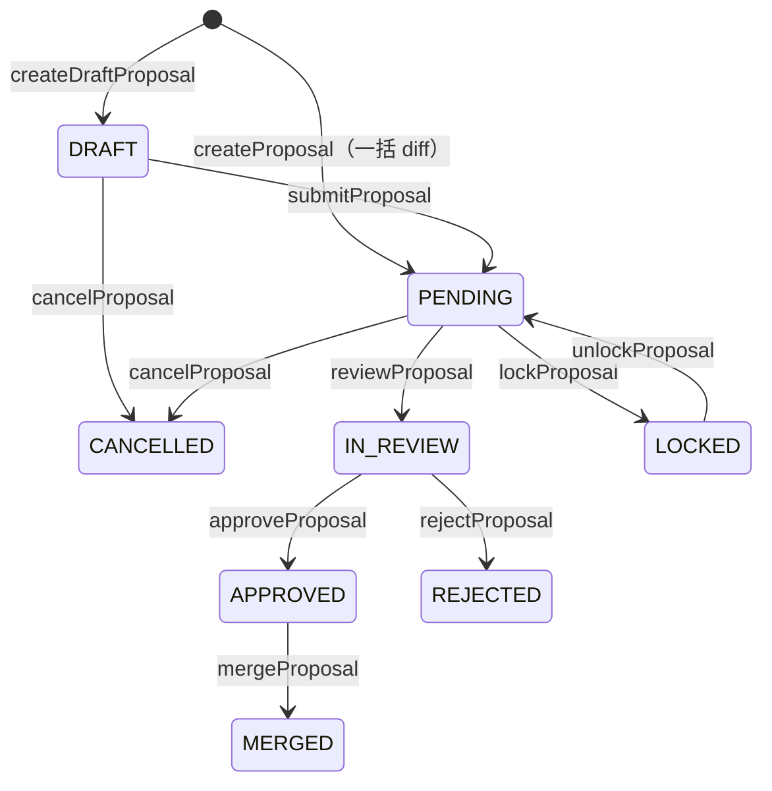

# グラフ変更提案（GraphEditProposal）

TopicSpace の統合グラフに対する GitHub 風の変更提案ワークフロー。提案者が diff を作成し、管理者がレビュー・承認・マージする。マージ時は [provenance](./topic-space-node-provenance.md) のノード統合も再割り当てされる。

## 状態遷移

`ProposalStatus`（`prisma/schema.prisma`）:

| 状態 | 説明 |
|------|------|
| `DRAFT` | 下書き（段階的編集中、未提出） |
| `PENDING` | レビュー待ち |
| `IN_REVIEW` | レビュー中（`reviewerId` 設定） |
| `LOCKED` | 管理者が悲観的ロック中 |
| `APPROVED` | 承認済み（マージ可能） |
| `REJECTED` | 却下 |
| `MERGED` | 統合グラフへ反映済み |
| `CANCELLED` | 提案者による取り下げ |

## 作成パターン

### 1. 一括 diff（`createProposal`）

現行グラフと `newGraphData` を比較し、`GraphEditChange` 行を生成。**初期状態は `PENDING`**（即レビュー待ち）。

- ノード・エッジに差分がない場合は `BAD_REQUEST`
- 説明は 10 文字以上必須

### 2. 段階的ドラフト（`createDraftProposal` + draft mutations）

空の **`DRAFT`** を作成し、`upsertNodeInDraft` 等で `changes` を段階的に追加。MCP / LLM エージェント向け。

| 手続き | 操作 |
|--------|------|
| `upsertNodeInDraft` / `deleteNodeInDraft` | ノード追加・更新・削除 |
| `setNodePropertyInDraft` / `unsetNodePropertyInDraft` | ノードプロパティ |
| `upsertRelationshipInDraft` / `deleteRelationshipInDraft` | エッジ |
| `setRelationshipPropertyInDraft` / `unsetRelationshipPropertyInDraft` | エッジプロパティ |
| `mergeNodesInDraft` | ノード統合（canonical + duplicates） |
| `deduplicateEdgesInDraft` | 重複エッジ除去 |
| `getProposalDraftDiff` / `getProposalDraftGraph` | 下書き確認 |

準備完了後 `submitProposal` で `DRAFT` → `PENDING`。

## レビュー・マージ

| 手続き | 実行者 | 前提状態 |
|--------|--------|----------|
| `lockProposal` / `unlockProposal` | 管理者 | `PENDING` ↔ `LOCKED` |
| `reviewProposal` | 管理者 | `PENDING` → `IN_REVIEW` |
| `approveProposal` | 管理者 | `IN_REVIEW` → `APPROVED` |
| `rejectProposal` | 管理者 | `IN_REVIEW` → `REJECTED` |
| `mergeProposal` | 管理者 | `APPROVED` → `MERGED` |
| `cancelProposal` | 提案者 | `DRAFT` / `PENDING` → `CANCELLED` |

### マージ処理（`mergeGraphEditProposal`）

1. `generateProposalChangeData` で変更をスコープ付き mutation に変換
2. ノードマージがある場合 `reassignTopicSpaceNodeProvenanceOnMerge` で provenance を canonical へ再割り当て
3. `applyScopedGraphChanges` で TopicSpace 統合グラフを更新
4. `GraphChangeHistory` にマージ記録を作成
5. 提案 status を `MERGED` に更新

トランザクションタイムアウト: 30 秒。

## ロールバック

マージ後の変更を個別に巻き戻す:

| 手続き | 説明 |
|--------|------|
| `getChangeHistoryForRollback` | TopicSpace の `GraphChangeHistory` 一覧（管理者のみ） |
| `rollbackChange` | 指定 `changeHistoryId` をロールバック（`reason` 任意） |

## コメント・一覧

| 手続き | アクセス |
|--------|----------|
| `addComment` / `getComments` | 管理者または提案者 |
| `getProposalById` | 管理者または提案者 |
| `listProposalsByTopicSpace` | 管理者のみ（`status` フィルタ可） |
| `listMyProposals` | ログインユーザー自身の提案 |

コメント本文は Tiptap JSON（`TiptapContentSchema`）。スレッドは `parentCommentId` でネスト。

## UI

- 提案詳細: `/[locale]/proposals/[proposal_id]`
- README の「Edit Proposals — GitHub-like pull request system」がこのワークフローに対応

## 権限まとめ

| 操作 | 提案者 | TopicSpace 管理者 |
|------|--------|-------------------|
| 作成・下書き編集 | ✓ | ✓ |
| 提出・取り下げ | ✓（自分のみ） | — |
| レビュー・承認・却下・マージ | — | ✓ |
| ロック | — | ✓ |
| 変更履歴ロールバック | — | ✓ |

## 関連ファイル

- `src/server/api/routers/graph-edit-proposal.ts` — tRPC ルーター（全手続き）
- `src/server/services/graph-edit-proposal/` — 作成・マージ・ロールバック・ドラフト編集
- `src/server/domain/kg/proposal-change-rows.ts` — diff → `GraphEditChange` 行
- `prisma/schema.prisma` — `GraphEditProposal`, `GraphEditChange`, `ProposalComment`

## 関連ドキュメント

- [MCP 認証](./mcp-authentication.md) — MCP 経由のドラフト編集・提案作成
- [TopicSpace ノード・エッジ provenance](./topic-space-node-provenance.md) — マージ時の provenance 再割り当て
- [KG alignment agent](./kg-alignment-agent/README.md) — 自動アライメントの出力先として提案を利用可能
