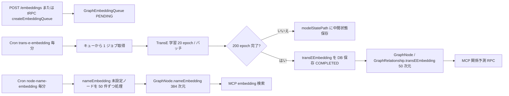

# グラフ埋め込みパイプライン

TopicSpace のノード名セマンティック検索と TransE グラフ埋め込みを非同期で生成するパイプライン。MCP の重複候補検索・関係予測の前提となる。

キュー作成の REST エンドポイントは [TopicSpace 公開 REST API](./topic-space-public-rest-api.md) § POST embeddings を参照。本ドキュメントは **キュー以降の運用・Cron・Edge Function** を扱う。

## 全体フロー

## 2 段階の埋め込み

| 段階 | カラム | 次元 | モデル / アルゴリズム | スコープ |
|------|--------|------|----------------------|----------|
| ノード名 | `GraphNode.nameEmbedding` | 384 | HuggingFace `sentence-transformers/all-MiniLM-L6-v2` | **全 GraphNode**（TopicSpace 横断） |
| グラフ構造 | `GraphNode.transEEmbedding` | 50 | TransE（ベース 45 次元 + 文脈 5 次元） | **キュー対象 TopicSpace** |
| リレーション | `GraphRelationship.transEEmbedding` | 50 | 同上 | 同上 |

文脈 5 次元は `label` / `topicSpaceId` / `properties` の簡易ハッシュから生成（`create-trans-e-embedding-from-jobs`）。

## キュー作成

**tRPC**: `graphEmbedding.createEmbeddingQueue({ topicSpaceId })`（`publicProcedure`）

| 条件 | 結果 |
|------|------|
| TopicSpace 未存在 | `NOT_FOUND` |
| 同一 TopicSpace に既存ジョブあり | `BAD_REQUEST`（"Embedding job already exists"） |
| 成功 | `GraphEmbeddingQueue` を `PENDING` で作成 |

TopicSpace あたり **1 ジョブのみ** 許可。

## GraphEmbeddingQueue 状態

`JobStatus`（`prisma/schema.prisma`）:

| 状態 | 説明 |
|------|------|
| `PENDING` | 作成直後。TransE Cron が取得待ち |
| `PROCESSING` | 学習中（`startedAt` 設定） |
| `COMPLETED` | 200 epoch 完了、`transEEmbedding` 保存済み |
| `FAILED` | エラー（`error` フィールドにメッセージ） |

追加フィールド: `processedEpochs`（累積 epoch）, `modelStatePath`（中間モデルの Supabase Storage パス）

### スタック回復

`create-trans-e-embedding-from-jobs` は `PROCESSING` のまま **35 秒以上** `updatedAt` が更新されていないジョブを stale として再取得する。

## Cron スケジュール

`vercel.json`（いずれも **毎分** `*/1 * * * *`）:

| パス | 呼び出し先 |
|------|-----------|
| `/api/cron/node-name-embedding` | Supabase `bulk-create-node-name-embedding` |
| `/api/cron/trans-e-embedding` | Supabase `create-trans-e-embedding-from-jobs` |

両 Cron ルートは `maxDuration: 60`（秒）。

## Edge Function 詳細

### bulk-create-node-name-embedding

1. `nameEmbedding IS NULL` の `GraphNode` を最大 50 件取得（**TopicSpace フィルタなし**）
2. 各ノード名を HuggingFace API でベクトル化
3. `GraphNode.nameEmbedding` を更新

全ノードが埋まっている場合は `"No nodes found or all nodes already have embeddings"` を返す。

### create-trans-e-embedding-from-jobs

1. `PENDING`（または stale `PROCESSING`）ジョブを 1 件取得
2. TopicSpace のノード・エッジを取得（`deletedAt IS NULL`）
3. **ノードまたはエッジが空なら `FAILED`**
4. TransE を 20 epoch 実行（`TOTAL_EPOCHS = 200`, `EPOCHS_PER_BATCH = 20`）
5. 200 epoch 未満: モデル状態を `embedding-models` バケットに保存し `processedEpochs` 更新
6. 200 epoch 到達: ノード・リレーションの `transEEmbedding` をバッチ更新 → `COMPLETED`

中間状態の復元は `modelStatePath` から `transE.loadModel()` で行う。

## 環境変数・デプロイ

| 変数 / リソース | 用途 |
|-----------------|------|
| `NEXT_PUBLIC_SUPABASE_URL` | Cron → Edge Function 呼び出し |
| `NEXT_PUBLIC_SUPABASE_ANON_KEY` | 同上（Bearer 認証） |
| `HUGGINGFACE_API_KEY` | Edge Function（Deno）でのノード名埋め込み |
| Supabase Storage `embedding-models` | TransE 中間モデル保存 |
| pgvector | `nameEmbedding vector(384)`, `transEEmbedding vector(50)` |

## 下流利用（MCP）

`src/app/api/topic-spaces/[id]/mcp/route.ts`:

| RPC | 用途 |
|-----|------|
| `node-name-embedding-query-rpc-in-user-resources` | ノード名の embedding 類似検索（重複候補） |
| `trans-e-predict-relations-query-rpc` | 関係予測 |

embedding 検索が使えない場合（認証・URL 未設定等）は文字列類似にフォールバックし、`embeddingSkippedReason` を返す。

詳細は [MCP 認証](./mcp-authentication.md)。

## トラブルシューティング

| 症状 | 原因・対処 |
|------|-----------|
| `Embedding job already exists` | 同一 TopicSpace に未完了ジョブあり。`COMPLETED` / `FAILED` 後に再作成 |
| `No nodes or edges found` | TransE 開始前にグラフが空。ノード・エッジを追加してからキュー再作成 |
| nameEmbedding が進まない | HuggingFace API キー未設定、または全ノード処理済み |
| TransE が途中で止まる | Cron 1 分間隔で 20 epoch ずつ継続。`processedEpochs` を確認 |
| `PROCESSING` が固まる | 35 秒後に stale 回復。それでも失敗なら `FAILED` を確認 |
| Cron タイムアウト | `maxDuration: 60`。大規模グラフは複数 Cron 実行に分割される設計 |

## 関連ファイル

- `src/server/api/routers/graph-embedding.ts` — キュー作成 tRPC
- `src/app/api/topic-spaces/[id]/embeddings/route.ts` — REST ラッパー
- `src/app/api/cron/node-name-embedding/route.ts`
- `src/app/api/cron/trans-e-embedding/route.ts`
- `supabase/functions/bulk-create-node-name-embedding/index.ts`
- `supabase/functions/create-trans-e-embedding-from-jobs/index.ts`
- `supabase/functions/_shared/get-embedding.ts`, `_shared/trans-e.ts`
- `vercel.json` — Cron 定義

## 関連ドキュメント

- [TopicSpace 公開 REST API](./topic-space-public-rest-api.md) — POST embeddings
- [MCP 認証](./mcp-authentication.md) — embedding 検索の利用条件
