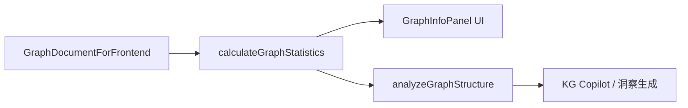

# グラフ統計パネル（GraphInfoPanel）

トピックスペース・ドキュメントグラフの D3 ビュー右側に表示される統計パネル。`calculateGraphStatistics`（`src/app/_utils/kg/graph-statistics.ts`）が中核で、同関数は LLM 向け `analyzeGraphStructure`（`graph-analysis.ts`）からも再利用される。

## 表示箇所

- `GraphInfoPanel`（`src/app/_components/d3/force/graph-info-panel.tsx`）
- クリップボードコピーで JSON エクスポート可能（タイムスタンプ付き）

## 指標一覧

### 基本統計

| 指標 | 算出 |
|------|------|
| ノード数 | `nodes.length` |
| エッジ数 | `relationships.length` |

### 次数分析

無向グラフとして各ノードの次数（接続エッジ数）を集計。

| 指標 | 式・説明 |
|------|----------|
| 平均次数 (K) | `2 * |E| / |V|`（`|V| = 0` なら 0） |
| 次数の標準偏差 | 各ノード次数の母標準偏差 |
| 最大次数 | `reduce` で算出（大規模グラフでのスタックオーバーフロー回避） |
| 最大次数ノード | 次数上位から名前付きで表示 |
| ハブ依存度 | `maxDegree / (2 * |E|)`。最大ハブが全エッジに占める割合の近似 |
| 密度 (ρ) | `2|E| / (|V|(|V|-1))`（`|V| ≤ 1` なら 0） |

### 次数分布

`degreeDistribution: Record<次数, ノード数>` をヒストグラム表示。

- ユニーク次数が **20 以下**: 次数ごとにバー表示
- **21 以上**: ビン化して表示（`0`, `1`, `2`, `3-5`, `6-10`, `11-20`, `21-50`, `51+`）

### 接続性指標

BFS による最短経路長の集計（無向・非加重）。

| 指標 | 説明 |
|------|------|
| 平均ホップ数 | 全ノード対の最短距離の平均（距離 0 は除外） |
| 直径 | 観測された最大最短距離 |
| 大域的クラスター係数 | `Σ(2×隣接間リンク) / Σ(k(k-1))` |
| 平均クラスター係数 | 各ノードの局所係数の平均 |

**大規模グラフのサンプリング**: ノード数が **800 を超える**場合、直径・平均ホップ数の計算起点は次数上位 5 ノードに限定（計算コスト削減）。小規模グラフは全ノードから BFS。

### 重要エンティティ（ハブ）

次数上位 5 ノード。クリックでフォーカスノードを切り替え。

### タイプ内訳

ノードラベル別・エッジタイプ別の件数。

## データフロー

## 実装上の制約

- グラフは **無向** として扱う（エッジの `sourceId` / `targetId` は双方向に隣接リストへ追加）
- 次数分布の `maxDegree` は `Math.max(...array)` ではなく `reduce` を使用（PR #65）
- `hubDependencyRatio` はエッジが 0 件のとき 0
- パネルのノードプロパティ編集は体験上の理由で無効化済み（コメント参照）

## 関連ファイル

- `src/app/_utils/kg/graph-statistics.ts` — 統計計算本体
- `src/app/_utils/kg/graph-analysis.ts` — LLM 向け拡張分析
- `src/app/_utils/kg/bfs.ts` — BFS 距離計算
- `src/app/_components/d3/force/graph-info-panel.tsx` — UI・ヒストグラム・コピー
