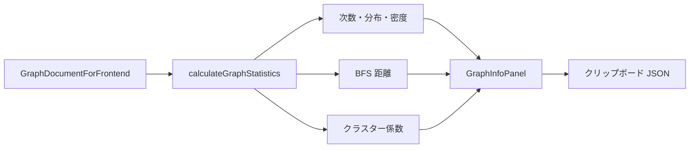

# グラフ統計パネル（D3 可視化）

知識グラフビューア右側の `GraphInfoPanel` が表示する構造指標。`calculateGraphStatistics`（`src/app/_utils/kg/graph-statistics.ts`）でクライアント側計算し、ノード・エッジの変更に追従する。

## 表示場所

- `src/app/_components/d3/force/graph-info-panel.tsx` — トピックスペース・ドキュメントのグラフ画面
- 統計のコピー（JSON）ボタンでクリップボードへエクスポート可能

## 指標一覧

### 基本統計

| 指標 | 説明 |
|------|------|
| ノード数 | `graph.nodes.length` |
| エッジ数 | `graph.relationships.length` |

### 次数分析

無向グラフとして各ノードの次数（接続エッジ数）を集計する。

| 指標 | 計算 |
|------|------|
| 平均次数 (K) | `2 × エッジ数 / ノード数` |
| 次数の標準偏差 | 各ノード次数の母標準偏差 |
| 最大次数 | 全ノードの次数の最大値（ハブノード名も表示） |
| ハブ依存度 | `maxDegree / (2 × エッジ数)` — 最大ハブが全体の接続に占める割合 |
| 密度 (ρ) | `2 × エッジ数 / (n × (n-1))` |

### 次数分布

`degreeDistribution` は `{ [次数]: ノード数 }` のヒストグラム。

- ユニークな次数が 20 以下: 次数ごとに棒グラフ表示
- 21 以上: `DEGREE_BINS` でビン分割（0, 1, 2–3, 4–5, … 50+）して表示

大規模グラフでも UI が崩れないよう、次数の種類が多い場合は自動ビン化する。

### 接続性指標

BFS により無向グラフ上の距離を計算。

| 指標 | 説明 |
|------|------|
| 平均ホップ数 | 全ノード対の最短距離の平均（距離 0 は除外） |
| 直径 | グラフ内の最大最短距離 |
| 大域的クラスター係数 | `Σ(2×隣接間リンク) / Σ(k×(k-1))` |
| 平均クラスター係数 | 各ノードの局所クラスター係数の平均 |

**大規模グラフの近似**: ノード数が 800 を超える場合、直径・平均ホップ数の計算は次数上位 5 ノード（ハブ）のみを始点にサンプリングする。正確な全域指標ではなく、計算コスト削減のための近似である。

### 重要エンティティ（ハブ）

次数上位 5 ノードをリスト表示。クリックでグラフ上のフォーカスノードに設定する。

## 処理フロー図



## エクスポート JSON 構造

コピー時のペイロード例（フィールド名は実装どおり）:

```json
{
  "summary": {
    "nodeCount": 42,
    "edgeCount": 58,
    "avgDegree": 2.76,
    "density": 0.067,
    "degreeStdDev": 1.82,
    "maxDegree": 12,
    "hubDependencyRatio": 0.103,
    "diameter": 6,
    "avgPathLength": 2.41,
    "avgClusteringCoeff": 0.15,
    "globalClusteringCoeff": 0.12
  },
  "degreeDistribution": { "1": 5, "2": 18, "3": 12 },
  "distributions": {
    "nodeTypes": { "Person": 10, "Artwork": 8 },
    "edgeTypes": { "created": 20 }
  },
  "topDegreeNodes": [
    { "id": "...", "name": "...", "label": "Person", "degree": 12 }
  ],
  "timestamp": "2026-06-21T12:00:00.000Z"
}
```

## 関連ファイル

- `src/app/_utils/kg/graph-statistics.ts` — 指標計算の単一ソース
- `src/app/_utils/kg/bfs.ts` — BFS 距離
- `src/app/_components/d3/force/graph-info-panel.tsx` — UI・`DegreeDistributionChart`

## 実装上の注意

- `maxDegree` は `Math.max(...degreeValues)` を `reduce` で求める（大規模グラフでのスタックオーバーフロー回避）
- 次数分布・ハブ依存度は PR #65 以降でパネルに追加。研究・キュレーション時のグラフ構造のざっくりした把握に使う
- フィールドリサーチの `GraphPreview` は統計パネルではなく要約リスト（`GraphSummary`）を使用。統計パネルはデスクトップ D3 グラフ画面専用
