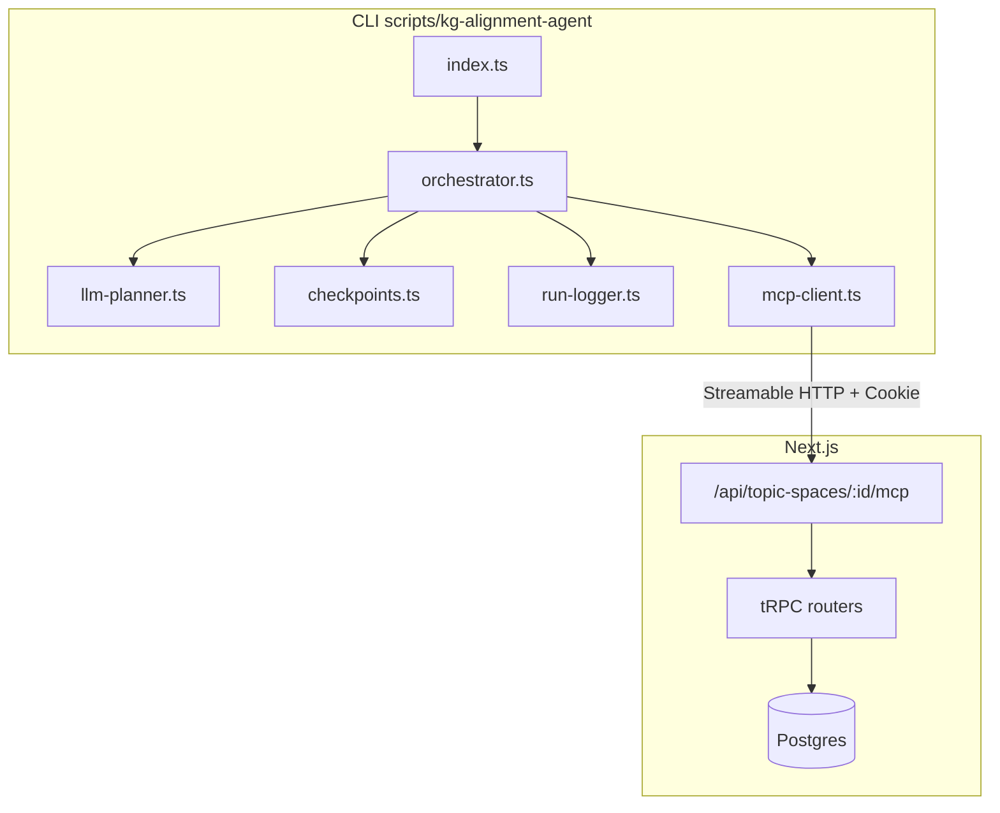
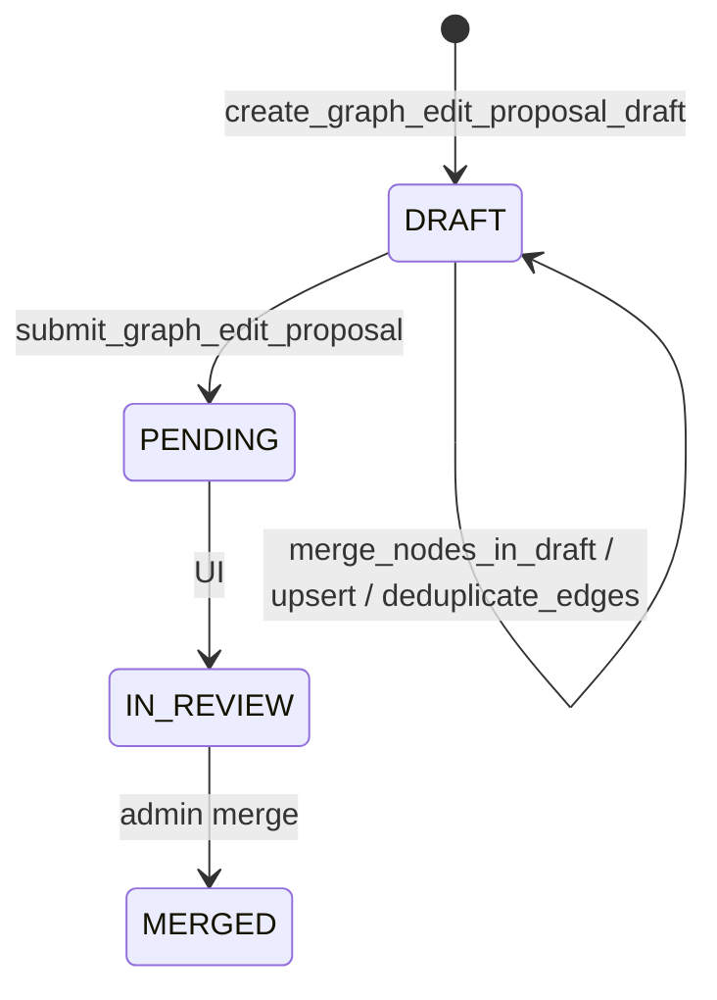

# KG Alignment Agent — アーキテクチャ

## 概要

## 変更提案ライフサイクル

CLI は **PENDING まで**。MERGED は管理 UI の責務。

## MCP 改善との対応

| 改善 | エージェントでの利用 |
|------|----------------------|
| P0 `mcpToolIdentifier` フォールバック | ツール名の安定解決 |
| P0 認証エラー JSON | CLI が `isError` を検出 |
| P1 `find_duplicate_edges` | scan / plan |
| P1 `deduplicate_edges_in_draft` | execute |
| P1 `get_label_distribution` | scan / plan |

## 将来拡張（未実装）

- Web UI からのエージェント起動
- `AlignmentRun` の Prisma 永続化
- 変更提案の自動承認（意図的に非対応）
