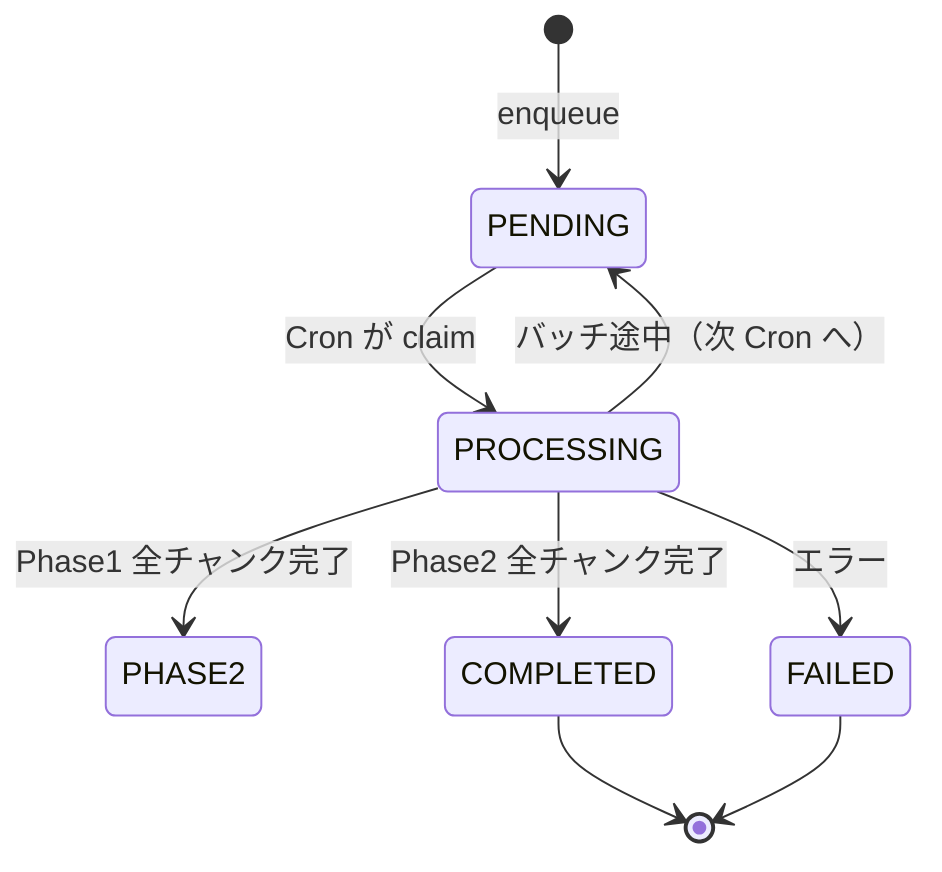

# KG バッチ抽出パイプライン（Phase1 / Phase2）

長文ドキュメント（Drive 同期・PDF OCR 完了後など）の知識グラフ抽出は、チャンク数に応じて **インライン即時抽出** か **非同期バッチジョブ** に分岐する。バッチ処理は 2 フェーズの反復抽出（Phase1: エンティティ、Phase2: 関係の精緻化）で Vercel Functions のタイムアウトを回避する。

Drive 同期・PDF パイプラインとの接続は [Google Drive 同期](./topic-space-drive-sync.md) を参照。

## 分岐条件

`extractKgForDocument`（`src/server/services/kg-extraction/extract-kg-for-document.service.ts`）が `resolveKgExtractionStrategy` で判定:

| 条件 | 動作 |
|------|------|
| チャンク数 ≤ `KG_EXTRACTION_INLINE_CHUNK_THRESHOLD`（**10**） | `runExtractKGFromPlainText` で即時完了（`mode: "inline"`） |
| チャンク数 > 10 | `KgExtractionJob` を enqueue（`mode: "queued"`） |

チャンク分割は `textInspectFromPlainText`（LangChain `Document[]`）に依存する。

## ジョブのライフサイクル



### Phase1 — エンティティ抽出

- モデル: **gpt-4o**（`IterativeGraphExtractorCore` の `PHASE1_MODEL`）
- 1 Cron 実行あたり最大 **3 チャンク**（`KG_EXTRACTION_BATCH_SIZE`）
- 各バッチの nodes / relationships を `accumulatedNodes` / `accumulatedRelationships` に追記
- 全チャンク完了後、ノードを **名前で重複排除** し Phase2 へ

### Phase2 — 関係の精緻化

- モデル: **gpt-4o-mini**（`PHASE2_MODEL`）
- Phase1 で得た全ノードをコンテキストとして各チャンクを処理
- チャンク内に出現するノードのみを `buildLocalContextFromNodes` でフィルタし、プロンプトに渡す
- バッチ内のチャンク LLM 呼び出しは `Promise.all` で **並列実行**
- `relationshipType` が null の場合は `RELATED_TO` にフォールバック
- 全チャンク完了後 `finalizeAccumulatedKg` → `replaceDocumentGraphFromExtraction`

`topicSpaceId` が付いているジョブは完了時に `resyncDocumentGraphToTopicSpace` でリポジトリへ再 attach する。

## Cron 実行

`vercel.json`:

```
GET /api/cron/kg-extraction
schedule: */1 * * * *
```

- 1 回の呼び出しで `claimNextKgExtractionJob` → `processKgExtractionJob` を **1 ジョブのみ** 処理
- 本番は `Authorization: Bearer ${CRON_SECRET}` が必須（他 Cron と同様）
- 関数 `maxDuration` は 300 秒

## 呼び出し元

| 経路 | 説明 |
|------|------|
| Drive 同期 | `sync-topic-space-drive.service` → `extractKgForDocument` |
| PDF OCR 完了 | `process-pdf-extraction-job.service` → 同上 |
| tRPC `kg.extractKG` 等 | 短文はインライン、長文はジョブ化の可能性 |

## ローカルコンテキスト（Phase2）

`buildLocalContextFromNodes`（`src/server/lib/extractors/build-local-context.ts`）:

- チャンク本文に **名前・name_ja・name_en** が出現する Phase1 ノードのみをコンテキスト化
- 日本語/CJK は部分一致、ASCII ラテン語は単語境界 + 大文字小文字無視

これにより全ノードを毎チャンクに載せず、トークンとコストを抑える。

## データモデル（主要フィールド）

`KgExtractionJob`（Prisma）:

| フィールド | 用途 |
|------------|------|
| `phase` | `PHASE1` → `PHASE2` → `FINALIZE` |
| `batchSize` | 1 回の Cron で処理するチャンク数（既定 3） |
| `processedChunks` / `totalChunks` | 進捗 |
| `accumulatedNodes` / `accumulatedRelationships` | フェーズ横断の累積結果 |
| `plainText` | 抽出元全文 |
| `topicSpaceId` | 完了後のリポジトリ resync 用（任意） |

## トラブルシューティング

| 症状 | 対処 |
|------|------|
| Drive 同期後しばらくグラフが空 | チャンク > 10 でジョブ化。Cron `/api/cron/kg-extraction` とジョブ `status` を確認 |
| ジョブが `FAILED` | `error` フィールド。Phase2 で `accumulatedNodes` 未設定はデータ不整合 |
| 関係が薄い | Phase2 はチャンク内に出現するノードのみコンテキスト化。固有名の表記ゆれは Phase1 ノード名に依存 |
| Vercel タイムアウト | `batchSize`（3）を下げるか `maxDuration` を確認。インライン閾値（10 チャンク）未満なら即時経路 |

## 関連ファイル

- `src/server/services/kg-extraction/extract-kg-for-document.service.ts` — インライン / キュー分岐
- `src/server/services/kg-extraction/process-kg-extraction-job.service.ts` — バッチ処理本体
- `src/server/services/kg-extraction/constants.ts` — 閾値・バッチサイズ
- `src/server/lib/extractors/iterative-core.ts` — Phase1 / Phase2 LLM 抽出
- `src/server/lib/extractors/build-local-context.ts` — チャンクローカルコンテキスト
- `src/app/api/cron/kg-extraction/route.ts` — Cron エンドポイント
