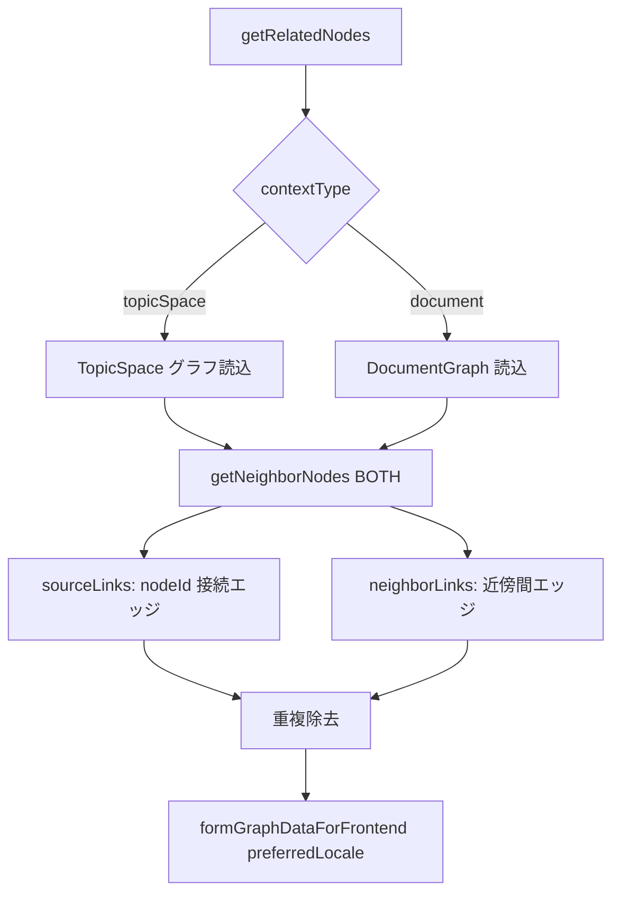

# KG 統合・近傍取得 API（kgRouter 統合手続き）

`kg-integration.ts` が export する手続きは `kgRouter` にマージされる。TopicSpace / DocumentGraph へのグラフ統合と、ノード近傍の部分グラフ取得を担う。

`kg.extractKG` 等の抽出手続きは [TopicSpace グラフ拡張](./topic-space-graph-extension.md) / [KG バッチ抽出パイプライン](./kg-batched-extraction-pipeline.md) を参照。

## 手続き一覧

| tRPC | 認証 | 説明 |
|------|------|------|
| `kg.integrateGraph` | 要 | TopicSpace 統合グラフへ fuse + 永続化 |
| `kg.getNodesByIds` | 要 | ID 指定ノードのフロント形式取得 |
| `kg.getRelatedNodes` | **不要**（publicProcedure） | 1-hop 近傍 + ソースリンクの部分グラフ |

## kg.integrateGraph

TopicSpace への書き込み統合。詳細フロー・権限・provenance 制約は [TopicSpace グラフ拡張](./topic-space-graph-extension.md#kgintegrategraph) を参照。

| 項目 | 値 |
|------|-----|
| 入力 | `{ topicSpaceId, graphDocument }` |
| 権限 | TopicSpace **管理者のみ** |
| マージ | `fuseGraphs({ labelCheck: false })` |
| 履歴 | `applyTopicSpaceGraphDiff` — 「グラフを追加しました」 |
| トランザクション | 30 秒タイムアウト |

成功時 `{ data: topicSpace }`（統合前の topicSpace エンティティ）。

## kg.getNodesByIds

| 入力 | `{ nodeIds: string[] }` |
|------|-------------------------|
| クエリ | `graphNode.findMany`（`deletedAt: null`, `id in nodeIds`） |
| 出力 | `formNodeDataForFrontend` 適用済みノード配列 |

主用途: グラフ変更提案の visual diff（`graph-edit-proposal/visual-diff-viewer.tsx`）で変更対象ノードのラベル表示。

## kg.getRelatedNodes

指定ノードを中心とした **1-hop 近傍** と、ソースノードに接続する全エッジを返す。公開 Procedure のためセッション不要だが、ログイン時は `preferredLocale` で `name_ja` / `name_en` を解決する。

### 入力

```typescript
{
  nodeId: string,
  contextId: string,
  contextType: "topicSpace" | "document",
}
```

| contextType | contextId | グラフソース |
|-------------|-----------|--------------|
| `topicSpace` | TopicSpace ID | `topicSpace.graphNodes/Relationships`（`isDeleted: false`） |
| `document` | DocumentGraph ID | `documentGraph` のノード・エッジ |

### 処理フロー



### 返却グラフの構成

| 要素 | 内容 |
|------|------|
| ノード | ソース + `getNeighborNodes(..., "BOTH")` の近傍（ID 重複除去） |
| リレーション | ソース接続エッジ + 近傍ノード間エッジ（ID 重複除去） |

`formGraphDataForFrontend` 前に DB フィールド（`documentGraphId`, `topicSpaceId`, タイムスタンプ）を null 化して渡す。

### 主な UI 利用箇所

| コンポーネント | 用途 |
|----------------|------|
| `RelatedNodesViewer` | ノード詳細パネルの近傍グラフ |
| `AdditionalGraphExtractionModal` | 選択テキスト抽出時の文脈グラフ |
| `NodePropertiesDetail` | `integrateGraph` 後の `invalidate` |

## エラーケース

| 状況 | メッセージ / 挙動 |
|------|-------------------|
| integrateGraph: 非管理者 | リポジトリ assert 失敗 |
| integrateGraph: fuse 失敗 | `"Graph fusion failed"` |
| getRelatedNodes: TS 未存在 | `"リポジトリが見つかりません"` |
| getRelatedNodes: DocumentGraph 未存在 | `"DocumentGraph not found"` |

## 関連ファイル

- `src/server/api/routers/kg-integration.ts` — 手続き定義
- `src/server/api/routers/kg.ts` — `extractionProcedures` + `integrationProcedures` + `copilotProcedures` の合成
- `src/server/services/kg/integrate-graph.service.ts` — 統合ビジネスロジック
- `src/app/_utils/kg/get-tree-layout-data.ts` — `getNeighborNodes`
- `src/app/_utils/kg/frontend-properties.ts` — `formGraphDataForFrontend`, `formNodeDataForFrontend`

## 関連ドキュメント

- [TopicSpace グラフ拡張](./topic-space-graph-extension.md) — extractKG + integrateGraph UI フロー
- [クロス言語ノード同一性](./cross-language-node-identity.md) — fuse / name 解決
- [グラフ変更提案](./graph-edit-proposal-flow.md) — `getNodesByIds` 利用
- [TopicSpace ノード・エッジ provenance](./topic-space-node-provenance.md) — integrateGraph は provenance 非記録
