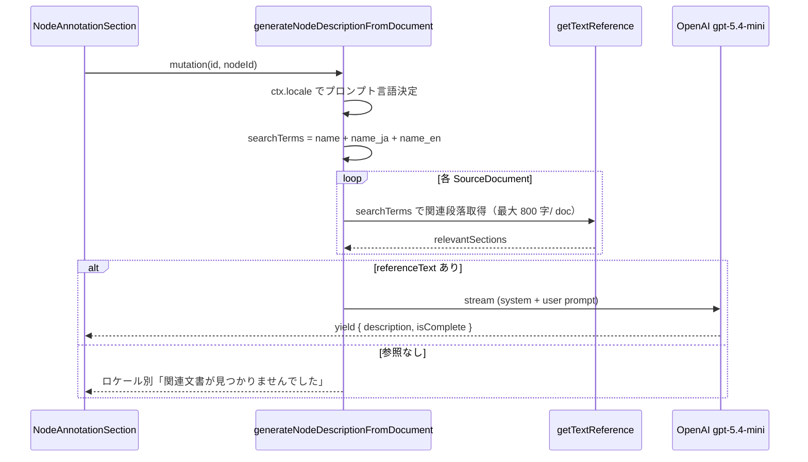

# ノード解説文の自動生成（UI ロケール対応）

TopicSpace のノード詳細から、関連 SourceDocument を参照して LLM が解説文（アノテーション下書き）をストリーミング生成する機能。UI ロケール（`ja` / `en`）に合わせて **プロンプト言語・出力言語・ノード表示名** を切り替える（PR #83）。

## エントリポイント

| 層 | ファイル |
|----|----------|
| UI | `src/app/_components/view/node/node-annotation-section.tsx` |
| tRPC | `topicSpaces.generateNodeDescriptionFromDocument`（`src/server/api/routers/topic-space.ts`） |
| プロンプト | `src/server/lib/i18n/prompts/node-description.ts` |

ユーザーが「ドキュメントから解説を生成」を押すと、注釈フォームを開いたうえでストリーミング mutation を開始する。

**関連機能:** 同じノード詳細パネルには説明文から KG を抽出する「知識グラフを拡張」もある（`generateGraphFromDescription` → `kg.extractKG`）。こちらは注釈ではなくグラフ統合向け — [TopicSpace グラフ拡張](./topic-space-graph-extension.md)。

## 処理フロー

## ロケールの決定

tRPC コンテキスト `ctx.locale`（`src/server/api/trpc.ts`）:

1. セッション `user.uiLocale` が `ja` / `en` なら優先
2. それ以外は `x-locale` ヘッダ（クライアントは `document.documentElement.lang` を `src/trpc/react.tsx` から送信）
3. フォールバック: `Accept-Language` → 既定 `ja`

## プロンプトの言語別仕様

| ロケール | システムプロンプト | 出力長の目安 | プロンプト内ノード名 |
|----------|-------------------|--------------|---------------------|
| `ja` | 日本語指示 | 200–300 文字 | `name_ja` 優先、なければ `name` |
| `en` | 英語指示 | 120–180 words | `name_en` 優先、なければ `name` |

ユーザープロンプトには `nodeLabel` と `referenceText`（全ドキュメントの関連段落を `---` 連結）を含める。

## 参照テキストの検索

関連段落のキーワードは **表示名だけでなく** `node.name` / `properties.name_ja` / `properties.name_en` の和集合（重複除去）。ドキュメント言語と `name` の言語が異なってもヒットしやすくするため。同一性の詳細は [クロス言語ノード同一性](./cross-language-node-identity.md)。

## LLM 設定

| 項目 | 値 |
|------|-----|
| モデル | `gpt-5.4-mini`（ハードコード） |
| `max_completion_tokens` | 1500 |
| `reasoning_effort` | `low` |
| `temperature` | 未指定（ reasoning モデルの既定 1） |
| 応答形式 | tRPC async generator によるチャンク yield |

エラー時はロケール別メッセージ（`getNodeDescriptionGenerationFailedMessage`）を返す。

## 権限

TopicSpace が存在し、対象 `graphNode` が見つかれば、**ログインユーザーであれば誰でも**生成可能（管理者限定ではない）。

## 制約

- 参照テキストが空のときは LLM を呼ばず、即座に「関連する文書が見つかりませんでした」を返す
- 生成結果は注釈フォームの下書きテキストとして表示されるのみ。自動保存はしない（ユーザーが注釈として投稿する必要がある）
- モデル名は環境変数 `KG_PHASE1_MODEL` 等とは独立（本 API 専用の固定値）

## トラブルシューティング

| 症状 | 対処 |
|------|------|
| 英語 UI なのに日本語で生成される | セッション `uiLocale` と `x-locale` ヘッダを確認。`resolveLocaleFromHeaders` のフォールバックは `ja` |
| 常に「関連文書が見つかりません」 | `name_ja` / `name_en` が未設定で `name` も本文に無い可能性。finalize 翻訳または手動プロパティ編集 |
| ストリームが途中で止まる | OpenAI API エラー。サーバーログの `OpenAI API error` を確認 |
| 生成が遅い | `reasoning_effort: low` でも reasoning モデルはレイテンシあり。参照段落の合計量（ドキュメント数 × 800 字上限）も影響 |

## 関連ファイル

- `src/server/lib/i18n/prompts/node-description.ts` — プロンプト・エラーメッセージ
- `src/server/lib/locale.ts` — ヘッダからのロケール解決
- `src/server/api/routers/topic-space.ts` — mutation 本体
- `src/app/_components/view/node/node-annotation-section.tsx` — UI とストリーム消費
