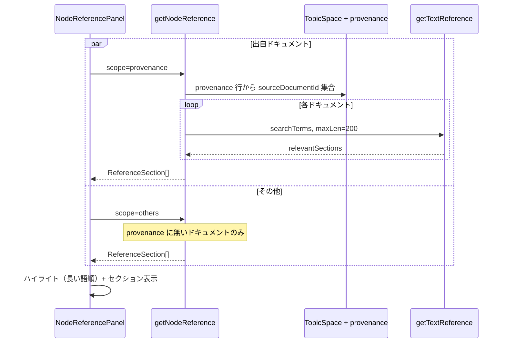

# ノード引用パネル（SourceDocument 参照）

TopicSpace のノード詳細・注釈セクション内で、ノード名が言及されている SourceDocument の抜粋を表示する機能。出自（provenance）ドキュメントを優先表示し、その他のドキュメントを後から追加する（PR #82）。

ノード解説文の **LLM 生成**（800 字/ doc）とは別 API。生成フローは [ノード解説文の自動生成](./node-description-generation.md) を参照。

## エントリポイント

| 層 | ファイル |
|----|----------|
| UI | `NodeReferencePanel`（`node-reference-panel.tsx`） |
| 親 | `NodeAnnotationSection` の「引用」タブ |
| tRPC | `topicSpaces.getNodeReference`（`topic-space.ts`） |
| 検索 | `getTextReference`（`source-document.ts`） |

## 処理フロー



## tRPC: getNodeReference

| 入力 | 型 | 説明 |
|------|-----|------|
| `id` | string | TopicSpace ID |
| `nodeId` | string | GraphNode ID |
| `scope` | `provenance` \| `others` \| `all` | 検索対象ドキュメントの絞り込み（既定 `all`） |

### scope の意味

| scope | 対象 SourceDocument |
|-------|---------------------|
| `provenance` | `TopicSpaceDocumentNodeProvenance` に `graphNodeId` が記録されているドキュメントのみ |
| `others` | 上記以外の TopicSpace 配下ドキュメント |
| `all` | 全ドキュメント（後方互換） |

UI は `provenance` と `others` を **並列クエリ** で取得し、出自セクションを先に描画する。

### 検索キーワード（searchTerms）

`node.name` / `properties.name_ja` / `properties.name_en` の和集合（trim・重複除去）。ドキュメント言語と `name` の言語が異なってもヒットしやすくする。詳細は [クロス言語ノード同一性](./cross-language-node-identity.md)。

### 抜粋長

各ドキュメントあたり **最大 200 文字**（`getTextReference` の第 4 引数）。返却時に各セクション末尾へ `...` を付与。

解説文生成 API は同じ `getTextReference` を **800 字/ doc** で使用する。

## 権限

**TopicSpace 管理者のみ**（`assertTopicSpaceAdmin`）。

| API | 権限 |
|-----|------|
| `getNodeReference` | 管理者 |
| `generateNodeDescriptionFromDocument` | ログインユーザー全員 |

管理者でないユーザーは引用タブのクエリがエラーになり、両クエリ失敗時は `referenceFetchError` を表示する。

## UI のハイライト

クライアント側で `name` / `name_ja` / `name_en` を収集し、**文字数降順**に正規表現オルタネーションを構築。短い語が先にマッチして長い語のハイライトが欠ける問題を防止する（サーバー側の `highlight-entities` と同様の意図）。

## レスポンス構造

```typescript
type ReferenceSection = {
  sourceDocument: { id: string; name: string; url: string; /* ... */ };
  relevantSections: string[]; // 各 200 字以内 + "..."
}[];
```

`relevantSections` が空のドキュメントは UI でフィルタされない。両 scope とも空のとき `noReferencesFound` を表示。

## 制約

- provenance 未記録のノードは `scope=provenance` でヒットしない（手動 `integrateGraph` 由来ノードなど）
- 全文検索ではなくキーワードベースの段落抽出。意味的類似は対象外
- 引用表示は読み取り専用。ドキュメントへのリンクは `sourceDocument.url`（新規タブ）

## トラブルシューティング

| 症状 | 確認ポイント |
|------|--------------|
| 「引用の取得に失敗」 | 管理者権限。非管理者は本 API 不可 |
| 出自に表示されない | `TopicSpaceDocumentNodeProvenance` に当該 `graphNodeId` があるか |
| 本文に名前があるのにヒットしない | `name_ja` / `name_en` が未設定で `name` も本文に無い |
| 解説は生成できるが引用が空 | 解説は 800 字・全ログインユーザー可。引用は 200 字・管理者・scope 依存 |

## 関連ファイル

- `src/app/_components/view/node/node-reference-panel.tsx`
- `src/app/_components/view/node/node-annotation-section.tsx`
- `src/server/api/routers/topic-space.ts` — `getNodeReference`
- `src/server/api/routers/source-document.ts` — `getTextReference`
- `src/server/repositories/topic-space-document-provenance.repository.ts`
