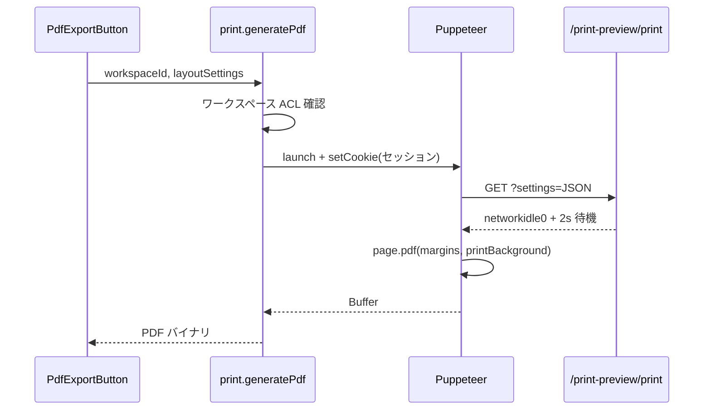

# 印刷 PDF API（printRouter）

ワークスペースの印刷プレビュー画面をヘッドレス Chromium（Puppeteer）でレンダリングし、**サーバー側で PDF バイナリ**を生成する tRPC ルーター。

ブラウザの `window.print()` によるクライアント印刷とは別経路。詳細 UI は [執筆ワークスペース API — 印刷・PDF](./workspace-router-api.md#印刷pdf) を参照。

## 手続き一覧

| 手続き | 種別 | 認証 | 説明 |
|--------|------|------|------|
| `print.generatePdf` | mutation | 要 | レイアウト設定付きで PDF `Buffer` を返す |

## print.generatePdf

### 入力

```typescript
{
  workspaceId: string,
  layoutSettings: PrintLayoutSettings, // print-preview/types と同一形状
}
```

主要フィールド:

| フィールド | 説明 |
|------------|------|
| `pageSize` | テンプレート（A4 等）またはカスタム寸法 + `orientation` |
| `margins` | mm 単位の上下左右 |
| `fontSize` | 見出し・本文・グラフ用フォントサイズ |
| `graphSize` | 詳細グラフの描画領域 |
| `colorMode` | `color` / `grayscale` |
| `metaGraphDisplay` | メタグラフ表示モード（`none` / `story` / `all`） |
| `detailedGraphDisplay` | 詳細グラフのノード範囲（`all` / `story`） |
| `pdfFilename?` | クライアント保存時のファイル名（サーバーは未使用） |

スキーマは `src/server/api/routers/print.ts` の `PrintLayoutSettingsSchema`（`.passthrough()` で追加キーを許容）。

### 処理フロー



| 項目 | 値 |
|------|-----|
| レンダリング URL | `{NEXT_PUBLIC_BASE_URL\|NEXTAUTH_URL}/workspaces/{id}/print-preview/print?settings=...` |
| 認証 | tRPC リクエストの `Cookie` を Puppeteer に転送 |
| タイムアウト | `page.goto` 30 秒。失敗時は i18n 付き `INTERNAL_SERVER_ERROR` |
| 戻り値 | Node `Buffer`（クライアントは Blob 化してダウンロード） |

### 運用上の注意

| トピック | 内容 |
|----------|------|
| **UI** | `pdf-export-button.tsx` の `handleDownload` はコメントアウト。本 API は実装済みだがプロダクト UI からは未接続 |
| **本番 URL** | `NEXT_PUBLIC_BASE_URL` が Puppeteer から到達不能だと PDF が空・タイムアウトになる |
| **Chromium** | デプロイ環境に Puppeteer 実行用の依存（サンドボックスフラグは `--no-sandbox` 等を付与）が必要 |
| **権限** | 所有者または共同編集者のみ。未存在は `NOT_FOUND` |

## 関連ファイル

- `src/server/api/routers/print.ts` — ルーター本体
- `src/app/[locale]/workspaces/[id]/print-preview/` — プレビュー・印刷専用ページ
- `src/app/_components/print-preview/pdf-export-button.tsx` — クライアント呼び出し（ダウンロード無効）

## 関連ドキュメント

- [執筆ワークスペース API](./workspace-router-api.md)
