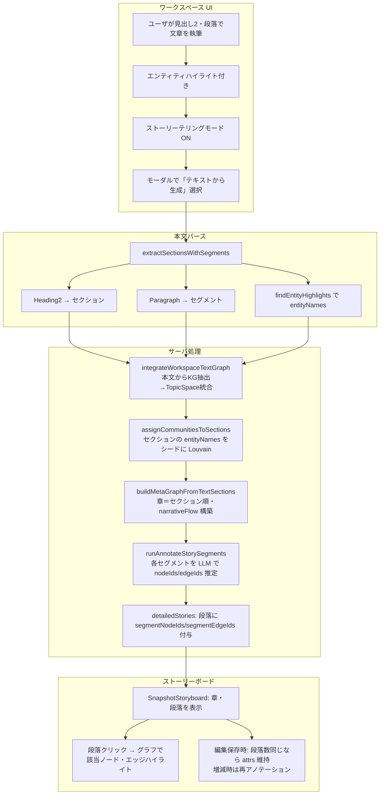

# キュレーターの文章執筆へのこだわり：テキストから生成（処理フロー）

文章をLLMによって知識グラフに連動させる機構。ユーザが書いた見出し2・段落を「章＝セクション」「段落＝セグメント」として固定し、既存の知識グラフのノード・エッジと対応づける。

## 処理フロー図

## 関連ファイル

- `src/app/_utils/text/parse-content-sections.ts` — extractSectionsWithSegments
- `src/app/_utils/text/find-entity-highlights.ts` — findEntityHighlights
- `src/server/api/routers/kg-copilot.ts` — integrateWorkspaceTextGraph, assignCommunitiesToSections, buildMetaGraphFromTextSections, runAnnotateStorySegments
- `src/app/_components/curators-writing-workspace/artifact/snapshot-storyboard.tsx` — SnapshotStoryboard
