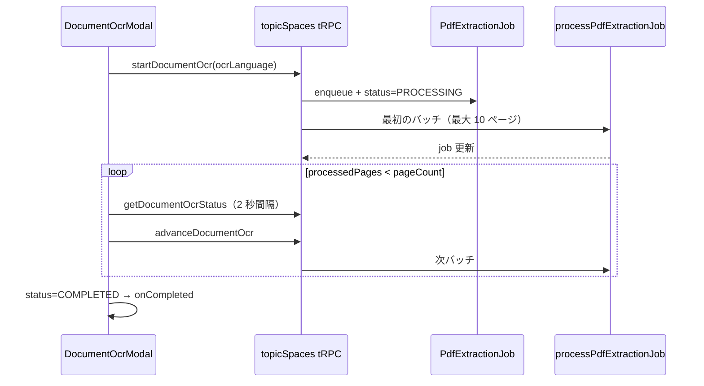

# Google Drive 同期（リポジトリ）

ArsTraverse がリポジトリ（TopicSpace）単位で Google Drive フォルダと同期し、`INPUT_DRIVE` / `INPUT_PDF` 型の SourceDocument として知識グラフ化します。取り込み後は通常の attach と同様にグラフ統合・[provenance 記録](./topic-space-node-provenance.md) が行われます。

## 認証方式

ログイン中の **本人の Google アカウント** で Drive にアクセスします（ユーザー OAuth のみ）。

1. リポジトリ画面で **「Google Drive を連携」**（`/api/google-drive/connect`）
2. Google の同意画面で Drive 読み取りを許可
3. **「フォルダを選ぶ」**（Google Picker）で同期フォルダを選択
4. **「今すぐ同期」**

- フォルダ ID の手入力不要
- サービスアカウントへの共有不要
- `UserGoogleDriveConnection` に refresh token を保存
- Cron 同期は `configuredByUserId` の token を使用

## 同期の挙動

`syncTopicSpaceDriveFolder`（tRPC `syncDriveFolder` / MCP `sync_topic_space_drive_folder` / Cron）の処理:

| 結果 | 条件 |
|------|------|
| **created** | Drive 上の新規ファイル → SourceDocument 作成 → attach |
| **updated** | 既存ファイルの内容ハッシュ変更 → 再抽出 → detach/再 attach |
| **skipped** | 内容ハッシュ同一、または本文が空 |
| **detached** | Drive フォルダから消えたファイル → detach → SourceDocument を論理削除 |

- `contentHash` はファイル ID・更新日時・MD5・本文 SHA256 から算出。同一なら LLM 再抽出をスキップ
- 更新時は一度 detach してから DocumentGraph を差し替え、再度 attach
- `recursive: true`（既定）でサブフォルダも走査

### 対応 MIME タイプ

`isSyncableDriveMimeType` で判定:

- Google ドキュメント（`application/vnd.google-apps.document`）
- PDF（`application/pdf` → `INPUT_PDF`）
- プレーンテキスト系（`text/*`、`text/markdown`、`application/json` など → `INPUT_DRIVE`）

## 定期同期（Cron）

`vercel.json` で 6 時間ごとに実行:

```
GET /api/cron/topic-space-drive-sync
schedule: 0 */6 * * *
```

- 本番では `Authorization: Bearer ${CRON_SECRET}` が必須
- 開発環境（`NODE_ENV !== production`）では認証なしで呼び出し可
- `enabled: true` の全 `TopicSpaceDriveSync` を `configuredByUserId` の OAuth で同期

## UI / API

| 経路 | 説明 |
|------|------|
| `TopicSpaceDriveSyncPanel` | リポジトリ詳細の Drive 同期 UI |
| tRPC `topicSpaces.getDriveSyncStatus` | 設定・最終同期状態 |
| tRPC `topicSpaces.upsertDriveSyncConfig` | Picker 選択フォルダの保存 |
| tRPC `topicSpaces.syncDriveFolder` | 手動同期 |
| tRPC `googleDrive.getConnectionStatus` / `disconnect` | ユーザー OAuth 連携状態 |

## 環境変数

| 変数 | 説明 |
|------|------|
| `GOOGLE_CLIENT_ID` / `GOOGLE_CLIENT_SECRET` | 既存 NextAuth 用（Drive 追加 OAuth にも使用） |
| `NEXTAUTH_SECRET` | OAuth state 署名 |
| `NEXT_PUBLIC_BASE_URL` | OAuth コールバック URL のベース |
| `NEXT_PUBLIC_GOOGLE_PICKER_API_KEY` | Google Picker 用 API キー |
| `NEXT_PUBLIC_GOOGLE_APP_ID` | Google Cloud プロジェクト番号 |
| `CRON_SECRET` | Vercel Cron 認証用（本番必須。Vercel が `Authorization: Bearer` で送信） |

## Google Cloud Console 設定

1. **Drive API** を有効化
2. OAuth クライアントの **承認済みリダイレクト URI** に追加:
   - `https://<your-domain>/api/google-drive/callback`
   - ローカル: `http://localhost:3000/api/google-drive/callback`
3. OAuth 同意画面にスコープ `https://www.googleapis.com/auth/drive.readonly` を追加
4. Picker 用に **API キー** を作成（HTTP リファラー制限推奨）

## データモデル

- `UserGoogleDriveConnection` — ユーザーごとの Drive refresh token
- `TopicSpaceDriveSync.configuredByUserId` — OAuth 同期のトークン持ち主
- `TopicSpaceDriveSync.driveFolderName` — Picker で選んだ表示名
- `SourceDocument.externalSourceId` — Drive ファイル ID（同一ファイルの upsert キー）
- `SourceDocument.contentHash` — 変更検知用
- `TopicSpace.defaultOcrLanguage` — PDF の OCR フォールバック時のデフォルト言語（`jpn` / `jpn_vert` / `eng`）
- `PdfExtractionJob` — テキスト層品質が低い PDF の非同期 OCR ジョブ

## PDF テキスト抽出パイプライン

Drive 同期および Storage アップロードの PDF は共通パイプラインで処理します。

1. **テキスト層抽出** — `pdf-parse` / PDFLoader で plain text を取得
2. **品質判定** — 文字化け・空ページ・異常な改行などをヒューリスティックで評価
3. **品質 OK** — そのまま KG 抽出へ
4. **品質 NG（Drive 同期）** — `PdfExtractionJob` を enqueue。同期結果に `pendingOcr` 件数を表示
5. **品質 NG（インライン OCR）** — ページをラスタライズし、レイアウトから読み方向を判定
   - 縦書き日本語 → サーバー NDLOCR
   - 横書き / 英語 → Tesseract + LLM 正規化
6. **Cron** — `/api/cron/pdf-extraction` が 1 分ごとにジョブを処理（本番は `CRON_SECRET` 必須。Vercel Functions は Dashboard で **4 GB / 2 vCPU（Performance）** 推奨）

複数ページ PDF は 10 ページずつ OCR し、`PdfExtractionJob.accumulatedPlainText` に結合してから KG 抽出します。リポジトリ画面では処理待ちジョブ数（`pendingOcrJobs`）も確認できます。

テキストが 10 チャンクを超える場合、KG 抽出は `KgExtractionJob` にキューイングされ、Cron `/api/cron/kg-extraction` で Phase1（`gpt-5.4-mini`）→ Phase2（`gpt-5.4-nano`）のバッチ処理が行われます。詳細は [KG バッチ抽出パイプライン](./kg-batched-extraction-pipeline.md) を参照。

リポジトリ画面の Drive 同期パネルで **OCR 言語** を設定できます。NDLOCR モデルは初回利用時に R2 から `.cache/ndlocr-models/` へダウンロードされます。

## 手動 OCR 再抽出（管理者 UI）

Drive 同期 Cron とは別に、リポジトリ管理者が PDF ドキュメントに対して **手動で OCR を再実行** できます。テキスト層品質が低い PDF の再処理や、言語指定のやり直しに使います。

### 対象ドキュメント

`isOcrEligibleDocument`（`document-ocr-modal.tsx` / `manual-document-ocr.service.ts`）:

| `documentType` | 条件 |
|----------------|------|
| `INPUT_PDF` | 常に対象 |
| `INPUT_DRIVE` | MIME が `application/pdf`、または MIME 未設定 |

### UI

- リポジトリ詳細 → ドキュメント一覧のメニュー → **「OCR で再抽出」**（`DocumentOcrModal`）
- OCR 言語: `auto` / `jpn` / `jpn_vert` / `eng`
- 処理中は進捗（`processedPages` / `pageCount`）と検出言語を表示
- 完了時に `onCompleted` でドキュメント一覧を再取得

### tRPC API（管理者のみ）

| 手続き | 説明 |
|--------|------|
| `topicSpaces.getDocumentOcrStatus` | 最新 `PdfExtractionJob` と本文プレビュー（先頭 500 文字） |
| `topicSpaces.startDocumentOcr` | ジョブ enqueue → 最初のバッチを同期的に処理 |
| `topicSpaces.advanceDocumentOcr` | 次のバッチ（10 ページ単位）を処理 |

**権限**: `assertTopicSpaceAdmin` — リポジトリ管理者のみ。

**競合**: 同一ドキュメントに `PENDING` / `PROCESSING` のジョブがある場合、`startDocumentOcr` は `CONFLICT` を返す。

### 処理フロー



- `startDocumentOcr` は Drive ファイル（`sourceType: drive`）と Storage アップロード PDF（`sourceType: storage`）の両方に対応
- ジョブ完了後は通常の KG 抽出パイプラインへ（Cron またはインライン）
- Cron `/api/cron/pdf-extraction` と **同じ** `processPdfExtractionJob` を共有。手動起動は UI から `advanceDocumentOcr` でバッチを進める点が異なる

縦書き OCR（NDLOCR-Lite）のライセンス・帰属表示要件は [NDLOCR ライセンス](./ndlocr-license.md) を参照。

## MCP / CLI

| 手段 | 説明 |
|------|------|
| `sync_topic_space_drive_folder` | Platform MCP で Drive 同期（要 Drive 連携・フォルダ設定） |
| `get_topic_space_drive_sync_status` | 同期設定・状態の確認 |
| `npm run export:topic-space` | DB からグラフ JSON をエクスポート（provenance 付き） |

Platform MCP の認証・設定例は [MCP 認証](./mcp-authentication.md) を参照。

## トラブルシューティング

| 症状 | 対処 |
|------|------|
| Picker が開かない | `NEXT_PUBLIC_GOOGLE_PICKER_API_KEY` / `NEXT_PUBLIC_GOOGLE_APP_ID` を確認 |
| 同期で token エラー | Drive 連携を解除して再連携 |
| Cron が止まる | 設定者の token 失効 → 再連携 |
| Vercel デプロイで関数サイズ超過 | PDF/OCR Cron は ONNX 等で 250MB 超になる。Vercel 環境変数に `VERCEL_SUPPORT_LARGE_FUNCTIONS=1` を設定して再デプロイ |
| `PRECONDITION_FAILED: Drive 同期が有効化されていません` | Picker でフォルダを選び `upsertDriveSyncConfig` 相当の保存を実行 |
| ファイル単位の errors | 同期結果 JSON の `errors[]` にファイル名とメッセージ。他ファイルは継続処理 |
| 手動 OCR が `CONFLICT` | 同一 PDF に進行中ジョブあり。完了を待つか Cron で処理完了後に再試行 |
| 手動 OCR 対象外 | `INPUT_PDF` / Drive 上 PDF のみ。テキスト・Google ドキュメントは対象外 |

## 関連ファイル

- `src/server/services/kg/sync-topic-space-drive.service.ts` — 同期本体
- `src/server/lib/google-drive/sync-client.ts` — OAuth クライアント解決
- `src/server/lib/google-drive/fetch-document-text.ts` — MIME 判定・テキスト取得
- `src/app/api/cron/topic-space-drive-sync/route.ts` — Cron エンドポイント
- `src/app/_components/topic-space/topic-space-drive-sync-panel.tsx` — UI
- `src/app/_components/topic-space/document-ocr-modal.tsx` — 手動 OCR モーダル
- `src/server/services/pdf-extraction/manual-document-ocr.service.ts` — 手動 OCR サービス
