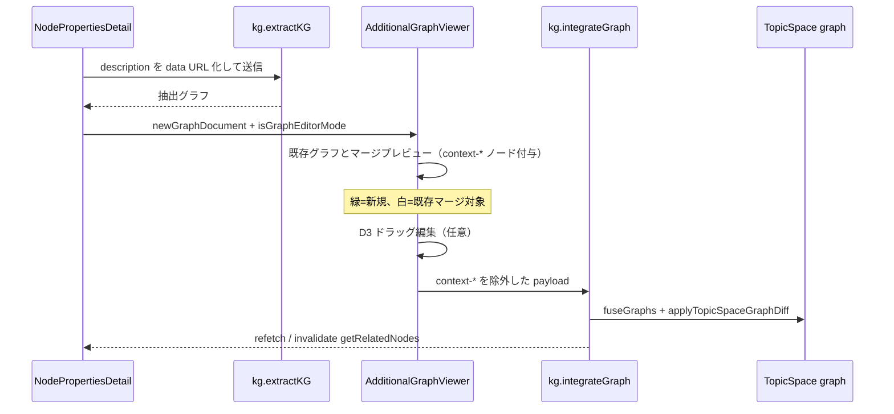

# TopicSpace グラフ拡張（抽出・プレビュー・統合）

ノードの説明文や執筆ワークスペースの選択テキストから KG を抽出し、既存 TopicSpace グラフへ追加するワークフロー。プレビューでは新規ノードを緑で強調し、ドラッグ編集後に `kg.integrateGraph` で永続化する（PR #82）。

ノード解説文の **ストリーミング生成**（注釈下書き）とは別機能。そちらは [ノード解説文の自動生成](./node-description-generation.md) を参照。

## エントリポイント

| 経路 | UI | 抽出入力 | 統合先 |
|------|-----|----------|--------|
| ノード詳細 | `NodePropertiesDetail` の「知識グラフを拡張」 | `name:label` + `properties.description` をプレーンテキスト化 | TopicSpace 統合グラフ |
| 執筆ワークスペース | `AdditionalGraphExtractionModal` | エディタ選択テキスト + 既存ノード文脈プロンプト | 親の `onGraphUpdate`（執筆メタグラフへステージング） |
| 注釈セクション | `NodeAnnotationSection` 経由の `onGraphUpdate` | 注釈由来の追加グラフ | `NodePropertiesDetail` の `integrateGraph` またはステージング |

## 処理フロー（ノード詳細）

## kg.extractKG

| 項目 | 値 |
|------|-----|
| 入力 | `fileUrl`（data URL 可）、`extractMode: "langChain"`、`isPlaneTextMode: true` |
| 出力 | `GraphDocumentForFrontend` |
| 権限 | `publicProcedure`（セッション不要だが UI は編集可能時のみ表示） |

ノード詳細では `Buffer.from(textContent).toString("base64")` で `data:text/plain;base64,...` を組み立てる。

## AdditionalGraphViewer プレビュー

`topicSpaces.getByIdPublic` で既存グラフを取得し、抽出結果に注釈を付与する。

### マージ対象の判定

プレビューでは **`${node.name}:${node.label}`** キーで既存ノードとの重複を判定する（`nodesShareName` ではない）。

| フラグ | 意味 | 表示 |
|--------|------|------|
| `isNewlyAdded` | 既存グラフに同名・同ラベルが無い | 緑で強調 |
| `isMergeTarget` | 既存ノードと `name:label` が一致 | 通常（白） |
| `isExistingContext` | マージ対象に接続する既存ノード | `context-{id}` としてプレビューに付加 |

`context-*` ノード・エッジは統合送信時に除外する。既存コンテキストエッジは `context-` プレフィックスを除去して既存 ID にマッピングし、重複エッジはフィルタする。

### 編集モード

| props | 値 |
|-------|-----|
| `isEditor` | `true` |
| `enableLiveSimulation` | `true`（固定） |
| `onGraphUpdate` | ドラッグ編集・ノード追加のコールバック |

右クリックで `NodePropertyEditModal` / `LinkPropertyEditModal` を開く。内部 state フローでは `NodeLinkEditModal` で追加ノードのプロパティ編集を促す。

### onConfirm モード

執筆ワークスペースでは `onConfirm` を渡し、「グラフに反映」で親へマージ済みグラフを返す。`hideConfirmButton` でボタンを親フッターに移せる。

## kg.integrateGraph

| 項目 | 説明 |
|------|------|
| tRPC | `kg.integrateGraph`（`protectedProcedure`） |
| 権限 | **TopicSpace 管理者のみ**（`findTopicSpaceWithGraphAndAssertAdmin`） |
| マージ | `fuseGraphs({ labelCheck: false })` — ラベル不一致でも `nodesShareName` で統合 |
| 履歴 | `applyTopicSpaceGraphDiff` で「グラフを追加しました」を記録 |
| provenance | **書き込まない** — [provenance ドキュメント](./topic-space-node-provenance.md#provenance-を記録しない経路) 参照 |

API 全体（`getRelatedNodes` / `getNodesByIds` 含む）は [KG 統合・近傍取得 API](./kg-integration-api.md) を参照。

`NodePropertiesDetail.onGraphUpdate` は `context-*` を除外したノード・エッジのみ送信する。

## 執筆ワークスペースとの違い

`AdditionalGraphExtractionModal` は:

- 選択テキスト + `getRelatedNodes` の近傍を LLM プロンプトに含める
- フロントの重複除去に `nodesShareName` を使用（プレビュー viewer の `name:label` 判定とは異なる）
- `topicSpaceId` があるとき `AdditionalGraphViewer` で可視化し、`onConfirm` で執筆側グラフへ反映

TopicSpace への直接 `integrateGraph` はノード詳細パスが主経路。

## 制約・既知の挙動

- 説明文（`properties.description`）が空のとき「知識グラフを拡張」ボタンは表示されない
- プレビューの `name:label` マッチはクロス言語同一性（`name_ja` / `name_en`）を考慮しない — [クロス言語ノード同一性](./cross-language-node-identity.md#プレビュー-viewer-の例外) 参照
- ライブシミュレーション ON 時は位置ドラッグ無効。ドラッグエディタは `canEditGraph`（`isEditor && onGraphUpdate`）で有効 — [D3 パフォーマンス doc](./d3-force-graph-performance.md#インタラクティブグラフ編集ドラッグエディタ) 参照
- `integrateGraph` はドキュメント attach 経路と異なり detach 時の provenance 保護対象外になり得る

## トラブルシューティング

| 症状 | 確認ポイント |
|------|--------------|
| 「グラフに統合」が失敗 | 管理者権限。`integrateFailed` アラートとサーバーログ |
| プレビューで既存ノードが緑になる | `name:label` が既存と一致していない（言語違いの表記など） |
| 統合後に近傍グラフが古い | `getRelatedNodes` の invalidate が走っているか |
| ドラッグでノードを追加できない | `onGraphUpdate` が渡されているか。ライブ OFF でもエディタはライブ ON 固定の viewer 内では動作 |
| 重複エッジが増えない | 送信前に既存 `(sourceId, targetId, type)` と重複チェック済み |

## 関連ファイル

- `src/app/_components/view/node/node-properties-detail.tsx` — ノード詳細からの抽出・統合
- `src/app/_components/view/graph-view/additional-graph-viewer.tsx` — プレビュー・統合 UI
- `src/app/_components/curators-writing-workspace/tiptap/tools/additional-graph-extraction-modal.tsx` — 執筆 WS 経路
- `src/server/services/kg/integrate-graph.service.ts` — サーバー統合
- `src/server/api/routers/kg-integration.ts` — tRPC 定義
- `src/server/domain/kg/data-disambiguation.ts` — `fuseGraphs`
