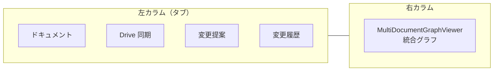

# TopicSpace（リポジトリ）画面ナビゲーション

TopicSpace（UI 上は「リポジトリ」）の主要ルート・左パネルタブ・グラフビューの対応関係。個別機能の詳細は各サブシステムのドキュメントを参照する。

## ルート一覧

| パス | コンポーネント | 認証 | 概要 |
|------|----------------|------|------|
| `/topic-spaces` | 一覧 | 要ログイン | リポジトリ一覧 |
| `/topic-spaces/[id]` | `TopicSpaceDetail` | 要ログイン・メンバー | **管理画面**（ドキュメント・Drive・提案・履歴 + 統合グラフ） |
| `/topic-spaces/[id]/graph` | `TopicGraphDetail` | 公開可（`getByIdPublic`） | **公開グラフビュー**（クラスタ・経路検索・単一ドキュメント表示） |
| `/topic-spaces/[id]/edit` | `TopicGraphEditor` | 管理者 | グラフ構造の直接編集（ドラッグエディタ） |
| `/topic-spaces/[id]/tags/[tag_name]` | `TopicGraphDetail` | 公開可 | タグでフィルタした公開ビュー |
| `/topic-spaces/[id]/labels/[label_name]` | `TopicGraphDetail` | 公開可 | ノードラベルでフィルタした公開ビュー |
| `/topic-spaces/[id]/path/[start_id]/[end_id]` | `TopicGraphPathDetail` | 公開可 | 2 ノード間最短経路の部分グラフ |
| `/topic-spaces/[id]/tree/[node_id]` | `TreeViewer` | 公開可 | ノードを根とするツリー表示 |
| `/proposals/[proposal_id]` | 提案詳細 | 提案者または管理者 | 変更提案のレビュー・diff 表示 |

HTTP クライアント向けの公開 API は [TopicSpace 公開 REST API](./topic-space-public-rest-api.md)。MCP は [MCP 認証](./mcp-authentication.md)。

## 管理画面（`TopicSpaceDetail`）

`/topic-spaces/[id]` は **2 カラム** レイアウト。

### 左パネルタブ

| タブ（i18n キー） | 内容 | 関連ドキュメント |
|-------------------|------|------------------|
| `documents` | 添付ドキュメント一覧・追加・メニュー（削除・名前編集・**OCR で再抽出**） | [Drive 同期](./topic-space-drive-sync.md)（手動 OCR）、[provenance](./topic-space-node-provenance.md) |
| `driveSyncTab` | `TopicSpaceDriveSyncPanel` — OAuth 連携・Picker・同期・OCR デフォルト言語 | [Drive 同期](./topic-space-drive-sync.md) |
| `changeProposals` | `ProposalList` — 変更提案一覧（管理者向けフィルタ） | [グラフ変更提案](./graph-edit-proposal-flow.md) |
| `changeHistory` | `TopicSpaceChangeHistory` — マージ履歴の検索・グラフ上ハイライト | [グラフ変更提案](./graph-edit-proposal-flow.md)、[provenance](./topic-space-node-provenance.md) |

ヘッダーアクション:

| リンク | 先 |
|--------|-----|
| `editAction` | `/topic-spaces/[id]/edit` — グラフ直接編集 |
| `publicPage` | `/topic-spaces/[id]/graph` — 公開ビュー |

変更履歴タブで行を選択すると、右カラムの統合グラフに追加・削除ノード/エッジがハイライト表示される（`highlightData` → `MultiDocumentGraphViewer`）。

**注意:** `TopicSpaceDriveSyncPanel` は管理画面の **Drive 同期タブ専用**。公開グラフ画面（`TopicGraphDetail`）には含まれない（PR #91 以降）。

### 右カラム（統合グラフ）

`MultiDocumentGraphViewer` — ライブシミュレーション切替・ノード検索・`NodeLinkList` など。仕様は [D3 フォースグラフ](./d3-force-graph-performance.md)、[グラフ統計パネル](./graph-statistics-panel.md) を参照。

グラフ上のノード詳細・引用・解説生成は [ノード引用パネル](./node-reference-citations.md)、[ノード解説文生成](./node-description-generation.md)、[グラフ拡張](./topic-space-graph-extension.md)。

## 公開グラフビュー（`TopicGraphDetail`）

`/topic-spaces/[id]/graph` およびタグ・ラベルフィルタルート。`api.topicSpaces.getByIdPublic` でデータ取得（ログイン時は `preferredLocale` で表示名を解決）。

| 機能 | 説明 |
|------|------|
| ドキュメント一覧 | 単一ドキュメントの部分グラフを右側に重ね表示 |
| クラスタ表示 | `isClustered` でドキュメント別にノードを円配置・色分け |
| 経路検索 | `RelationPathSearch` → 結果から `/path/{start}/{end}` へリンク |
| ツールバー | リンクフィルタ・ノード検索（`NodeLinkList` へ渡す） |

### クエリパラメータ（フィルタ付きビュー）

`TopicGraphDetail` / `TopicGraphEditor` が `useSearchParams` で読む値:

| パラメータ | 用途 |
|------------|------|
| `cut-off` | タグ・ラベルフィルタ時の BFS 距離上限（`filterOption.cutOff`） |
| `with-between-nodes` | `true` で中間ノードを含むフィルタ（`filterOption.withBetweenNodes`） |

グラフビュー共通（`NodeLinkList` / D3）:

| パラメータ | 用途 |
|------------|------|
| `list=true` | ノードリンクリストを開く |
| `list=true&nodeId=<id>` | リスト + ノード詳細パネル |

詳細は [D3 フォースグラフ](./d3-force-graph-performance.md) の「URL 駆動のリスト・詳細」を参照。

## グラフ直接編集（`TopicGraphEditor`）

`/topic-spaces/[id]/edit` — 管理者向け。`MultiDocumentGraphEditor` で `dragEditorExtension` によるノード・エッジのドラッグ作成、プロパティ編集モーダル、未保存時の「更新」ボタン（`NodeLinkList` の `onGraphUpdate`）を利用。

- 構造編集ドラッグ・stale closure 対策: [D3 フォースグラフ](./d3-force-graph-performance.md)
- クロス言語ノード名: [クロス言語ノード同一性](./cross-language-node-identity.md)

## ドキュメント一覧メニュー（管理タブ）

`DocumentList` のコンテキストメニュー（管理者）:

| 操作 | 説明 |
|------|------|
| リポジトリから削除 | `detachDocument` |
| 名前を編集 | `DocumentEditModal` |
| OCR で再抽出 | `isOcrEligibleDocument` のとき `DocumentOcrModal` を開く |

OCR 対象・API・進捗 UI は [Drive 同期ドキュメントの手動 OCR 節](./topic-space-drive-sync.md#手動-ocr-再抽出管理者-ui) を参照。ヒント文は Drive 同期タブ下部（`manualOcrHint`）にも表示される。

## 関連ファイル

| パス | 役割 |
|------|------|
| `src/app/[locale]/topic-spaces/[id]/page.tsx` | 管理画面ルート |
| `src/app/_components/topic-space/topic-space-detail.tsx` | 管理 UI 本体 |
| `src/app/_components/topic-space/topic-graph-detail.tsx` | 公開グラフビュー |
| `src/app/_components/topic-space/topic-graph-editor.tsx` | グラフ直接編集 |
| `src/app/_components/topic-space/topic-space-drive-sync-panel.tsx` | Drive 同期タブ |
| `src/app/_components/graph-edit-proposal/proposal-list.tsx` | 変更提案タブ |
| `src/app/_components/topic-space/topic-space-change-history.tsx` | 変更履歴タブ |

## 関連ドキュメント

- [Google Drive 同期](./topic-space-drive-sync.md)
- [グラフ変更提案](./graph-edit-proposal-flow.md)
- [TopicSpace ノード・エッジ provenance](./topic-space-node-provenance.md)
- [TopicSpace 公開 REST API](./topic-space-public-rest-api.md)
- [D3 フォースグラフの描画パフォーマンス](./d3-force-graph-performance.md)
