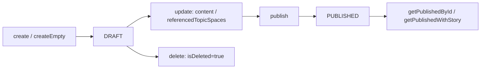

# 執筆ワークスペース API（workspaceRouter）

キュレーター執筆ワークスペースの CRUD、共同編集、LLM テキスト補完、公開ビュー、公開ノード検索を提供する tRPC ルーター。

執筆体験とデータの概念関係は [執筆体験とデータの関係（概念図）](./concept-writing-experience.md) / [データ連携の概念](./concept-writing-data-linkage.md) を参照。注釈 CRUD は [注釈コラボレーション API](./annotation-collaboration-api.md) が対象（エッジ注釈の取得のみ本ルーター）。

## データモデル

`prisma/schema.prisma` の `Workspace`:

| フィールド | 説明 |
|------------|------|
| `content` | Tiptap JSON（執筆本文） |
| `status` | `WorkspaceStatus`: `DRAFT` / `PUBLISHED` |
| `curatorialContext` | キュレトリアル文脈（`stance`, `extractionRules`, `negativeArchive` 等） |
| `referencedTopicSpaces` | 参照 TopicSpace（グラフソース） |
| `collaborators` | 共同編集者 |
| `story` | 1 対 1 の `Story`（メタグラフ） |
| `isDeleted` | 論理削除 |

### WritingHistory（執筆履歴）

`workspace.update` / `upsertBySource` / 外部 REST の PUT で本文またはライブグラフが変わったときにスナップショットを積む。詳細ルールは [執筆履歴](#執筆履歴) と [外部 Workspace REST API](./external-workspace-api.md#執筆履歴の記録ルール) を参照。

| フィールド | 説明 |
|------------|------|
| `previousContent` / `currentContent` | 変更前後の Tiptap JSON |
| `previousGraph` / `currentGraph` | 変更前後の **ライブグラフ**（`curatorialContext` 内） |
| `changeDescription` | 人間可読な変更理由（省略時は自動文言） |
| `changedBy` | 変更ユーザー |

### curatorialContext 内の liveGraph

外部アプリ（SOS 等）が TopicSpace 統合グラフとは別に保持する **執筆中の部分グラフ**。`workspace-graph-history.ts` が読み書きする。

| 配置 | 読み取り順 |
|------|------------|
| `curatorialContext.sosWriting.liveGraph` | 最優先（SOS 執筆モード） |
| `curatorialContext.sosConcept.liveGraph` | 次点 |
| `curatorialContext.liveGraph` | 上記が無い場合 |

履歴の同一判定・差分は `updatedAt` を除いた JSON 比較（`liveGraphsEqual` / `diffLiveGraphs`）。

## アクセス制御

| 操作 | 所有者 | 共同編集者 | 未認証 |
|------|--------|------------|--------|
| CRUD（`create` 除く共同編集者追加/削除） | ○ | ○（更新・閲覧） | × |
| `addCollaborator` / `removeCollaborator` / `delete` | ○ のみ | × | × |
| `getPublishedById` / `getPublishedWithStory` | — | — | ○ |
| `searchPublishedNodes` | ○（要ログイン） | ○ | × |

## 処理フロー（ライフサイクル）

## 手続き一覧

### CRUD・一覧

| 手続き | 認証 | 入力 | 説明 |
|--------|------|------|------|
| `create` | 要 | `name`, `description?`, `referencedTopicSpaceIds?`, `tags?` | 新規ワークスペース（`DRAFT`）。参照 TopicSpace のグラフを include |
| `createEmpty` | 要 | `{}` | ロケール別デフォルト名・空 Tiptap テンプレートで即作成 |
| `getById` | 要 | `{ id }` | 所有者または共同編集者のみ。`graphDocument` をフラット結合して返す |
| `getListBySession` | 要 | — | セッション用户がアクセス可能な一覧（最小 include） |
| `getMyWorkspaces` | 要 | — | タグ・共同編集者・履歴件数付き、`updatedAt` 降順 |
| `update` | 要 | `id` + 部分更新 | `content`, `status`, `referencedTopicSpaceIds`, `curatorialContext` 等。`content` / `curatorialContext` 変更時は [執筆履歴](#執筆履歴) を記録 |
| `upsertBySource` | 要 | `source`, `sourceKey`, 部分更新 | `(source, sourceKey)` で作成または更新。REST `PUT /api/external/workspaces` と同じサービス層 |
| `delete` | 要 | `{ id }` | **所有者のみ**。論理削除 |

`getById` の `graphDocument` は参照 TopicSpace 全ノード・エッジを `sourceId`/`targetId` 形式で結合する（`formGraphDataForFrontend` 未使用）。

### upsertBySource（外部同期）

| 入力 | 説明 |
|------|------|
| `source` / `sourceKey` | 外部アプリ内の一意キー（DB `@@unique([source, sourceKey])`） |
| `recordHistory?` | `false` で履歴記録をスキップ（デフォルト `true`） |
| `forceHistory?` | `true` で 30 秒スロットルを無視 |
| `changeDescription?` | 履歴行の説明文 |

新規作成時は `force: true` で初回履歴を必ず 1 件作成する。

### 共同編集

| 手続き | 制約 |
|--------|------|
| `addCollaborator` | 所有者のみ。`userId` を connect |
| `removeCollaborator` | 所有者のみ。`userId` を disconnect |

### LLM テキスト補完

| 手続き | モデル | 説明 |
|--------|--------|------|
| `textCompletion` | `gpt-4.1-nano`（OpenAI Responses API） | 執筆中テキストの続き生成 |
| `textCompletionWithGraph` | 同上 | クライアント送信の部分グラフをコンテキストに使用 |

#### textCompletion のモード

| `isDeepMode` | 動作 |
|--------------|------|
| `false` | 参照 TopicSpace[0] の `searchEntities` 近傍ノードをプロンプトに埋め込み |
| `true` | 各参照 TopicSpace 向け MCP ツール（`/api/topic-spaces/{id}/mcp`）を Responses API に付与 |

MCP 失敗時は `getTextCompletionFallbackPrompt` で基本補完にフォールバック。戻り値は `baseText` プレフィックスを除去した **追記部分のみ**。

#### textCompletionWithGraph

入力 `subgraph` のリレーションを `(label:name)-[type]->` 行に変換。リレーションが空ならノード名のみ列挙。

### 注釈（エッジ）

| 手続き | 説明 |
|--------|------|
| `getWorkspaceEdgeAnnotations` | ワークスペース参照 TopicSpace 内のエッジに紐づく注釈一覧（子注釈・履歴含む） |

ノード注釈は `annotationRouter` を使用。

### 公開

| 手続き | 認証 | 説明 |
|--------|------|------|
| `publish` | 要 | `status` → `PUBLISHED`（所有者または共同編集者） |
| `getPublishedById` | 不要 | 公開済みのみ。`graphDocument` は `formGraphDataForFrontend` 適用 |
| `getPublishedWithStory` | 不要 | 上記 + 未削除 `story` があれば `metaGraphData`（`convertFromDatabase`） |
| `searchPublishedNodes` | 要 | 公開ワークスペースが参照する TopicSpace 内ノードを名前部分一致検索 |

#### searchPublishedNodes

| 入力 | 説明 |
|------|------|
| `query` | 必須。`name` の case-insensitive `contains` |
| `workspaceId?` | 指定時はその公開 WS のみ |
| `limit` | 1–100、デフォルト 20 |

戻り値 `PublishedNodeMatch[]`: `nodeId`, `name`, `label`, `workspaceId`, `workspaceName`, `topicSpaceId`, `topicSpaceName`, `sourceType: "workspace"`。

フィールドリサーチの OCR マッチングは `scanRouter` 側（[フィールドリサーチ](./field-research-scan-flow.md)）が別経路。

## 執筆履歴

GUI（`WritingHistoryModal`）と外部 REST / `upsertBySource` は同じ `WritingHistory` テーブルと `listWritingHistory` / `restoreWritingHistory` サービスを共有する。

### 記録タイミング

| 経路 | トリガ |
|------|--------|
| `workspace.update` | `content` または `curatorialContext` が渡されたとき |
| `upsertBySource` / 外部 REST PUT | 更新時（新規は `force` 付き初回記録） |
| `restoreWritingHistory` | 復元前状態を `force: true` で記録してから適用 |

スロットル・同一判定の詳細は [外部 Workspace REST API — 執筆履歴の記録ルール](./external-workspace-api.md#執筆履歴の記録ルール)。

### 手続き

| 手続き | 種別 | 入力 | 戻り値 |
|--------|------|------|--------|
| `getWritingHistory` | query | `workspaceId`, `take?`（1–100、省略時 50） | `ExternalWritingHistoryDto[]`（新しい順） |
| `restoreWritingHistory` | mutation | `workspaceId`, `historyId` | 復元後の `ExternalWorkspaceDto`（`content` + `curatorialContext`） |

#### getWritingHistory の各要素（API 利用者向け）

| フィールド | 説明 |
|------------|------|
| `preview` / `previousPreview` | 変更後 / 前の本文プレビュー（最大 160 文字、`tiptapPlainTextPreview`） |
| `previousText` / `currentText` | 段落改行を保持した全文（差分 UI 用） |
| `hasGraph` | `currentGraph` が保存されているか |
| `graphSummary` | グラフ差分の一行要約（例: `+2ノード · −1関係`） |
| `graphDiff` | 構造化差分（変更が無いとき `null`） |

### UI の制約（2026-09）

| 項目 | 状態 |
|------|------|
| `WritingHistoryModal` | 日時・説明・`preview` の一覧と復元ボタン |
| 本文差分 | API の `previousText` / `currentText` は返るが **モーダル未表示** |
| グラフ差分 | `graphSummary` / `graphDiff` は API 返却済みだが **モーダル未表示** |
| 復元後のエディタ | `onRestored` は **`content` のみ** 反映。サーバーは `curatorialContext.liveGraph` も更新するため、ライブグラフを見るには `refetch` 後のワークスペース全体を読み直す必要がある |

## UI エントリポイント

| 画面 | パス | 主な手続き |
|------|------|------------|
| ワークスペース一覧 | `/[locale]/workspaces` | `getMyWorkspaces` |
| 新規作成 | `/[locale]/workspaces/new` | `create` |
| 執筆エディタ | `/[locale]/workspaces/[id]` | `getById`, `update` |
| 執筆履歴モーダル | 執筆 UI | `getWritingHistory`, `restoreWritingHistory` |
| レイアウト編集 | `/[locale]/workspaces/[id]/layout-edit` | `getById` |
| 印刷プレビュー | `/[locale]/workspaces/[id]/print-preview` | `getById` + ブラウザ `window.print()` |
| 公開モーダル | 執筆 UI | `publish` |
| テキスト補完 | Tiptap `use-text-completion` | `textCompletion`, `textCompletionWithGraph` |
| オンボーディング | 初回フロー | `createEmpty` |

### 印刷・PDF

- UI: `PrintPreviewContent` + `PdfExportButton`（`publish-workspace-modal` から `/print-preview` へリンク）
- ブラウザ印刷: `@page` CSS を動的注入して `window.print()`
- サーバー PDF: [印刷 PDF API](./print-router-api.md)（`print.generatePdf`）。`PdfExportButton` の **PDF ダウンロードは UI 上コメントアウト**

## エラーケース

| 状況 | 挙動 |
|------|------|
| 未存在 / アクセス拒否 | `workspace.notFoundOrDenied`（i18n）または `"Workspace not found or access denied"` |
| 公開 WS 未存在 | `workspace.publishedNotFound` |
| エッジが参照 TS に属さない | `workspace.edgeNotReferenced` |

## 関連ファイル

- `src/server/api/routers/workspace.ts` — tRPC ルーター（20 手続き）
- `src/server/services/workspace/writing-history.ts` — 履歴記録・TipTap プレーンテキスト
- `src/server/services/workspace/workspace-graph-history.ts` — liveGraph 読み書き・グラフ差分
- `src/server/services/workspace/external-workspace.ts` — `listWritingHistory` / `restoreWritingHistory` / `upsertBySource` 実装
- `src/server/services/workspace/search-published-nodes.service.ts` — 公開ノード検索
- `src/app/_components/curators-writing-workspace/writing-history-modal.tsx` — 執筆履歴 UI
- `src/server/lib/i18n/prompts/workspace.ts` — テキスト補完プロンプト
- `src/app/_constants/workspace-default-content.ts` — 空ワークスペース Tiptap テンプレート
- `src/app/_components/curators-writing-workspace/` — 執筆 UI

## 関連ドキュメント

- [執筆体験とデータの関係](./concept-writing-experience.md)
- [テキストからストーリー生成](./story-generation-text-mode-flow.md)
- [TopicSpace グラフ拡張](./topic-space-graph-extension.md) — 執筆中の追加 KG 抽出
- [公開記事のストーリーテリングと URL クエリ](./storytelling-public-viewer-and-urls.md)
- [注釈コラボレーション API](./annotation-collaboration-api.md)
- [外部 Workspace REST API](./external-workspace-api.md) — MCP トークン・履歴 REST
- [印刷 PDF API](./print-router-api.md)
