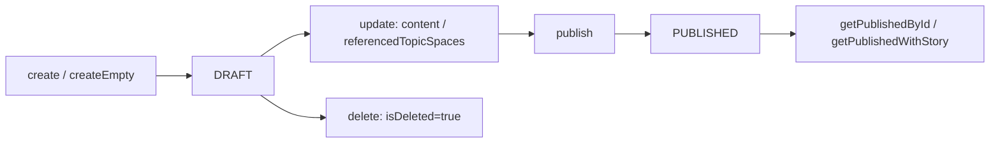

# 執筆ワークスペース API（workspaceRouter）

キュレーター執筆ワークスペースの CRUD、共同編集、LLM テキスト補完、公開ビュー、公開ノード検索を提供する tRPC ルーター。

執筆体験とデータの概念関係は [執筆体験とデータの関係（概念図）](./concept-writing-experience.md) / [データ連携の概念](./concept-writing-data-linkage.md) を参照。注釈 CRUD は [注釈コラボレーション API](./annotation-collaboration-api.md) が対象（エッジ注釈の取得のみ本ルーター）。

## データモデル

`prisma/schema.prisma` の `Workspace`:

| フィールド | 説明 |
|------------|------|
| `content` | Tiptap JSON（執筆本文） |
| `status` | `WorkspaceStatus`: `DRAFT` / `PUBLISHED` |
| `curatorialContext` | キュレトリアル文脈（`stance`, `extractionRules`, `negativeArchive` 等） |
| `referencedTopicSpaces` | 参照 TopicSpace（グラフソース） |
| `collaborators` | 共同編集者 |
| `story` | 1 対 1 の `Story`（メタグラフ） |
| `isDeleted` | 論理削除 |

## アクセス制御

| 操作 | 所有者 | 共同編集者 | 未認証 |
|------|--------|------------|--------|
| CRUD（`create` 除く共同編集者追加/削除） | ○ | ○（更新・閲覧） | × |
| `addCollaborator` / `removeCollaborator` / `delete` | ○ のみ | × | × |
| `getPublishedById` / `getPublishedWithStory` | — | — | ○ |
| `searchPublishedNodes` | ○（要ログイン） | ○ | × |

## 処理フロー（ライフサイクル）

## 手続き一覧

### CRUD・一覧

| 手続き | 認証 | 入力 | 説明 |
|--------|------|------|------|
| `create` | 要 | `name`, `description?`, `referencedTopicSpaceIds?`, `tags?` | 新規ワークスペース（`DRAFT`）。参照 TopicSpace のグラフを include |
| `createEmpty` | 要 | `{}` | ロケール別デフォルト名・空 Tiptap テンプレートで即作成 |
| `getById` | 要 | `{ id }` | 所有者または共同編集者のみ。`graphDocument` をフラット結合して返す |
| `getListBySession` | 要 | — | セッション用户がアクセス可能な一覧（最小 include） |
| `getMyWorkspaces` | 要 | — | タグ・共同編集者・履歴件数付き、`updatedAt` 降順 |
| `update` | 要 | `id` + 部分更新 | `content`, `status`, `referencedTopicSpaceIds`, `curatorialContext` 等 |
| `delete` | 要 | `{ id }` | **所有者のみ**。論理削除 |

`getById` の `graphDocument` は参照 TopicSpace 全ノード・エッジを `sourceId`/`targetId` 形式で結合する（`formGraphDataForFrontend` 未使用）。

### 共同編集

| 手続き | 制約 |
|--------|------|
| `addCollaborator` | 所有者のみ。`userId` を connect |
| `removeCollaborator` | 所有者のみ。`userId` を disconnect |

### LLM テキスト補完

| 手続き | モデル | 説明 |
|--------|--------|------|
| `textCompletion` | `gpt-4.1-nano`（OpenAI Responses API） | 執筆中テキストの続き生成 |
| `textCompletionWithGraph` | 同上 | クライアント送信の部分グラフをコンテキストに使用 |

#### textCompletion のモード

| `isDeepMode` | 動作 |
|--------------|------|
| `false` | 参照 TopicSpace[0] の `searchEntities` 近傍ノードをプロンプトに埋め込み |
| `true` | 各参照 TopicSpace 向け MCP ツール（`/api/topic-spaces/{id}/mcp`）を Responses API に付与 |

MCP 失敗時は `getTextCompletionFallbackPrompt` で基本補完にフォールバック。戻り値は `baseText` プレフィックスを除去した **追記部分のみ**。

#### textCompletionWithGraph

入力 `subgraph` のリレーションを `(label:name)-[type]->` 行に変換。リレーションが空ならノード名のみ列挙。

### 注釈（エッジ）

| 手続き | 説明 |
|--------|------|
| `getWorkspaceEdgeAnnotations` | ワークスペース参照 TopicSpace 内のエッジに紐づく注釈一覧（子注釈・履歴含む） |

ノード注釈は `annotationRouter` を使用。

### 公開

| 手続き | 認証 | 説明 |
|--------|------|------|
| `publish` | 要 | `status` → `PUBLISHED`（所有者または共同編集者） |
| `getPublishedById` | 不要 | 公開済みのみ。`graphDocument` は `formGraphDataForFrontend` 適用 |
| `getPublishedWithStory` | 不要 | 上記 + 未削除 `story` があれば `metaGraphData`（`convertFromDatabase`） |
| `searchPublishedNodes` | 要 | 公開ワークスペースが参照する TopicSpace 内ノードを名前部分一致検索 |

#### searchPublishedNodes

| 入力 | 説明 |
|------|------|
| `query` | 必須。`name` の case-insensitive `contains` |
| `workspaceId?` | 指定時はその公開 WS のみ |
| `limit` | 1–100、デフォルト 20 |

戻り値 `PublishedNodeMatch[]`: `nodeId`, `name`, `label`, `workspaceId`, `workspaceName`, `topicSpaceId`, `topicSpaceName`, `sourceType: "workspace"`。

フィールドリサーチの OCR マッチングは `scanRouter` 側（[フィールドリサーチ](./field-research-scan-flow.md)）が別経路。

## UI エントリポイント

| 画面 | パス | 主な手続き |
|------|------|------------|
| ワークスペース一覧 | `/[locale]/workspaces` | `getMyWorkspaces` |
| 新規作成 | `/[locale]/workspaces/new` | `create` |
| 執筆エディタ | `/[locale]/workspaces/[id]` | `getById`, `update` |
| レイアウト編集 | `/[locale]/workspaces/[id]/layout-edit` | `getById` |
| 印刷プレビュー | `/[locale]/workspaces/[id]/print-preview` | `getById` + ブラウザ `window.print()` |
| 公開モーダル | 執筆 UI | `publish` |
| テキスト補完 | Tiptap `use-text-completion` | `textCompletion`, `textCompletionWithGraph` |
| オンボーディング | 初回フロー | `createEmpty` |

### 印刷・PDF

- UI: `PrintPreviewContent` + `PdfExportButton`（`publish-workspace-modal` から `/print-preview` へリンク）
- ブラウザ印刷: `@page` CSS を動的注入して `window.print()`
- サーバー PDF: `print.generatePdf`（Puppeteer）は実装済みだが、`PdfExportButton` の **PDF ダウンロードボタンはコメントアウト**（`handleDownload` 無効）

## エラーケース

| 状況 | 挙動 |
|------|------|
| 未存在 / アクセス拒否 | `workspace.notFoundOrDenied`（i18n）または `"Workspace not found or access denied"` |
| 公開 WS 未存在 | `workspace.publishedNotFound` |
| エッジが参照 TS に属さない | `workspace.edgeNotReferenced` |

## 関連ファイル

- `src/server/api/routers/workspace.ts` — tRPC ルーター（17 手続き）
- `src/server/services/workspace/search-published-nodes.service.ts` — 公開ノード検索
- `src/server/lib/i18n/prompts/workspace.ts` — テキスト補完プロンプト
- `src/app/_constants/workspace-default-content.ts` — 空ワークスペース Tiptap テンプレート
- `src/app/_components/curators-writing-workspace/` — 執筆 UI

## 関連ドキュメント

- [執筆体験とデータの関係](./concept-writing-experience.md)
- [テキストからストーリー生成](./story-generation-text-mode-flow.md)
- [TopicSpace グラフ拡張](./topic-space-graph-extension.md) — 執筆中の追加 KG 抽出
- [公開記事のストーリーテリングと URL クエリ](./storytelling-public-viewer-and-urls.md)
- [注釈コラボレーション API](./annotation-collaboration-api.md)
